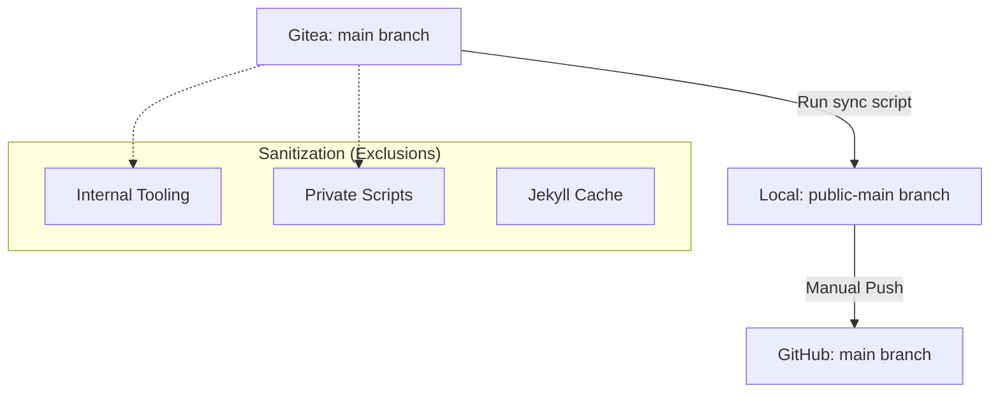

# Publishing Workflow (Sanitize & Sync)

This document describes the bridge between the **Private Source of Truth** (Gitea) and the **Public Publication** (GitHub).

## Architecture

The homelab environment treats Gitea as the primary authority. However, because the repository contains internal tooling and experimental pages that are not intended for the public eye, we use a "Sanitize & Sync" workflow.



## The Sync Script

The process is managed by a specialized script located at:
`~/git/tmp-kriebb-public-sync/sync-public-branch.sh`

### Deep Analysis of Operation

1.  **Worktree Isolation:** The script uses `git worktree` to maintain a clean `public-main` branch without interfering with the active development in the `main` branch.
2.  **Explicit Sanitization:** It uses `rsync` with a hardcoded exclusion list to strip away private components:
    *   `docs/`: Usually contains private operator notes.
    *   `.jekyll-cache/` & `_site/`: Ephemeral build artifacts.
3.  **Destructive Mirroring:** It uses `rsync -a --delete`. This is critical: if a file is deleted in the private repo, it is automatically removed from the public export. This prevents "secret leakage" via abandoned files.
4.  **Identity Enforcement:** The script performs a commit on the `public-main` branch. This requires a valid Git identity (Human or AI).

## Requirements

*   **rsync:** Must be installed on the host.
*   **Git:** Access to both the Gitea and GitHub remotes.
*   **Environment:** If run by an AI agent, the `GIT_AGENT_IDENTITY` and related variables must be exported.

## How to Publish

### 1. Sync Private to Public (Local)
Run the sync script from your terminal:
```bash
/home/kristof/git/tmp-kriebb-public-sync/sync-public-branch.sh
```

### 2. Push to GitHub
Because of security guardrails (AI identity protection), the final push to GitHub is restricted for AI agents. The human operator should perform the final step:

```bash
cd ~/git/kriebb.github.io
git push github public-main:main
```

## Security & Guardrails

*   **Branch Protection:** Never push the private `main` directly to `github/main`. Always use the `public-main` bridge.
*   **Exclusion Maintenance:** Whenever a new private-only feature is added to the site, ensure it is added to the `--exclude` list in the sync script.
*   **Token Safety:** The `rsync` process ensures that `.env` files (if any were accidentally left in the repo) are not carried over, provided they are in the excluded directories or ignored by `.gitignore`.
