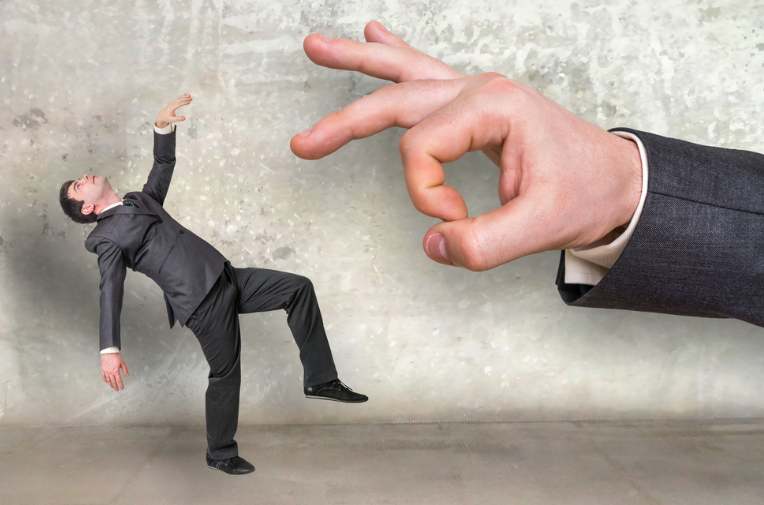

## Previously on...

I talked about the book [Getting Naked](https://www.amazon.de/-/en/Patrick-M-Lencioni/dp/0787976393) multiple times in my [blog posts personal growth](https://kriebbels.hashnode.dev/devretro2022-my-personal-growth-over-2022), [my adventure in consultancy](https://kriebbels.hashnode.dev/devretro2022-my-adventure-in-consultancy).

## Summary of Getting Naked

If you want to read the summary of that book, here you find [one, written by leenasn on medium.com](https://medium.com/@leenasn/book-summary-getting-naked-a-business-fable-about-shedding-the-three-fears-that-sabotage-client-632d2bbc295f). I will copy the gist here from that webpage:

*This is a story about a management consulting firm, who tries to acquire a successful running boutique consulting firm. While studying the success of the boutique firm, the consultant at the other firm learns the below model the boutique firm uses, which he later explains to his senior management.*

## Fears

I will not make a summary of this book, but I will address and comment on the fears: feeling inferior, losing business and feeling embarrassed. I believe that I need to search in my life what the origins of those fears are so I can deal with them. There is a difference between anxiety and fear. I will not address this, but more information you can find [here](https://batonrougebehavioral.com/fear-vs-anxiety-understanding-the-difference/).

## Inspiration

This book inspired me and enforces the idea of how I want to do business. Where I do not think I can truly shed my fears, I do believe that I can be aware of them, learn about them, know my pitfalls and act accordingly. Hopefully, when doing this enough, the ['Pavlovian response'](https://en.wikipedia.org/wiki/Ivan_Pavlov) will kick in. That does not mean my fears are gone. Like most things in life, I best adapt and embrace them.

## Fear of feeling inferior

Feeling inferior is what I call "The [calimero](https://en.wikipedia.org/wiki/Calimero) effect". Calimero's favourite saying is something in the form of:

*"You are big and I am small and that is not fair!".*

Not dealing with my inferior feelings can feed an "[imposter syndrome](https://en.wikipedia.org/wiki/Impostor_syndrome)". That will lead to underperformed work, and jealousy in all kinds of relationships.

It is easier to talk to someone that is "down to earth". Knowing that the other person can set his ego aside, can lift some barriers. When the other person lifts his barriers, I can gain trust. I have to be okay with it that some business is not for me (yet?). That brings us to the next fear.

## Fear of losing the business

[Fear of losing control](http://questfusion.com/fear-of-losing-control/), somewhat fits this fear as well. The blog post I linked gives you more information about that.

This section of the book will tell me that coping mechanisms are created to cope with fears. [Job protection falls in that category of a coping mechanism](https://www.mindtools.com/a6844l3/living-with-a-lack-of-job-security). I like to empower other people. I believe that when I empower others by creating less dependency on myself, new opportunities will arise and I create happy relationships.

Mistakes I made, and a customer project that ends... is a part of life. Of course, feelings will be felt. I am not saying I will like it. I understand that it can create other problems and uncertainties. We all have a lot on our plate at home, with friends or family. It is understandable. However, my approach is that I believe that everything will work out. Losing work, doing other work and/or having fewer dependencies on that person, is also nothing to be embarrassed about. That will bring us to discuss the next fear: The fear of embarrassment.

## Fear of being embarrassed

Embarrassment is natural. Below I have written 3 moments of embarrassment I have conquered.

[From when we were infants, we mock what we do not know or what seems strange to us.](https://childmind.org/article/help-kids-deal-embarrassment/) The fear can grow problematic when I e.g. as a child or even as an adult was picked upon. When I was bullied, I tried a lot of things. Fighting back, buying them off, and adapting myself until I was liked or ignored by those bullies. That has kept me somewhat safe during my puberty. In work life, I had to unlearn that coping behaviour. I am aware of it now that it was a problematic behaviour that puts me ultimately into mental problems created by my anxieties.

A less problematic fear of embarrassment is getting a compliment. I notice that people in a meeting, interview or date can not handle a compliment. There is only one way to accept a compliment: read more on that [here](https://www.psychalive.org/the-importance-of-accepting-compliments/), but for dutch readers, [this is a good link as well.](https://assertief.nl/compliment-ontvangen/) I will spoil the one way on how you should react and that is by saying thank you.

Another view on the fear of embarrassment is admitting I do not know everything. I can help a customer by giving honest advice, even if that is that I have to say I do not know the solution. I also say that if they would like, will find more information and experience on this matter. The customer is not interested in my ego at all. He is helped by getting advice that he [feels](https://consulting.wiki/question/how-do-consultants-build-trust/) he can trust.

## Comparison of Fears and Their Effects

| Fear Type | Description | Impact | How to Address |
|-----------|-------------|--------|---------------|
| Feeling Inferior | The "Calimero effect" | Leads to imposter syndrome and underperformance | Be authentic and acknowledge limitations |
| Losing Business | Fear of losing control and opportunities | Creates unhealthy job protection behaviors | Empower others and trust that new opportunities will arise |
| Being Embarrassed | Fear of appearing incompetent | Prevents authentic connections | Accept compliments gracefully and admit when you don't know |

## Xpirit | Part of Xebia

When I read that book, I saw a resemblance with the way [Xpirit | Part of Xebia](https://xpirit.com) operates. A company that acknowledges these fears and especially that wants to help me conquer those fears is admiring and can lift me further as well.

## Outro

I hope you get a better understanding of why I find this book this inspiring at this time of my life. This book is a good source of inspiration on how I can do consultancy and become a better person in life as well.

Building honest relations and living very mindful will help me to overcome those fears.

Reviewed by [Pieter](https://xpirit.com/team/pieter-gheysens/), [Bas](https://azurecodingarchitect.com/author/bas-van-de-sande/)
