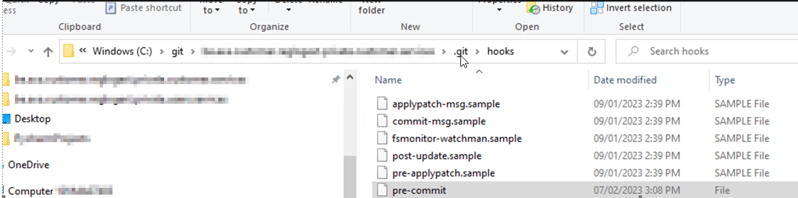
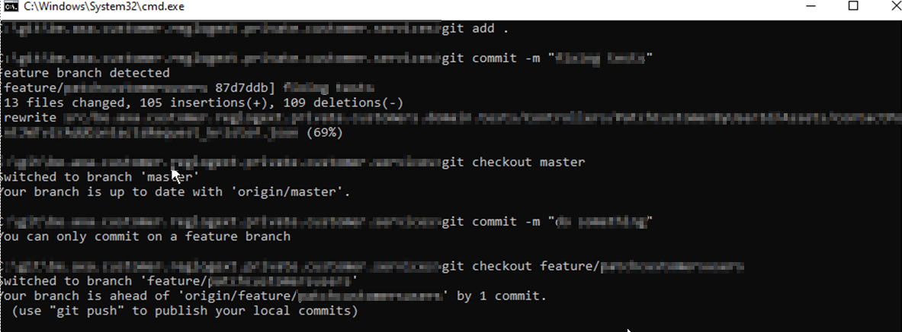

## Previously on

In one of my previous posts, I talked about [my assignment](https://dotnet.kriebbels.me/lets-zoom-in-on-my-first-assignment). In summary, that assignment consists of making some REST API protected with an OAuth2 access token. During that assignment, the DevOps team rolled out a new way of deployment using [IaC](https://learn.microsoft.com/en-us/devops/deliver/what-is-infrastructure-as-code), which comes with a new branching strategy: [an environment-based branch strategy](https://dev.to/preethamsathyamurthy/git-branching-and-branching-strategy-4mci).

## Context

In this post, you will read about what I do to make sure I use the new branching strategy as intended. That new branching strategy is needed to enable the way they implemented IaC.

It is imperative to work with bugfix branches and feature branches. The code that is deployed to an environment, will be put on in the same repo but on a branch that is coupled to a development, test or production environment branch. You cannot work directly on the branch named master.

Each time a developer pushes his code on the master branch a new (unintended) deployment happens. To ensure this does not happen, use branch policies. [You read more here](https://learn.microsoft.com/en-us/azure/devops/repos/git/branch-policies?source=recommendations&view=azure-devops&tabs=browser).

However, in this stage, the DevOps team does not make any decisions about that. I should do what I can on my end.

## Enter Git Hooks

Below I have copied information from the git-scm.com page. I did this for the reader. I hope this will enable everything the reader needs to know to understand the git pre-commit hook. The next source you want to visit is the following: [Learn how to use pre-commit hooks, post-commit hooks, post-receive hooks, and more. | Matthew Hudson](https://githooks.com/).

### Needed theory to understand

Below I define two sections that are needed to understand the script I wrote: Git Pre-commit hook and the scripting language Bash.

### Git Custom Scripts

> Git has a way to fire off custom scripts when certain important actions occur. There are two groups of these hooks: client-side and server-side. Client-side hooks are triggered by operations such as committing and merging, while server-side hooks run on network operations such as receiving pushed commits. You can use these hooks for all sorts of reasons.

#### Installing a Hook

> To enable a hook script, put a file in the `hooks` subdirectory of your .git directory that is named appropriately (without any extension) and is executable. From that point forward, it should be called. We'll cover most of the major hook filenames here.

#### Pre-Commit hook

> The `pre-commit` hook is run first, before you even type in a commit message. It's used to inspect the snapshot that's about to be committed, to see if you've forgotten something, to make sure tests run, or to examine whatever you need to inspect in the code. Exiting non-zero from this hook aborts the commit, although you can bypass it with `git commit --no-verify`

### Scripting Languages

As long as the scripting language can be executed in the terminal on the system where the repository is located, it can be used to write Git hooks:

- Shell scripts (e.g. bash, sh)
- Python
- Ruby
- Perl
- Node.js (JavaScript)
- ...

### Bash

I based my pre-commit hook on the sample `pre-commit.sample` you find in the `.git\hooks` folder. In my script, I made use of a case statement: Using [case statements](https://tldp.org/LDP/Bash-Beginners-Guide/html/sect_07_03.html) with string matching

## The script

### Build up

I use a git pre-commit hook to enforce myself to use a feature or bugfix branch on my repository. The code is merged into the master using a pull request on Azure DevOps.

1. Indicate what script language is used

```sh
#!/bin/sh
```

2. Getting the current branchname:

```sh
branch="$(git rev-parse --abbrev-ref HEAD)"
```


3. String matching the branch name using a `case` statement. In the `case` statement, the string matching is performed using shell globbing patterns, not regular expressions.

Shell globbing patterns (not regex!) are a way to match strings against a set of specified patterns in Unix-like systems, including the shell. They use wildcard characters (e.g. `*` and `?`) to match multiple characters or a single character, respectively.

```sh
case "$branch" in
    feature/*)

        ;;
    bugfix/*)

        ;;
    *)

        ;;
;;
esac
```

4. Use `exitcode 0` for a successful exit and `exitcode 1` to indicate a failure

```sh
exit 0
exit 1
```

5. Report to the end user with a message

```sh
echo "Feature branch detected"
echo "bugfix branch detected"
echo "You can only commit on a feature branch"
```

### Entire script


```sh
#!/bin/sh

branch="$(git rev-parse --abbrev-ref HEAD)"

case "$branch" in
    feature/*)
        echo "Feature branch detected"
        exit 0
        ;;
    bugfix/*)
        echo "bugfix branch detected"
        exit 0
        ;;
    *)
        echo "You can only commit on a feature or bugfix branch"
        exit 1
        ;;
esac

``` 


### In Action

Creating the script:



Using the script:



## Branch Naming Conventions

| Branch Type | Convention | Example | Description |
|-------------|------------|---------|-------------|
| Feature | feature/[feature-name] | feature/user-registration | New functionality development |
| Bugfix | bugfix/[issue-id] | bugfix/login-error | Fixes for existing issues |
| Environment | [env-name] | development, staging | Deployment environment branches |
| Release | release/[version] | release/1.2.0 | Release candidate branches |

## Outro

Branching etiquette refers to the conventions and best practices that developers should follow when working with Git branches. This can include things like naming conventions for branches, guidelines for when to create a new branch, and rules for when to merge branches into the main codebase.

Having a branching etiquette can help to keep the codebase organized and maintainable, which is essential for effective collaboration and efficient development. It also helps to ensure that the codebase is easy to understand and navigate, even as the number of branches and the size of the codebase grows.
