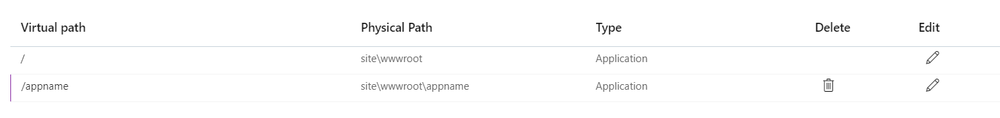

## Previously on…

When you read my posts, you do know by now I am working with Rest APIs and OAuth2, with some DevOps in between. In another post, I talk about branching etiquette. There you can read that the customer is also using an environment-based branching strategy.

## Context

At my customer, we are at the point we start to redeploy our existing APIs using Infrastructure-as-code. A new way of branching and deployment has been put in place. However, when surfing to the endpoint of the application, you get an Internal Server Error.

The setup described below, has been setup on a Continuous Deployment pipeline using ARM templates. There is a convention that the DevOps team follows: each application is deployed in its virtual directory, using the application name

# How it begins…

Below I will describe first how to get in a situation similar to the one that I debugged. Afterwards, I will explain how I debugged that situation.

## Create the Azure App Service

First, create the Azure Application Service. Secondly, using the Azure Portal, go to the configuration page. Then setup a virtual directory with the following parameters: `/app_name` to `\site\wwwroot\appname`

## Deploy the Azure App Service

Using a Powershell terminal, I published the application and compressed the output folder. That zip file was deployed using the AzCli to the Azure App Service.

`Set-Location C:\git\SomeRepo\src\WeatherApp`

`dotnet publish -o appname`

`cd .\appname`

`Compress-Archive .` [`appname.zip`](http://appname.zip)

`az login`

`az webapp deployment source config-zip --src .\`[`appname.zip`](http://appname.zip) `-n "webapp-230219103841" -g "rg-230219103841"`

# Debugging the situation

My colleague told me that the deployment had succeeded. I navigated to the Azure App Service. The browser reported an Internal Server Error.

## Use Kestrel

The first step I took, was to check Application Insights but found that no error was logged. After that, Using the Azure Portal, I checked the Logs. I got no connection with the streaming logs due to the enterprise proxy server.

Next, using the console in the Azure Portal, I started the application. First, I got an error that the [Asp.net core Development certificate](https://learn.microsoft.com/en-us/dotnet/core/tools/dotnet-dev-certs) was not available. So I created and configured a generated self-signed certificate. That error was mitigated and now I got no error at all.

After waiting a while, the console let me know that the process was killed due to no CPU activity.

To exclude the idea there was something wrong with the HTTPS endpoint, I edited the appsettings.json and removed the HTTPS endpoint. Next, I removed the self-signed certificated. The result was the same.

## Use Advanced Tools (SCM)

On the "[troubleshoot page of Microsoft](https://learn.microsoft.com/en-us/aspnet/core/test/troubleshoot-azure-iis?view=aspnetcore-7.0#app-startup-errors)", I read that I should enable the stdout-logging to troubleshoot the problem.

At my customer, access to Kudu does not seem possible, due to Proxy restrictions. [I looked into the possibility of uploading my web.config instead of the generated one](https://learn.microsoft.com/en-us/aspnet/core/host-and-deploy/iis/web-config?view=aspnetcore-7.0). This, however, was not feasible, because I had to wait 15min each time I made a change.

## Logging and Advanced Tools

After searching for the procedure to make the proxy server work with Azure functionality, I finally got access to the Log Streaming service and the Advanced Tools.

### Application Insights Logging and Logstream

I could find nothing in Application Insights. Maybe I had some logging using the LogStream in Azure Portal.

After enabling the options, I navigated to the Azure App Service. Afterwards in the LogStream, I could find more information.

Sadly, it did not help me much. Except something seemed very wrong?

### Advanced Tools: Kudu

The advanced tools will help me debug the application. [I can edit the web.config and have immediate feedback](https://learn.microsoft.com/en-us/aspnet/core/test/troubleshoot-azure-iis?view=aspnetcore-7.0#aspnet-core-module-stdout-log-azure-app-service). I had heard of the ANCM module before, but never really understood it. [It is a native IIS module that plugs into the IIS pipeline. This way ASP.NET Core applications can work with IIS](https://learn.microsoft.com/en-us/aspnet/core/host-and-deploy/aspnet-core-module?view=aspnetcore-7.0#log-creation-and-redirection).

I had to enable the stdout logging. To do this I set the `stdoutLogEnabled` to `true`.

After pressing save, I went back to Kudu and looked for the output. I navigated again to the Azure App Service and nothing changed. It was still the same Internal Server Error.

I searched for the logging, but found nothing. It seemed that the application module was just not started at all.

At this point, I was searching for any clue... So using Kudu, I browsed around.

I found a file named `eventlog.xml`.

I noticed that the system complained that the `processpath` is required. That meant the system did not find the web.config. The `processpath` has the value `dotnet.` I put the `web.config` in the folder `wwwroot`.

I surfed to Azure App Service and I got a different error page. I got an error stating: ANCM Failed to Find Native Dependencies:

However, I did not find stdout logging. I checked the `eventlog.xml` again.

It complained about a missing `aspnetcorev2_inprocess.dll`. Which I found strange. I changed the `.\wwwroot\web.config` that the `WeatherApp.dll` is found in the `appname` folder.

Surfing again to the Azure AppService, I got a webpage stating: Page Not Found. However, I found the stdout logging file. But the file was empty.

[I read documentation about the web.config and the stdout logging](https://learn.microsoft.com/en-us/aspnet/core/host-and-deploy/iis/logging-and-diagnostics?view=aspnetcore-7.0). I need to add `handlersettings` to state the level of logging.

FInally, I got logging.

## Solution

Everything fell into place. From the days that I deployed applications in IIS on a PaaS, I know that a `web.config` should be in every application that you define in IIS. The `web.config` was not read by IIS the `appname`. It was read in the folder `wwwroot`. That meant that the configuration around Virtual Paths and Directory needed to be investigated. Using the configuration page in the Azure Portal, I saw that the appname defined in the virtual path did not follow the company's convention.

I changed the value of the virtual path from `app_name` to `appname.`

Finally, I surfed to `/WeatherForeCast` of the app and got a nice Not Authenticated Error. The app is working.

# Outro

Although the solution is straightforward, I learned what ANCM is and how to log at that level.

# Sources

The following are the sources I used to mimic the situation:

* [Deploying multiple virtual directories to a single Azure Website | Microsoft Learn](https://learn.microsoft.com/en-us/archive/blogs/tomholl/deploying-multiple-virtual-directories-to-a-single-azure-website)
    
* [dotnet publish command - .NET CLI | Microsoft Learn](https://learn.microsoft.com/en-us/dotnet/core/tools/dotnet-publish)
    
* [Visual Studio publish profiles (.pubxml) for](https://learn.microsoft.com/en-us/aspnet/core/host-and-deploy/visual-studio-publish-profiles?view=aspnetcore-7.0) [ASP.NET](http://ASP.NET) [Core app deployment | Microsoft Learn](https://learn.microsoft.com/en-us/aspnet/core/host-and-deploy/visual-studio-publish-profiles?view=aspnetcore-7.0)
    
* [Deploy a .NET 6 Web Application to an Azure App Service by the command line - DEV Community ??????????](https://dev.to/kasuken/deploy-a-net-6-web-application-to-an-azure-app-service-by-the-command-line-533j)
    

The following sources I have used to help me debug the situation.

* [Troubleshoot](https://learn.microsoft.com/en-us/aspnet/core/test/troubleshoot-azure-iis?view=aspnetcore-7.0) [ASP.NET](http://ASP.NET) [Core on Azure App Service and IIS | Microsoft Learn](https://learn.microsoft.com/en-us/aspnet/core/test/troubleshoot-azure-iis?view=aspnetcore-7.0)
    
* [ASP.NET](http://ASP.NET) [Core Module (ANCM) for IIS | Microsoft Learn](https://learn.microsoft.com/en-us/aspnet/core/host-and-deploy/aspnet-core-module?view=aspnetcore-7.0#log-creation-and-redirection)
    
* [Configure endpoints for the](https://learn.microsoft.com/en-us/aspnet/core/fundamentals/servers/kestrel/endpoints?view=aspnetcore-7.0#listenoptionsusehttps) [ASP.NET](http://ASP.NET) [Core Kestrel web server | Microsoft Learn](https://learn.microsoft.com/en-us/aspnet/core/fundamentals/servers/kestrel/endpoints?view=aspnetcore-7.0#listenoptionsusehttps)
    
* [Kudu service overview - Azure App Service | Microsoft Learn](https://learn.microsoft.com/en-us/azure/app-service/resources-kudu)
    
* [https://learn.microsoft.com/en-us/azure/app-service/configure-common?tabs=portal](https://learn.microsoft.com/en-us/azure/app-service/configure-common?tabs=portal)

