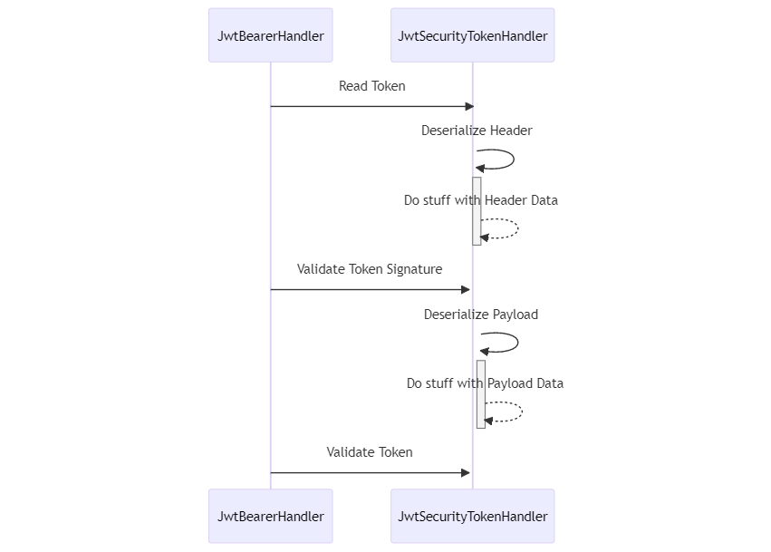
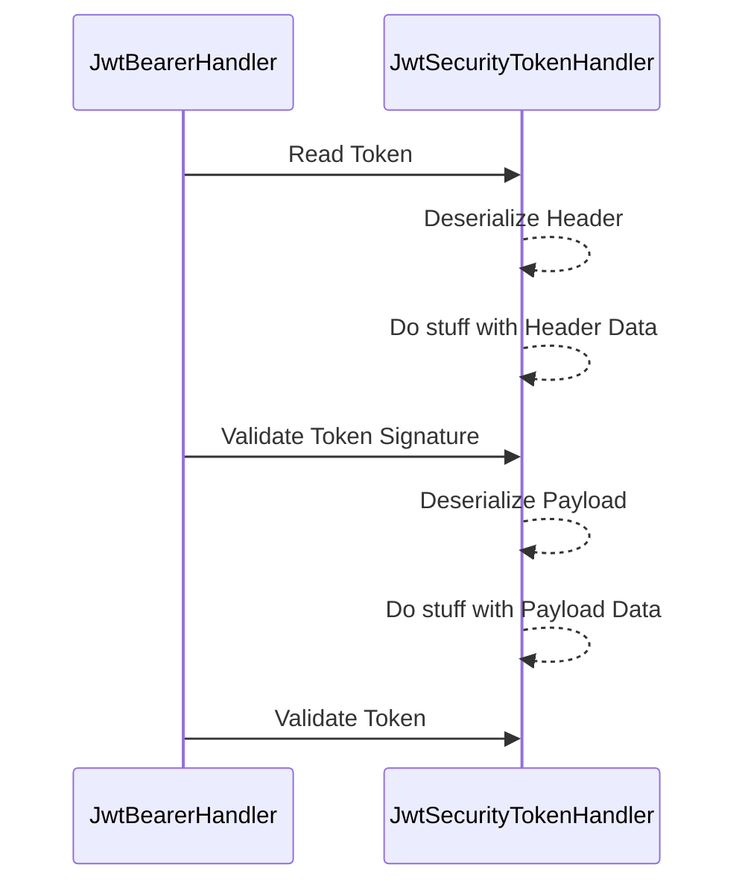
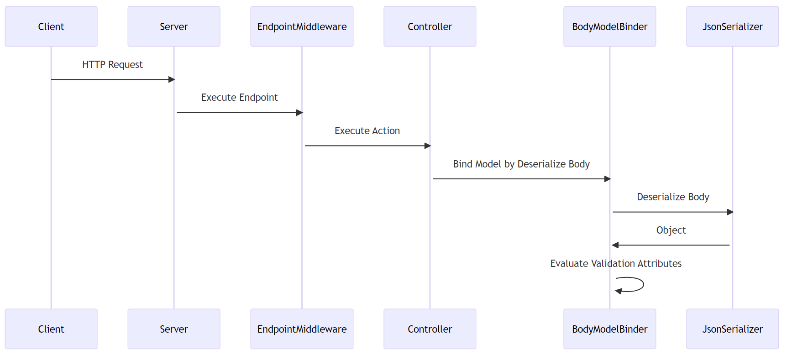
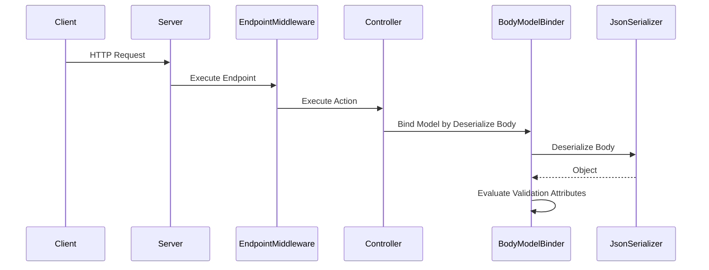
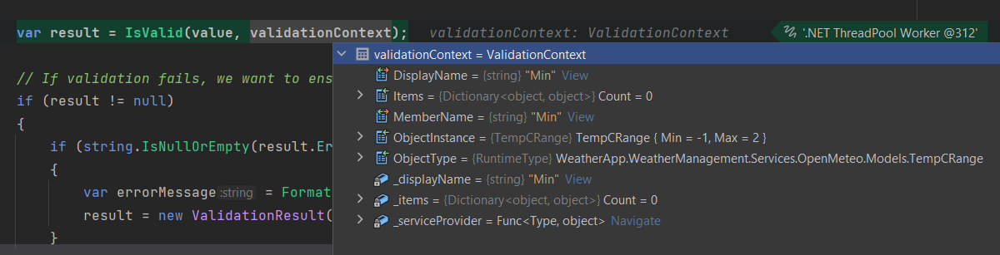
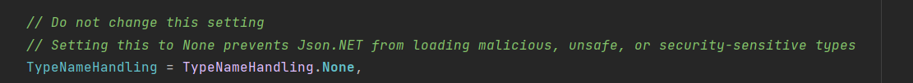
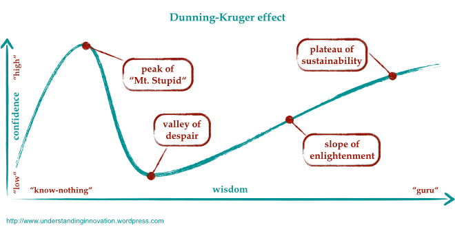

# Previously on...

[In my previous blog post](https://dotnet.kriebbels.me/the-hidden-dangers-of-json), I wrote about deserialization attacks and how to prevent them. I ended the post with a section called Hunger. There I stated I still doubted the link between JSON inside a string property and when the validation attributes are triggered.

# Context

The SAST (Static Application Security Testing)-squad informed us that the problem was not resolved. The property validation using data annotations didn't silence the SAST scan. The software informed us that the property still flowed from one end to the other without any sanitization occurring. Both my colleague and I were genuinely frustrated. We added the data validation attributes...

The security team gave us the [OWASP's cheat sheet](https://cheatsheetseries.owasp.org/cheatsheets/Deserialization_Cheat_Sheet.html#net-csharp). Our code followed everything it mentioned, except for [whitelisting objects before conversion](https://learn.microsoft.com/en-us/dotnet/standard/serialization/system-text-json/converters-how-to?pivots=dotnet-6-0). I was flabbergasted. I hadn't done this in the other projects, so what was the distinction?

We went on to implement a custom JSON converter using System.Text.Json, which first checks if the model to be deserialized is known.

Since the tool kept complaining about the property flow, we opted for AutoMapper instead of some code that maps one object to another. Additionally, we employed dependency injection to inject validators and utilized data annotations on the model. This approach aligned more closely with the existing code of the other projects

In all honesty, I believe the static tool scan just can't handle validation attributes, an AutoMapper and dependency injection.

The security team planned to examine our whitelisting usage and close the issue.

Naturally, being me, I couldn't just be content and let it be. I felt compelled to share my findings in this post.

# Did you know...

* The word "[serialization](https://www.etymonline.com/word/serial?ref=etymonline_crossreference)" originated from the Latin word "series," which means "a sequence or succession." It is used in computer science to refer to the process of converting an object into a sequence of bytes or characters so that it can be stored, transmitted or reconstructed later. The term "[serialization](https://en.wikipedia.org/wiki/Serialization)" is used because the process involves converting an object's internal state into a serial sequence of data that can be read or written in sequence.
    
* The term "deserialization" is a logical extension of "serialization," which refers to the process of converting a programming object or structure into a format that can be transmitted over a network or stored in a file
    
* SAST stands for Static Application Security Testing. It is a security testing methodology used to analyze the source code, bytecode, or binary code of an application to identify potential security vulnerabilities. SAST tools scan the code without executing the application, providing an efficient way to detect issues early in the development process.
    

# The attack of the JSONs.

While conducting my research, I felt compelled to test out this kind of attack on a personal web API project I had created for demonstration purposes.

I stumbled upon the following sources as I delved into researching deserialization attacks targeting both the body and the authorization header.

* [Reddit - Dive into anything](https://www.reddit.com/r/dotnet/comments/6q1p99/friday_the_13th_json_attacks_remote_code/): In this source, you'll find a link to a presentation by hackers, where they discuss how they discovered the vulnerabilities.
    
* [Hacking JWT Tokens: Bruteforcing Weak Signing Key (JWT-Cracker) | by Shivam Bathla | Pentester Academy Blog](https://blog.pentesteracademy.com/hacking-jwt-tokens-bruteforcing-weak-signing-key-jwt-cracker-5d49d34c44): An excellent read that demonstrates the importance of employing an RSA method for validating your tokens.
    
* [Critical vulnerabilities in JSON Web Token libraries (](https://auth0.com/blog/critical-vulnerabilities-in-json-web-token-libraries/)[auth0.com](http://auth0.com): A valuable read from Auth0, covering various vulnerabilities associated with JSON Web Tokens.
    

# The head and body by a Mermaid.

In the section titled "AuthorizationHeader," you'll discover a brief overview highlighting the significance of signature validation. Meanwhile, in the "Body" section, you'll learn about the process after JSON has been deserialized, and how data annotations won't be of assistance in that scenario.

## AuthorizationHeader

Since JWT is also in JSON format, it's crucial to ensure that your configuration is set up correctly. If not, the same attack could be applied to a JWT. Having a robust method for signing your token is of paramount importance.





If you permit an embedded certificate or certificate location, use a weak symmetric key, or have no key at all, you must exercise caution, as attackers can exploit these vulnerabilities. Attackers may impersonate another identity, or, if an outdated serializer is active, they could even carry out an RCE (Remote Code Execution) attack.

Keep in mind that once the signature is verified, the payload can be considered trustworthy.

## From Body

After conducting some research, I struggled to find a reliable source that explains the process of transitioning from an HTTP request to an HTTP response. However, by setting breakpoints, I managed to create the following sequence diagram to illustrate the process.





When you create a custom validation attribute and examine the stack trace, you'll see the validation context upon opening it. You'll notice that an object instance is already present. This serves as clear evidence that attribute validation takes place on the object model. That means that the deserialization process takes place first.

To safeguard your server from a JSON attack, this point in the process is too late.



### Whitelist your models

To protect yourself from unexpected models, whitelist your models in a custom json serialser.

```csharp
public class Program
{
...   
 builder.Services.AddControllers()
        .AddMvcOptions(options =>
        {
          //Only allowd types for the input can be allowed
            var jsonInputFormatter =
                (SystemTextJsonInputFormatter)options.InputFormatters.First(f =>
                    f.GetType() == typeof(SystemTextJsonInputFormatter));
            options.InputFormatters.Clear();
            options.InputFormatters.Add(jsonInputFormatter);
            
            jsonInputFormatter.SerializerOptions.Converters.Add(
                new WhitelistJsonConverter(AllowedTypesForDeserialisation.AllowedTypes));
        });
```

```csharp
using System;
using System.Linq;
using System.Text.Json;
using System.Text.Json.Serialization;

public class WhitelistJsonConverter : JsonConverterFactory
{
    private readonly Type[] _allowedTypes;
    public WhitelistJsonConverter(params Type[] allowedTypes){
        _allowedTypes = allowedTypes;
    }

    public override bool CanConvert(Type typeToConvert) {
        return Array.Exists(_allowedTypes, type => type == typeToConvert);
    }

    public override JsonConverter CreateConverter(Type typeToConvert, JsonSerializerOptions originalOptions)
    {
        var optionsWithoutThisConverter = new JsonSerializerOptions(originalOptions);
        optionsWithoutThisConverter.Converters.Remove(this);

        var converterType = typeof(WhitelistJsonConverterInner<>).MakeGenericType(typeToConvert);
        return (JsonConverter)Activator.CreateInstance(converterType, new object[] { optionsWithoutThisConverter });
    }

    private class WhitelistJsonConverterInner<T> : JsonConverter<T>{
        private readonly JsonSerializerOptions _options;

        public WhitelistJsonConverterInner(JsonSerializerOptions originalOptions){
            _options = new JsonSerializerOptions(originalOptions);
        }

        public override T Read(ref Utf8JsonReader reader, Type typeToConvert, JsonSerializerOptions options){
            return JsonSerializer.Deserialize<T>(ref reader, _options);
        }

        public override void Write(Utf8JsonWriter writer, T value, JsonSerializerOptions options){
            JsonSerializer.Serialize(writer, value, _options);
        }
    }
}
```

However, just whitelisting your models for the `JsonSerialiser` is not enough. Sanitizing input in your REST API can protect it from some attacks. That may not be enough. A string property containing a malicious JSON object could be passed to another module or server in the chain, resulting in bad things happening downstream. This is similar to a SQL injection attack, which doesn't happen on the API, but on the database. It's important to always sanitize your input to prevent attacks at any point in the chain.

# Do or do not. There is no try...

I experimented with three different approaches in a custom project, but none seemed to work. I'll outline the JSONs I used. The `System.Text.Json` package doesn't offer a feature like `Newtonsoft.Json`, which uses the `$type` property to inform the code about the object that should be constructed. This is why I used Newtonsoft.Json in my attempt.

## Authorization Header

The following JSONs show a possibility of how an attacker can try to execute a remote process. I converted this to a signed JWT.

```json
{
  "sub": "1234567890",
  "name": "John Doe",
  "iat": 1516239022,
  "exp": 1616239022,
  "process": {
    "$type": "System.Diagnostics.Process, System.Diagnostics.Process, Version=4.0.0.0, Culture=neutral, PublicKeyToken=b03f5f7f11d50a3a",
    "StartInfo": {
      "FileName": "cmd.exe",
      "Arguments": "/c calc.exe",
      "CreateNoWindow": true,
      "UseShellExecute": false
    }
  }
}
```

The above translates into a JWT. I censored the JWT, but the payload is the same.

```json
eyJh***.eyJzdWIiOiIxMjM0NTY3ODkwIiwibmFtZSI6IkpvaG4gRG9lIiwiaWF0IjoxNTE2MjM5MDIyLCJleHAiOjE2MTYyMzkwMjIsInByb2Nlc3MiOnsiJHR5cGUiOiJTeXN0ZW0uRGlhZ25vc3RpY3MuUHJvY2VzcywgU3lzdGVtLkRpYWdub3N0aWNzLlByb2Nlc3MsIFZlcnNpb249NC4wLjAuMCwgQ3VsdHVyZT1uZXV0cmFsLCBQdWJsaWNLZXlUb2tlbj1iMDNmNWY3ZjExZDUwYTNhIiwiU3RhcnRJbmZvIjp7IkZpbGVOYW1lIjoiY21kLmV4ZSIsIkFyZ3VtZW50cyI6Ii9jIGNhbGMuZXhlIiwiQ3JlYXRlTm9XaW5kb3ciOnRydWUsIlVzZVNoZWxsRXhlY3V0ZSI6ZmFsc2V9fX0.jDT3u***
```

## Body

The following JSON is the Json I used to try to create a file test.txt with the content test.

```json
{ "minMaxTempC": { "min": -1, "max": 2 }, "name": "crazy", "$type": "System.Diagnostics.Process, System.Diagnostics", "StartInfo": { "FileName": "cmd.exe", "Arguments": "test > test.txt", "RedirectStandardOutput": true } }
```

Because the model was not the one that the server expected, I got bad requests. So I ensured that it had the same properties as the model.

```csharp
public record TemperatureCelciusBucket(TempCRange minMaxTempC, string Name);
public record TempCRange(double Min, double Max);
```

In the `JsonSerialiserSettingsProvider,` you can notice the following comment about the type handling issue.



You need to set up your program to set the `TypeNameHandling` to `All` to ensure the attack could be done. Note, you want to set it to `None` when you try to protect yourself against an attack.

```csharp
builder.Services.AddControllers().AddNewtonsoftJson(options =>
{
    options.SerializerSettings.TypeNameHandling = TypeNameHandling.All;
    options.SerializerSettings.ContractResolver = new DefaultContractResolver();
});
```

On the website of JSON.NET, for that property and option, you do not get that warning. Check it out for yourself:

[TypeNameHandling Enumeration (](https://www.newtonsoft.com/json/help/html/T_Newtonsoft_Json_TypeNameHandling.htm)[newtonsoft.com](http://newtonsoft.com)[)](https://www.newtonsoft.com/json/help/html/T_Newtonsoft_Json_TypeNameHandling.htm)

They do mention that is a good practice to whitelist the objects that you want to use, which is also recommended by [OWASP](https://www.linkedin.com/posts/cybersecricki_i-will-be-bringing-some-freshly-delivered-activity-7043002593966522368-9mFL/).

# Outro

In my earlier post, I suggested using some sort of middleware to assist with JSON deserialization; however, this is an inefficient approach. Instead, it's better to add a custom converter and whitelist it from there. This way, you'll utilize the existing middleware and adhere to the Open/Closed principle from the SOLID pattern.

All my approaches seem to have failed to execute such an attack. I want to stress though that I am not a pentester. It seemed fun to try out this attack because it seemed simple enough. I sat on my peak of "Mount Stupid".

[](https://understandinginnovation.blog/2015/07/03/the-dunning-kruger-effect-in-innovation/)

The JSON.NET nuget-package that I have consumed, seems to have scars. Such an attack can now be mitigated. It is a whole new world that opens and I am liking it.

I recently came across a fitting T-shirt, invented by [**Ricki Burke** on LinkedIn](https://www.linkedin.com/posts/cybersecricki_i-will-be-bringing-some-freshly-delivered-activity-7043002593966522368-9mFL/) that encapsulates the importance of security.


Needless to say, I want one of those :)


