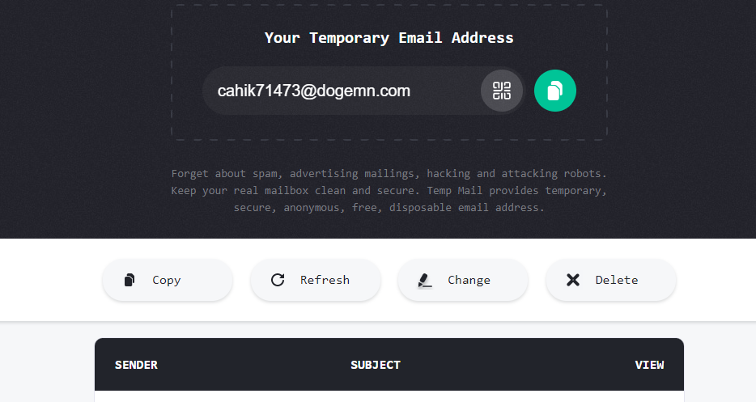

---
date: 2023-04-02
title: "The Importance of Unique Emails: Enhancing Your Security"
datePublished: Sun Apr 02 2023 09:22:46 GMT+0000 (Coordinated Universal Time)
cuid: clfz72eoh000l0amgddmkb9jj
slug: the-importance-of-unique-emails-enhancing-your-security
canonical: https://dotnet.kriebbels.me/the-importance-of-unique-emails-enhancing-your-security
cover: /assets/images/blog/2023-04-02-the-importance-of-unique-emails-enhancing-your-security/2023-04-02-the-importance-of-unique-emails-enhancing-your-security.cover.jpeg
tags: security, email, privacy, bitwarden, simplylogin

---

# Previously on...

[As mentioned in the initial article of this series](https://dotnet.kriebbels.me/how-to-know-if-your-data-is-leaked), I've grown increasingly frustrated with phishing emails and fraudulent text messages. My objective is to regain control of my data, and writing these blog posts serves as a commitment to taking action. I will share my past experiences, current efforts, and the knowledge I acquire along the way.

[In the previous blog post in this series](https://dotnet.kriebbels.me/protect-your-digital-life-a-password-manager-really), we discussed the importance of password managers, specifically KeePass and Bitwarden, and how they can help keep your online accounts secure.

# Context

So far, we've determined that it's crucial to safeguard oneself against cybercriminals who exploit leaked data. [Your information is out there on the internet, but by implementing two-factor authentication (2FA) and using unique passwords, you can protect your accounts on various websites from conventional unauthorized access methods.](https://dotnet.kriebbels.me/when-two-factor-authentication-is-useless)

Managing unique login names for each website isn't too challenging, and it makes the combination harder to guess. [This is a relatively simple task when using a password manager](https://dotnet.kriebbels.me/protect-your-digital-life-a-password-manager-really). However, the issue I want to tackle goes beyond that—I want to avoid phishing emails and scams. To achieve this, I need a unique email address for logins and registrations, or even better, a separate email address for each website I sign up for.

The concept of using a unique email address allows you to pinpoint the source of data leaks or sales. Additionally, you can switch the email address you provided to a different one and disregard any messages sent to the original account.

# The Phantom Nickname: Evolution of Email Identities.

In the early days of the internet, email addresses often featured nicknames or pseudonyms. Creative and unique nicknames allowed us to express ourselves. For me, it was a reference to the Kilrathi: A race of evolved cats in space. However, it became increasingly difficult to be able to register those popular nicknames. Many people used those nicknames in forums, chat rooms and online communities. It was natural for users to continue using these nicknames for their email addresses as well.

Over time, the need for using real names in email addresses emerged. We (Gen X / Millenials) became adults. Thus we needed an email address with real names. It was essential to use real names to establish credibility, trust, and professionalism.

Using your real name can help verify the other party the legitimacy of an email, reducing the risk of phishing and other scams.

# Order 66? Establishing Trust in the Email Wars.

In the early days of the internet, home computers and poorly secured email servers were vulnerable to exploitation by botnets and cyber criminals. The systems were compromised and used to send out large volumes of spam or fake emails. The origin of the email seemed genuine because of the true origin of the message. This led to a significant decrease in trust and reliability of email communications, as well as an increased risk of cyber threats like phishing and malware distribution. I[SPs started blocking outbound connections on Port 25](https://superuser.com/questions/1219829/outbound-port-25-blocked) for residential customers to prevent their computers from being used as spam relays by botnets or cyber criminals. This action forced users to rely on their ISP's mail server or use an alternative, [authenticated SMTP port (such as 587)](https://www.mailgun.com/blog/email/which-smtp-port-understanding-ports-25-465-587/) provided by their email service.

The issue with using nicknames or arbitrary names in email addresses is that it can undermine the social and visible trust between parties. A solution is needed to ensure the recipient can verify the email's legitimacy. Fortunately, some ingenious technical solutions have been developed:

* [SPF (Sender Policy Framework)](https://nl.wikipedia.org/wiki/Sender_Policy_Framework): This protocol helps defend against email spoofing and phishing attacks by allowing recipient mail servers to confirm that an email claiming to be from a particular domain was indeed sent from an authorized server.
    
* [DKIM (DomainKeys Identified Mail)](https://nl.wikipedia.org/wiki/DomainKeys_Identified_Mail): This method helps guarantee that the email hasn't been tampered with and verifies the sender's identity.
    
* [DMARC (Domain-based Message Authentication, Reporting, and Conformance)](https://nl.wikipedia.org/wiki/DMARC): This approach enables domain owners to dictate how receiving mail servers should manage emails failing SPF or DKIM checks. It also allows domain owners to oversee email delivery and possible misuse of their domain.
    

The issue with the solutions mentioned earlier is that they don't consider the average person's understanding of email technology. Many of us are unaware of the processes that occur when an email is sent. Most of us understand [the basics.](https://edu.gcfglobal.org/en/email101/introduction-to-email/1/)

[But, these methods don't appear to be very effective, because spammers and phishers can make new inboxes with custom origins way quicker than email providers can figure out they're not legit.](https://www.cmu.edu/iso/news/2020/email-spoofing.html)

# Exploring the alias: A New Hope.

People are starting to experiment again with their email names. Some tested strategies are used by creating a unique email address for each site. When the alias is too obvious, others can guess your "master" email or other aliases. So you will need a random string in that email address as well. [Does it ring a bell to password creation?](https://www.makeuseof.com/tag/create-strong-password-forget/)

On the following [Reddit](https://www.reddit.com/r/PrivacyGuides/comments/q8vct2/catch_all_email_vs_aliases/) forum, you can find discussions about the consequences of using random prefixes in an email address when registering on a website. This [website](https://krebsonsecurity.com/2022/08/the-security-pros-and-cons-of-using-email-aliases/comment-page-1/) also discusses the uses of an alias. Others are discussing other [strategies](https://www.reddit.com/r/PrivacyGuides/comments/q0ee09/custom_domain_email_alias_solution_to_avoid/) to avoid as well. [I am not alone in this. Others have blogged about this as well.](https://hackernoon.com/what-is-an-email-alias-and-why-you-should-stop-using-your-real-email-address)

[Some companies may even struggle to understand when an email address is created specifically for their organization, leading them to believe that the origin is being falsified](https://law.stackexchange.com/questions/32980/use-of-trademark-in-personal-email-alias).

[Not everyone has a technical background, so misunderstandings can arise. Tools can also misidentify your legit random alias as a fake email.](https://law.stackexchange.com/questions/32980/use-of-trademark-in-personal-email-alias)

I have not chosen why a strategy that I will implement. That I need to do. I do however explore multiple options that I could implement.

## The Catch-All Menace

The [catch-all inbox](https://www.mailercheck.com/articles/catch-all-email) approach is suitable if you have a personal domain for creating your email addresses.

The way it functions is by activating an option that allows all emails sent to any address ending with your domain to be received in a "catch-all" inbox. Congratulations, you can now use an alias on a website. However, there are some downsides to utilizing this method.

1. Catch-all inboxes can receive more spam as they accept emails sent to any address using your domain suffix, even if the address doesn't exist.
    
2. Managing and organizing emails in a catch-all inbox can be more challenging, as emails from various aliases are combined in a single location.
    

To hide your true inbox, this seems a valid option for me. Easy to set up and use. I need to think about the naming strategy I would use.

However, the downsides outweigh the benefits. The biggest one for me is I can't reply without revealing my true email address.

## Divide to Rule the Galaxy

In the spirit of the hit and run and divide and conquer tactic, consider creating a limited number of real email addresses that you designate for non-important matters and can close whenever you want. Managing too many at once would be overwhelming, so it's best to keep the count reasonable.

Alongside these disposable addresses, maintain a couple of email accounts for official communications. It's also a good idea to switch up your official email address from time to time for added security.

However, there is a serious downside to using this. It is time-consuming, you have a potential loss of information, and it gets complex very fast. Not to forget you get a reputation risk. Some service providers may view frequently changing email addresses as a sign of suspicious activity, potentially leading to account restrictions or limitations.

I won't pursue this option: I do not want to be seen as a criminal and most of all, it just takes too much time and management.

## Force Amplified: Enhancing Powers with a Galactic Plus

For your convenience, I quote Wikipedia on this one:

[`Some mail services support a tag included in the local-part, such that the address is an alias to a prefix of the local part. For example, the address joeuser+tag@example.com denotes the same delivery address as joeuser@example.com. RFC 5233,<sup>[15]</sup> refers to this convention as subaddressing, but it is also known as plus addressing, tagged addressing or mail extensions.`](https://en.wikipedia.org/wiki/Email_address#Subaddressing)

So how can you use this?

* For [Gmail](https://support.google.com/mail/answer/22370?hl=nl#zippy=%2Cfilteren-met-je-gmail-alias), [Hotmail, Outlook,](https://www.ghacks.net/2013/09/17/can-now-use-email-aliases-outlook-com/) this is supported!
    
* For your company, when using [Exchange](https://learn.microsoft.com/en-us/exchange/recipients-in-exchange-online/plus-addressing-in-exchange-online), you can use it as well. e.g. `john.doe+1234@company.com`
    

Great, you can now leave a valid personal email address at that company! While this is a great feature to help you filter your email inbox, not all companies are keen on this.

Email addresses with a plus sign are sometimes mistakenly deemed invalid. A company might quietly remove the part after the plus sign and use your actual email address instead. It's not surprising at all. When companies offer promotions like "Sign up and get a 5% discount when subscribing to our newsletter," they might want to verify whether the provided email address is associated with an existing customer. This allows them to better track and understand their customer base, as well as tailor their marketing efforts to target the right audience.

The act of "sub-addressing an email" will not help you when your data is leaked as well. A malicious actor could extract your real email address and use it for spam/phishing campaigns or link it to other data breaches. [The regex is fairly easy.](https://regex101.com/r/cHRjt9/1)

```csharp
string pattern = @"^([\w\.\-]+)(?:\+[\w\.\-]+)?(@\w+(?:\.[\w\-]+)+)$";
string substitution = @"$1$2";
string input = @"john.doe+1234@company.be";
RegexOptions options = RegexOptions.Multiline;
Regex regex = new Regex(pattern, options);
string result = regex.Replace(input, substitution);
```

Officially, you won't be able to reply from the subaddress. When you respond to an email sent to [**name+newsletter@company.com**](mailto:name+newsletter@gmail.com), the reply will be sent from your main email address, [**name@company.com**](mailto:name@gmail.com). However, some email providers like Gmail have an unsupported work-a-round. [Read here for more information](https://webapps.stackexchange.com/questions/3598/is-there-any-way-to-send-an-email-from-a-gmail-plus-address). The downside of this is that you need to do a manual action for each subaddress you want to send from.

Because it is fairly easy for criminals to still reach me when my data is leaked, I do not want to pursue this option. However, it is a good start.

## Harnessing the Power of Temporary Email

Disposable email addresses are temporary, short-lived email accounts that provide a convenient solution for situations where you need a temporary or throwaway email address. These addresses are particularly useful for signing up for newsletters, online services, or websites that require email verification but may result in unwanted email traffic or spam.

They offer a quick and easy way to create a temporary email address with a short lifespan, ranging from a few minutes to several hours. Once the designated time has passed, the email address is automatically deleted, along with any emails that were received.

How does it work? Fairly easy, you surf to a provider like [temp-mail.org](https://temp-mail.org/) and you got an inbox. You have an email assigned to you.



There are apps as well to use on your smartphones. How that can come into play, I do not know yet.

Some websites and services may block disposable email addresses, as they are often associated with spam or fraudulent activities as well. [Temp-mail.org has a solution tough to help you create short-lived email addresses using your domain name.](https://temp-mail.org/blog/temporary-email-with-private-domains-guide-2021/)

However, due to verification that can be happening to through what hoops the mail has been sent, you do not want your good own personal domain to be blacklisted by others. But this can give you an insight into how criminals do this tough.

I will not pursue this option completely for important activities.

## The Galactic Relay: Mastering Alias Email Forwarding

Some services aim to protect users' email privacy by masking their real email addresses. This is done by giving an alias.

I will mention two services: SimplyLogin and Apple's "Hide My Email". These services offer privacy-focused features designed to protect users' email addresses and reduce spam.

1. [SimplyLogin](https://simplelogin.io/docs/): I quote their site: `SimpleLogin is an` [`open source`](https://github.com/simple-login) `email aliasing service that allows you to receive and send emails anonymously. Based in France, SimpleLogin has helped 50,000+ people protect their mailboxes against spams, phishing and data breaches.`
    
2. [Hide My Email by Apple](https://support.apple.com/en-gb/guide/mac-help/mchle62f7f45/mac#:~:text=On%20your%20Mac%2C%20choose%20Apple,ID%20or%20to%20create%20one.&text=Click%20iCloud%20on%20the%20right,may%20need%20to%20scroll%20down.)): I quote their site: `With Hide My Email, you can generate unique, random email addresses that forward to your personal email account, so you don’t have to share your real email address when filling out a form on the web or signing up for a newsletter. You can choose to forward emails to your iCloud Mail address or any email address associated with your` [`Apple ID`](https://support.apple.com/en-gb/guide/mac-help/aside/glosbdc8e694/13.0/mac/13.0)`.`
    

For the customers of Apple: you have a built-in way. I am not using that ecosystem.

There are other services as well, like [Firefox relay](https://relay.firefox.com/).

SimplyLogin integrates with Gmail, Outlook and others... while Firefox Relay, on the other hand, is a standalone service that requires a separate browser extension to use. The upside is that Firefox Relay is completely free to use. SimplyLogin has a free plan, but does not seem to fit my needs. For me, the most important integration at this time is that Bitwarden also integrates with SimplyLogin for generating email aliases.

What I do like about the features that SimplyLogin offers is custom domain support, catch-all inboxes, and email forwarding. Firefox Relay seem to focus primarily on the core functionality of generating aliases.

SimplyLogin offers mobile apps for both Android and iOS. Firefox Relay currently only supports desktop browsers.

Both Firefox and SimplyLogin have a great reputation when it comes down to privacy and security because [Firefox is created by Mozilla](https://foundation.mozilla.org/en/privacynotincluded/) and SimplyLogin is bought by [Proton AG](https://proton.me/blog/privacy-news).

# Outro

If you want to read more about Email Privacy, I encourage you to read [EmailPrivacy on Reddit](https://www.reddit.com/r/emailprivacy/wiki/index/#wiki_no_pre-registration_required).

In my upcoming blog post, I'll be sharing my journey with SimplyLogin and a custom domain. The quest for online privacy can be overwhelming, and sometimes it feels like we're battling against an empire of companies. But like a Jedi, we must never give up our search for the right tools to protect ourselves. With SimplyLogin, I hope to have found a way to strike a blow against the dark side of data collection and have a quieter life in the digital galaxy.


