---
date: 2023-04-09
title: "An Egg-citing Approach to Email Privacy"
datePublished: Sun Apr 09 2023 15:57:02 GMT+0000 (Coordinated Universal Time)
cuid: clg9l8edz00080amef2ltazup
slug: an-egg-citing-approach-to-email-privacy
canonical: https://dotnet.kriebbels.me/an-egg-citing-approach-to-email-privacy
cover: /assets/images/blog/an-egg-citing-approach-to-email-privacy/2023-04-09-an-egg-citing-approach-to-email-privacy.cover.png
tags: email, privacy, smtp, bitwarden, simplelogin

---

# Previously on...

In the previous blog post in this series, I discuss the evolution of email identities. I state the history of using creative and unique nicknames in the early days of the internet to the increasing need for real names to establish credibility and trust. I explored various solutions to establish trust in email communication: SPF, DKIM, DMARC, and sub-addressing.

In this series, I am hoping to regain control of my data. I hop into the world of unique credentials for each website. I will use email forwarding service SimpleLogin.io to protect privacy and reduce spam.

# Context

I'm writing this because I'm fed up with spam and the constant mistrust in companies' security measures. Let me give an example of why it is important to protect your data and even using a unique login is not a luxury anymore...

[OpenAI announced that ChatGPT has been breached and data is leaked](https://openai.com/blog/march-20-chatgpt-outage). The vulnerability is known as [CVE-2023-28859](https://github.com/advisories/GHSA-24wv-mv5m-xv4h). In a later blog post, I will write about how this could potentially be solved. I appreciate how OpenAI addresses this issue. They demonstrate a high level of transparency regarding the events that transpired, the information that was exposed, and their efforts to resolve the matter. As time progresses, it will become evident whether this was simply an unfortunate incident or if their organizational structure is conducive to managing such unforeseen challenges.

I want to stress that as long as humans are involved, things will go wrong eventually. We need to find a decent balance between security, privacy and convenience.

Security [is difficult. Look at the US Department of Defense... Documents about e.g. the war in Ukraine are found on social media. The American Congress seems pretty mad about it...](https://www.politico.com/news/2023/04/07/leaked-military-documents-on-ukraine-battlefield-operations-circulated-as-early-as-march-00091073)

# Unscrambling the Email Privacy Process

Let me explain how the system works by breaking it down into smaller, manageable pieces.

## Gather all the eggs

What simple login does, is create relationships between an alias and your email inbox. SimpleLogin.io is not a place to read your mail, nor is it an SMTP server. SimpleLogin.io uses the word 'mailbox' which I found confusing in the beginning. I expected to read my emails in a 'mailbox'. However, it is just a concept to let the user know to what mailbox the alias will be linked. A mailbox is e.g. john.doe@gmail.com.

As a user, you can have multiple mailboxes. When you first signup, a [mailbox](https://simplelogin.io/docs/mailbox/add-mailbox/) will be created. That will also be your default mailbox. I do not have multiple ones at the time of writing.

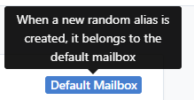

When you want to use aliases on an e.g. commercial website, you can create subdomains for your alias. It can look like 'commercialwebsite.1234@johndoe.simplelogin.com'. The part 'commercialwebsite.1234' can be whatever you want it can be!

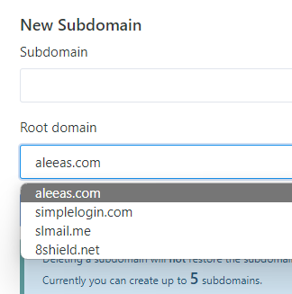

The use of a subdomain is essential because it allows the entire system to identify the default mailbox designated to receive emails. However, I opted to have my custom domain name. To get started, you do not need to spend money to get started with SimpleLogin.io.

## Receiving Emails in Your Basket

Once you have your forwarding email setup you can provide any alias email directly to the commercial website. The alias does not need to exist. SimpleLogin will create one, link it to you default mailbox and will forward you the mailbox. It replaces the sender with the alias.


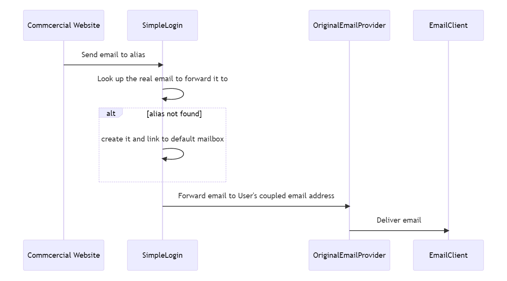
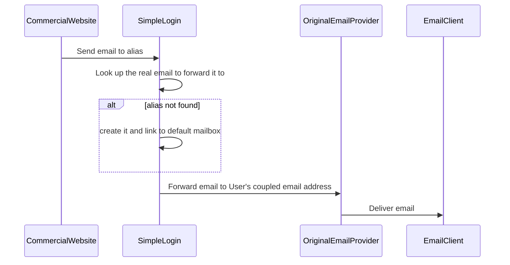

## Bunny-Approved Email Deliveries

I had difficulties understanding how to send an email using the alias from SimpleLogin.

However, it is really that simple. Before you can send an email, create a contact on SimpleLogin. Navigate to SimpleLogin website.

Press on Create Custom Alias

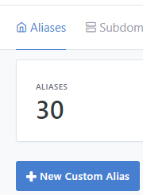

I create an alias with the name: test.perjurer933@simplelogin.com

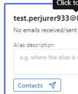

Now you need to define where that SimpleLogin needs to forward the email. Click on contacts and fill in the name of your contact: info@commercialcompany.com.

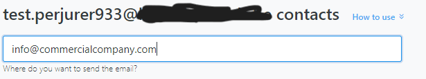

To get an overview, this is what you need to do.


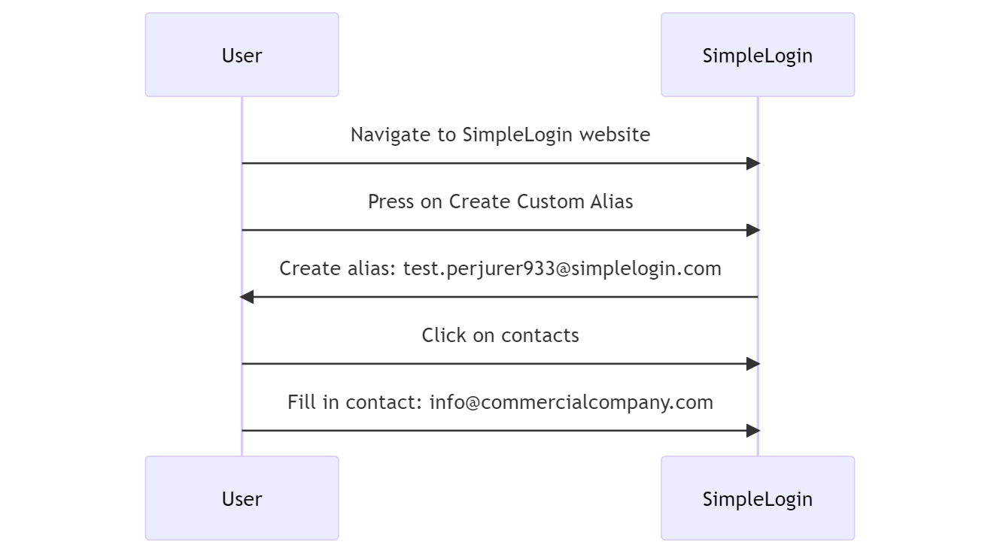
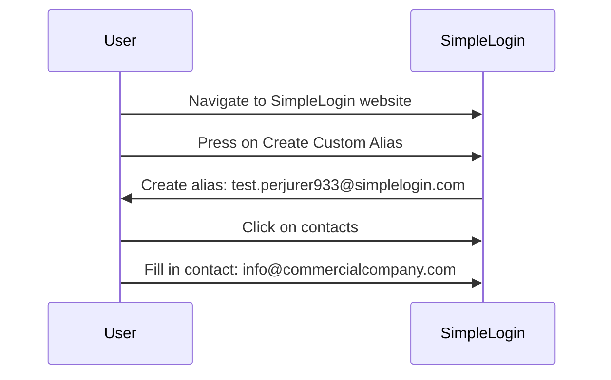

In your email, you can now send a mail to: test.perjurer933.simplelogin.com. Everything will be done for you.

## Hunting for Missing Functionality

[The current setup lacks an SMTP server](https://www.reddit.com/r/Simplelogin/comments/k9vpeq/smtp_relay/). I just want to set up a mail server that does the SimpleLogin magic instead of working with alias in my to/from. That would be an error-proof experience. Using rules to autogenerate alias and throwing errors when the alias is not defined. This would stop human error of forgetting to create an alias if needed.

It is on their [roadmap](https://trello.com/c/mnSYC4AF). If you cannot wait, somebody already created a [SimpleLogin SMTP relay](https://github.com/leoleoasd/simple-login-smtp-relay) server. However, do you really want to go down that road?

# My Egg-sperience Implementing It

Below I will go more in-depth on how I implemented SimpleLogin.

## Prepping the System

I set this up using an existing domain and a subdomain. I needed to make the following steps:

1. **Domain Ownership Verification**: Prove you own the domain by adding a special code (TXT record) given to you.
    
2. **MX Record**: Add two mailbox (MX) records to help emails go to the right place.
    
3. **SPF (Optional)**: Add a special note (TXT record) to let others know your emails are real and not spam.
    
4. **DKIM (Optional)**: Add some name labels (CNAME records) to make your emails more secure and trusted.
    
5. **DMARC (Optional)**: Add a rule (TXT record) to tell others what to do if your email doesn't pass security checks.
    

When you are not familiar with DNS settings, this can overwhelm you. I love the functionality that SimpleLogin offers to easily verify each step that you undertake.

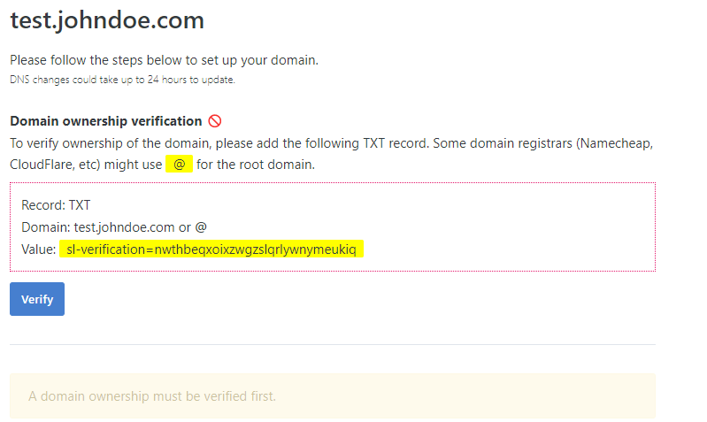

I do not own johndoe.com, so I cannot verify this step.

### Custom Domain Configuration

Configure the DNS records and check out the SimpleLogin page for a smooth experience.

Once you follow the Custom Domain configuration, your dns records looks like the following.

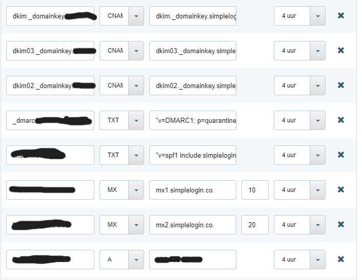

### Bitwarden Integration

I'll show you how to integrate Bitwarden.

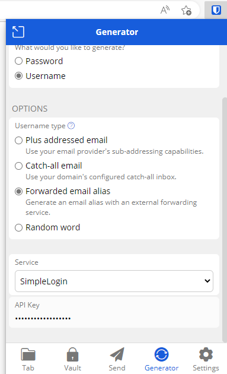

It was difficult to find the functionality of API Key's. However, a simple Google search lead me to the [forum of SimpleLogin.](https://forum.simplelogin.io/t/api-key-create-copy/120)

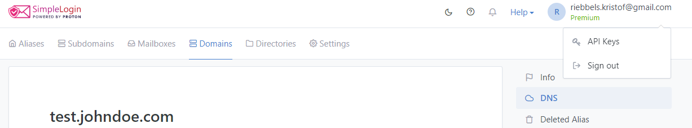

### Defining a naming strategy

I already discussed this in a [previous blog post](https://dotnet.kriebbels.me/the-importance-of-unique-emails-enhancing-your-security#heading-the-catch-all-menace). But it is important to have a naming strategy. A consistent naming strategy helps you easily identify the purpose of each alias and the service it is associated with. This makes it easier to manage your aliases and keep your inbox organized. A structured naming strategy makes it easier to set up filters and rules in your email client. That allows you to automatically sort incoming emails based on their alias.

Here are some naming strategies:

1. **Name + Random Number**: use your name followed by a random number, e.g., [**john.12345@domain.com**](mailto:john.12345@domain.com).
    
2. **Name + Date**: Combine your name with the current date, e.g., [**john.20230409@domain.com**](mailto:john.20230409@domain.com).
    
3. **Name + Service**: Use your name and the name of the service the alias is for, e.g., [**john.netflix@domain.com**](mailto:john.netflix@domain.com).
    
4. **Random Characters**: Create an alias using completely random characters, e.g., [**x4tYz1@domain.com**](mailto:x4tYz1@domain.com).
    
5. **Acronyms + Numbers**: Use acronyms or abbreviations related to the service or your interests, followed by numbers, e.g., [**moviebuff2023@domain.com**](mailto:moviebuff2023@domain.com).
    
6. **Name + Purpose**: Combine your name with the purpose of the alias, e.g., [**john.shopping@domain.com**](mailto:john.shopping@domain.com).
    

I am opting for the way that Bitwarden suggests a name. You can ask Bitwarden to generate an alias and it will generate the alias for you on the site SimpleLogin

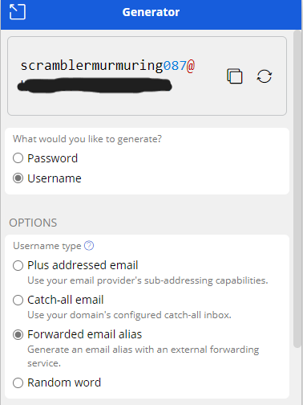

When the generation occurs, I added the name of the commercial website in the prefix as well.

In this case, that would be `commercialwebsite.scramblermurmering087@domain.com`

### Catch-all Strategy Conundrum

Is it wise to enable catch-all functionality indefinitely? What about the potential for recurring spam and automatic alias creation? [Wikipedia is quite sure that this can be abused](https://en.wikipedia.org/wiki/Bounce_message#Classification).

SimpleLogin provides an option to turn off the catch-all functionality. It then works with a regex rule system. I will quote them.

`For a greater control than a simple catch-all, you can define a set of rules to auto create aliases. A rule is based on a regular expression (regex): if an alias fully matches the expression, it'll be automatically created.`

The following image is a print screen of the existing system. You can define a regex prefix rule. That regex rule is coupled with a mailbox. There is a debug zone as well.

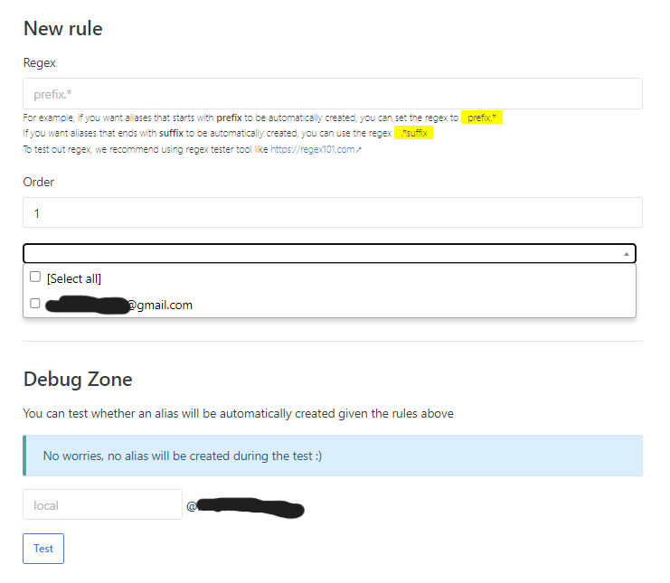

## Into the Easter Bunny's Burrow

It is difficult to work with structure. So sometimes... you just need to do. The more you go down the burrow, the more knowledge you gather.

### Updating Egg-isting Accounts

With the existing setup, I can already start updating my emails. I do not need to specify naming strategies. I want to get a feeling of how this work in practice. I need to update my emails. The problem is, this can take a while. So where do I start?

I have a premium Bitwarden account. [That allows me to get reporting on what login is leaked and what passwords have leaked. There is an entire post about it. I will not repeat it here.](https://bitwarden.com/blog/how-to-use-the-data-breach-report-in-bitwarden/) That helped me to get started with those accounts first.

### Receiving an Email

Discover how an alias email is forwarded to your mailbox. The following is a censored and anonymised extract of an email header.

```plaintext
Delivered-To: john.doe@gmail.com
Received: Sat, 8 Apr 2023 22:48:25 -0700 (PDT)
...
header.from=simplelogin.co
Return-Path: <s1.lmycyibrge3abcdefheydglbagy3dombwhboq.zos4xr6@simplelogin.co>
Received: from mail-2061.simplelogin.co (mail-2061.simplelogin.co. [***])
...
        for <john.doe@gmail.com>
...
Received-SPF: pass (google.com: domain of s1.lmycyibrge3abcdefheydglbagy3dombwhboq.zos4xr6@simplelogin.co designates **** as permitted sender) client-ip=***;
Authentication-Results: mx.google.com;
       dkim=pass header.i=@simplelogin.co header.s=dkim header.b=XronwIgb;
       spf=pass***
       dmarc=pass (p=QUARANTINE sp=QUARANTINE dis=NONE) header.from=simplelogin.co
DKIM-Signature: ***;
Subject: Waiting on confirmation
X-SimpleLogin-Type: Forward
X-SimpleLogin-Envelope-To: commercialwebsite.1234.dummy007@simplelogin.com
From: "CommercialWebsite - info at commercialwebsite.com" <info_at_commercialwebsite_com_ypnadtx@simplelogin.co>
To: commercialwebsite.1234.dummy007@simplelogin.com
...
```

It will tell you that the email journey starts from the Commercial Website, passes through SimpleLogin, and finally is delivered to John Doe's Gmail account. Security checks (DKIM, SPF, DMARC) are performed by SimpleLogin and Gmail during the process.


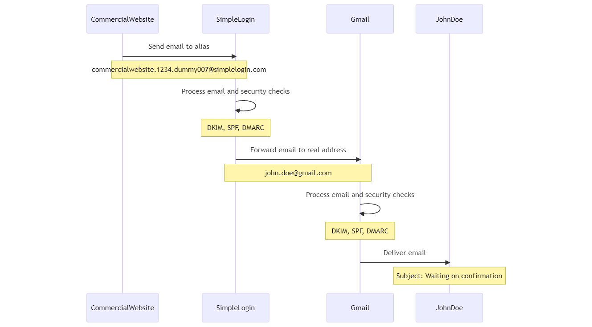
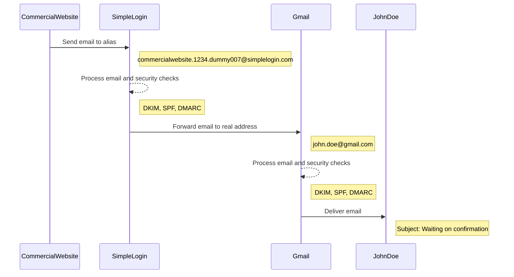

### Sending an email

Let us forget that we received the email from the commercial website. We do not have any aliases yet defined for this website. I'll explain how I initiated an email and how the reply system works, using a SimpleLogin example.

In this example, I wanted my account deleted. I could not initiate the delete sequence on the website. I needed to send an email to that company. I did not want that the company knows what my original email address is.

I went over to my simplelogin.com account. (note that there are browser extensions as well).

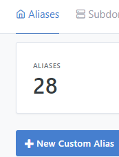

I pressed the New Custom Alias button.

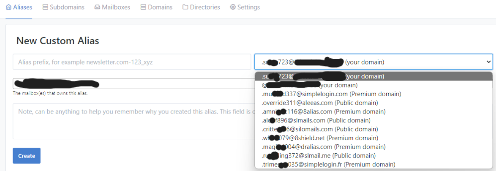

First, create an alias prefix. I would use commercialwebsite.1234.override311@aleeas.com

You select your mailbox, in this story, it would be john.doe@gmail.com.

After I send the email, I can look at the headers. This is what it looks like.

```plaintext
Date: Sat, 8 Apr 2023 09:55:42 +0200
Subject: Delete my account
From: John Doe <john.doe@gmail.com>
To: "Commercial Company | info at commercialcompany.com" <info_at_commercialcompany_com_yblraaaaa@simplelogin.com>
```

I got a reply and that looks the same as the receiving email. Let us take a look.

```plaintext
Delivered-To: john.doe@gmail.com
ARC-Authentication-Results: i=1; mx.google.com;
       dkim=pass header.i=@simplelogin.co header.s=dkim header.b=Qay02Ky8;
       spf=pass 
       dmarc=pass (p=QUARANTINE sp=QUARANTINE dis=NONE) header.from=simplelogin.co
Return-Path: <s1.lmycyibraalbagy3dkojshboq.mtf6b4aaaneq@simplelogin.co>
Received: from mail-200*.simplelogin.co (mail-*.simplelogin.co. [*.*.*.*])
Received-SPF: pass;
Authentication-Results: mx.google.com;
       dkim=pass header.i=@simplelogin.co header.s=dkim header.b=Qay**Ky8;
       spf=pass 
       dmarc=pass (p=QUARANTINE sp=QUARANTINE dis=NONE) header.from=simplelogin.co
Subject: Re: Delete my account
Date: Sat, 08 Apr 2023 10:48:09 +0000 (UTC)
X-SimpleLogin-Type: Forward
X-SimpleLogin-EmailLog-ID: ***
X-SimpleLogin-Envelope-To: info_at_commercialcompany_com_yblraaaaa@simplelogin.com 
From: "Company Website - info at companywebsite.com" <info_at_companywebsite_com_yblrlaaa@simplelogin.co>
To: John D <info_at_commercialcompany_com_yblraaaaa@simplelogin.com>
X-SimpleLogin-Want-Signing: yes
```

You can see that sending and receiving an email works flawlessly.

# Undiscussed functionalities.

There is so much more to investigate. I will list the functionalities here for your convenience. I was missing an [easy overview](https://simplelogin.io/), so let me give that to you.

1. Secure your account with Two-Factor Authentication (2FA) and FIDO-supported security keys.
    
2. Receive updates on new features via newsletters.
    
3. Use custom domains and suffix generators for your aliases.
    
4. Transform sender email addresses into different formats to protect your privacy.
    
5. Enable reverse-alias replacement to hide your contact email when replying.
    
6. Choose sender address inclusion options for reverse-aliases.
    
7. Automatically expand alias info and include website addresses in aliases created via browser extensions.
    
8. Set one-click unsubscribe preferences, quarantine and bounce management.
    
9. Decide how disabled aliases and blocked contacts should be handled.
    
10. Include original sender information in email headers.
    
11. Import and export aliases from other platforms or in CSV format.
    
12. Request a copy of your data according to GDPR regulations.
    
13. Delete your account if you no longer want to use the service.
    

# Outro

I want to reflect on my experiences and the challenges faced. Some websites do not offer account deletion and allow email changes. Sometimes I just want to delete my account and that is not always possible. I also notice that not everyone answers my requests to delete my data or change my email. I will find out if GDPR is useful for me as a person. I am curious if I can execute my rights. How that will go when I file a complaint, will be another story I suppose.

I was surprised by the number of password and username leaks uncovered through Bitwarden reports. Bitwarden and SimpleLogin come at a cost, but it's worth it. I'm still using Gmail but first things first. I am working on decoupling from known websites.

I do want to have a better workflow to create an alias for contact when I need to initiate the email tough. The first time is overwhelming, but now it is okay. I will look into the extensions for the browsers I use.

I need to search for a better way of defining my naming strategy. But at this moment, I have used the catch-all strategy. This means that anybody can mail at that subdomain and it will be delivered that the default mailbox. Off course, by the time this is published, I have disabled that catch-all way of working.

Have a happy easter all!


