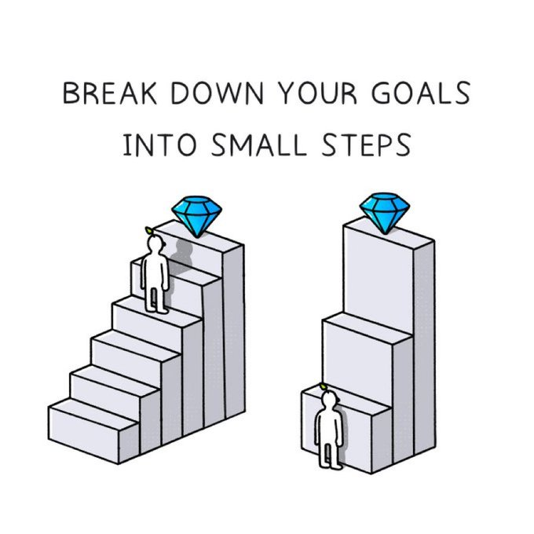
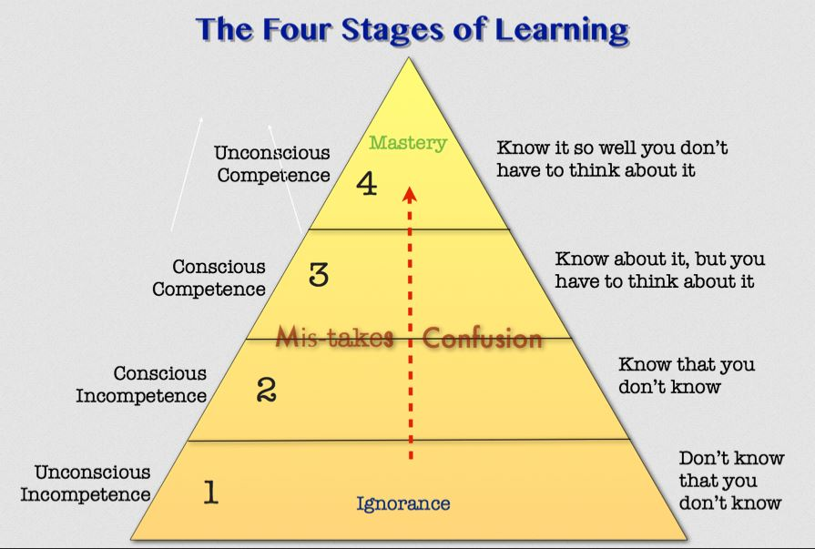

# Previously on...

At the beginning of the year, [I challenged myself](https://dotnet.kriebbels.me/devretro2022-my-adventure-in-consultancy) to pass a tech exam called [AZ-204](https://learn.microsoft.com/en-us/certifications/exams/az-204/). In this blog post, I'll talk about my experience that leads up to taking the exam and share my process of studying for it.

# Context

As a consultant, obtaining certifications demonstrates to potential customers that I have gone beyond the minimum expectations, giving them more confidence when working with me. However, it's crucial to remember that while certification may show a certain level of knowledge, it doesn't necessarily reflect a complete understanding of the subject.

After I began working for [<code>Xebia | Xpirit</code>](http://xpirit.com), one of my tasks was to earn Azure certifications such as the AZ-900 (Azure Fundamentals) and AZ-204 (Azure Developer Associate). I decided to start on the AZ-204 because I was advised to wait on the AZ-900 until Microsoft offered a free course with a seat for taking the exam. I eventually attended one of these free sessions. Those sessions are called [Virtual Training Days.](https://www.microsoft.com/en-us/trainingdays/azure) During that session the moderator informed us that there was no free way to attempt the certification.

With this in mind, I was curious about the process of earning certifications. After all, it's Microsoft - they must have excellent learning material and documentation of [Microsoft](http://docs.microsoft.com), as well as [learning paths on Azure](https://learn.microsoft.com/en-us/training/) and [Pluralsight](https://www.pluralsight.com/paths/developing-solutions-for-microsoft-azure-az-204). Pluralsight even provides a practice exam. I thought I was prepared... so, how challenging could earning a certification be?

# Move heaven and earth to get myself started

Getting started with something can be quite difficult. I know what I want to achieve. Most of the time I have that epic vision in my head that represents the result. If I want to do something new, it requires a lot of will- and mental power to get started on that. Once I am invested, I can dial back and work on a path towards that goal. The next difficult step is being consistent towards achieving that goal.

I make it easier to achieve my goals by breaking them down into smaller, achievable steps that allow me to take gradual progress towards the final objective. This may lead me to work more than just focusing on the end goal alone. However, if getting started seems like a challenge, I take the initial smaller steps to invest myself in the larger goal.

# Getting a certificate is challenging.

When I began studying for the AZ-204 exam, I assumed it would be similar to studying in high school or university. To begin, I focused on theoretical knowledge and started with a Pluralsight video, followed by reading and note-taking on the Microsoft learning path. To evaluate my understanding, I took a free test exam provided by Cybervista and Pluralsight.

Unfortunately, I scored only 22%, indicating my strategy had failed. I felt lost and disillusioned, but I realized I had gained more knowledge on Azure and its ecosystem. Despite my efforts, I still had a long way to go and struggled to pass the first module after investing 16 hours in studying.

[There are 4 steps to master something](https://en.wikipedia.org/wiki/Four_stages_of_competence). Below I have an image, borrowed from [a website called "ZenTools"](http://www.zen-tools.net) that shows the different kinds of learning stages.

[According to Wikipedia](https://en.wikipedia.org/wiki/Four_stages_of_competence), the process of learning a new skill can be divided into four stages. Let me assess my situation using this learning model.

* **Unconscious incompetence**: An individual may not understand or know how to do something and may not recognize their deficit.
    
    * I was not at this stage.
        
* **Conscious incompetence**: That individual becomes conscious of their incompetence and recognizes the value of the new skill.
    
    * According to the test, I was definitely in that stage. I became consicious of my flaws.
        
* In the **conscious competence** stage, the individual comes to understand how to perform the skill but still requires concentration to execute.
    
    * According to that first test, I had no competence. However, I work daily with a subset of Azure Services. It is difficult for me to admit that according to this test, then, I was not consciously competent.
        
* In the **unconscious competence stage**, the skill has been practised so much that it can be performed easily and second nature. The individual may even be able to teach it to others.
    
    * Just not applicable at that point.
        

One of the first steps to learning something is: **Know what to do.** The test on CyberVista confirmed that I did not know what to do. At this point, I reached out to [Bas van de Sande](https://azurecodingarchitect.com/). [I think he knows a thing or two about getting a certification...](https://www.credly.com/users/bas-van-de-sande/badges) He recommend that I learned each day for one hour. For sources, he recommended me [ExamTopics](https://www.examtopics.com/exams/microsoft/az-204/) and [the learning path that Microsoft provided](https://learn.microsoft.com/en-us/certifications/exams/az-204/).

ExamTopics offers me to learn question by question. When learning a subject that is represented by a question, I should use the discussion that is there in the answer section. When the discussion is not clear on a subject, I should visit the given links for that question. By reading the given links, I should know the answer.

# Seek out a learning strategy.

I wanted that achievement as soon as possible. However, I want to brute force my way through. I did not want to wait and have a long process. I wanted instant gratification. I threw out the advice about studying each day for one hour. I did follow up on the advice about studying with the questions provided by ExamTopics.

I have to say I had my brighter moments. One of the upsides that ExamTopics has, is that I can extract a PDF of the questions provided. Starting to go through the questions, I noticed that there is a lot of doubt. There is a provided answer and I have the community's answer as well! With that, I have a lot of discussions and source references. This was hell for me. I "just" want to learn and have clear answers, put on a platter. After some retries and brute forcing, I noticed that it gave me a lot of negative energy.

After some extra brute forcing myself into this, I decided to do it differently. I will learn each day for one hour as Bas suggested. [Kristof Van Hees](https://xpirit.com/team/kristof-van-hees/) has a method that is similar to that of Bas. He recommends me Whizlabs. Whizlabs offers a lot of questions. Whizlabs does not work with PDF but offers an interactive way of working. I got direct feedback if I get it right or wrong. There is a reason why the answer I picked was good or wrong. For each question, Whizlabs provides a source as well. In this phase, I just tried out the questions and my focus was on getting good answers. I verified why I picked the good answer. This way of learning was a better fit for me, but I did not get a feeling I deepened my knowledge of the subjects. I redid the questionnaires multiple times.

I talked to my coach [Kristien](https://www.mypersonalcoach.be/) about this topic. I wanted to postpone my deadline, however, she urged me to try the exam. When I take an exam, I can have a free do-over. What have I got to lose then? At this point, I have accumulated 60 hours worth of studying.

# Let\`s go! Setting a deadline...

With a lot of self-doubts, I bought a seat to take an exam at home. Microsoft offered me to buy access to the MeasureUp test exam as well. I can recommend everybody to do this. Those test exams are more difficult than the ones on Whizlabs. I just took the test exam and score 55%. To pass the Microsoft exams I need 70%. MeasureUp works in the same way as Whizlabs. The difference is that Whizlabs offers more videos and education around the topic. MeasureUp explains why an answer is good and why it is bad. I visited the links they provide for each answer. I started doing that because I did not understand some answers and felt insecure about some topics. Then it hits me, I think I figured out how to study for the exam.

# How to study for the exam.

Remember Bas, that good guy that told me how to study for the exam? Well, it was only ExamTopics that was not working for me. Understand that I will go through a process that is different from the one I know. Expect to fail... hard.

After I understand what kind of sources I got at my disposal, I figured out the following process:

* Ensure that I go through the learning path that Microsoft presents. This is important to understand the concepts and the dependency between all the subjects presented. It is very important for me, to get a good understanding of how all those concepts are linked. Without that, question-based studying offers me no reference points. During the process of finding out what works for me to study, I thought this was not needed. But looking back, I can say that it is not wasted time.
    
* Go watch the videos as a summary.
    
* Go and find my source for questions. I will use Whizlabs again.
    
* For each question:
    
    * Understand the question, do a guess, understand the answers, and visit the source.
        
    * Read the whole page and then go to the next question.
        
* Do this every day for several questions if I want to quantify my progress or work for some time. I will start with ten questions or one hour. I can adjust accordingly after witnessing my progression.
    
* Once I get 70% on the test exams, order my seat to take the exam use MeasureUp and take the exam with confidence. Remember, I got a free do-over.
    

# Summary certification preparation

Below I have made a list of sources:

* [Reddit: r/AzureCertificiaton: az 204](https://www.reddit.com/r/AzureCertification/search/?q=az%20204&restrict_sr=1&sr_nsfw=): I used this source to understand that I am not alone in this.
    
* [Thomas Maurer (MVP): AZ-204 Study Guide: Developing Solutions for Microsoft Azure](https://www.thomasmaurer.ch/2020/03/az-204-study-guide-developing-solutions-for-microsoft-azure/): A recommended source on certifications. Read it before I start. I wish I knew this before I got my certification.
    
* [Microsoft Learn: Exam AZ-204: Developing Solutions for Microsoft Azure - Certifications](https://learn.microsoft.com/en-us/certifications/exams/az-204/). useful to buy my seat for the exam and to buy my access to the MeasureUp test exams.
    
* [Exampro: Az 204 full video](https://www.youtube.com/watch?v=jZx8PMQjobk&t=6199s): A good explanation of the concepts given with taken the examination in mind.
    
* [Pluralsight: Developing Solutions for Microsoft Azure (AZ-204) Learning Path](https://www.pluralsight.com/paths/developing-solutions-for-microsoft-azure-az-204): The videos are good, structured and to the point. However, it feels like there is missing some information at the time of writing. The access to CyberVista is useful as well for having another set of questions to learn from.
    

# Show off your hard work

I recommend adding your certifications to your LinkedIn profile. It's a great way to showcase your skills and achievements to potential employers or potential customers.

Don't be afraid to let others know that you're certified and proud of your accomplishments.

Sometimes people might feel hesitant to share their certifications. Some people fear it might come across as bragging. Others might feel like they don't want to be perceived as arrogant.

However, as long as you are humble and gracious in the way you share your achievements, there's nothing wrong with letting others know about your certifications.

If you want to check out how that is visualised, check mine out here: [Microsoft Certified: Azure Developer Associate - Credly](https://www.credly.com/badges/9b96f7aa-a384-4268-ad53-2bc6e5bf0be4/linked_in_profile)

# Outro

Initially, I had a lot of different points of view when writing this post. Should I just write about how to achieve the Az-204? Should I write about my journey in achieving that certificate? Should I write about the aftereffects of obtaining that certificate? I ended up with a mixture of telling where I failed, what my pitfalls were and how I am going to study for other certifications. I can only hope this can help others as well.

At [Techorama](https://techorama.be/) 2023, I was surprised when some people asked me when I was going to write a new blog post. I like that people are holding me accountable. At the start of my blogging journey, I set a goal for myself, which was to have a weekly blog post in 2023 to build out my authority. I am humbled by this and feel inspired to write more.

In my next post, I will talk about why I stopped blogging for a bit and what helped me regain focus again.

Furthermore, I am still on the path of protecting my privacy. [I listed what I want to blog about](https://dotnet.kriebbels.me/how-to-know-if-your-data-is-leaked) and I intend to keep that promise.

