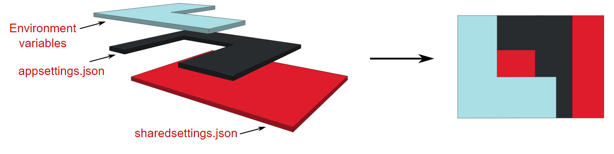

---
date: 2023-06-03
title: "Configuration: The Tangle of Layers, Sections and sources in .NET 6 Development"
seoTitle: ".NET 6 Dev: Config Layers & Sections"
seoDescription: "Explore .NET 6 config management for efficient, secure app development. Improve practices, optimize with layered settings, diverse sources"
datePublished: Sat Jun 03 2023 14:15:06 GMT+0000 (Coordinated Universal Time)
cuid: clig2t5c9000b09jm3l1jg7qe
slug: configuration-the-tangle-of-layers-sections-and-sources-in-net-6-development
cover: /assets/images/blog/2023-06-03-configuration-the-tangle-of-layers-sections-and-sources-in-net-6-development/2023-06-03-configuration-the-tangle-of-layers-sections-and-sources-in-net-6-development.cover.jpeg
tags: dotnet, configuration, secrets, azure-key-vault, appsettings

---

# Previously on...

[In my previous post, I described how I regained focus on my blogging.](https://dotnet.kriebbels.me/once-az-204-is-done-re-engaging-with-my-goals) This time, let us focus on how we can configure our settings in the DotNet "core" world.

# Context

It's not uncommon to come across projects with poorly managed configurations. When I first started building .NET Framework applications, the configuration process seems easy. However, over time, the `<appsettings>` section became more chaotic. [There is a possibility to cut this up into multiple sections, but that was writing a lot of boilerplate.](https://ardalis.com/custom-configuration-section-handlers/) Storing secrets in your configuration was not safe at all. [While there is a way to encrypt your settings](https://matthewregis.dev/posts/encrypting-application-settings-within-app-config), I do not know a lot of people of embracing this way of working. Developing microservices and managing all settings in multiple `web.config` ensures losing the will to live.


The .NET Core configuration is the new cool kid around the block. It provides a more flexible, efficient, and extensible way of handling application configuration.

The new configuration system in .NET Core replaces the `app.config` and `web.config` files used in previous versions of DotNET. That makes it easier to configure applications across multiple environments and platforms.

In .NET Framework web applications, making changes to the `web.config` file would trigger the recycling of the application pool, which would cause all sessions to be lost and all user connections to be dropped. The .NET Core configuration has support for reloading configuration data dynamically without restarting the application, which is a huge benefit for applications running in production that need to be updated or configured on the fly.

Finally, The .NET Core Configuration Framework comes with several providers that support a wide range of sources. The system is designed to be extensible. Developers can create custom configuration providers, handlers, and parsers to support their configuration formats or sources. Because of the extensibility the framework offers, adding secure sources for the storage of sensitive data is just a breeze using the Azure KeyVault!

Despite how much better configuration management has gotten in .NET, I can't help but notice that many developers are still working with outdated and painful techniques. That's why I'm writing this blog post - to talk about the importance of and benefits of properly managing configuration settings in .NET applications. I want to share my knowledge about the capabilities and show my fellow developers colleagues around the world, that it's never too late to start doing things the right way.

In this post, I will explore the layered configuration, grouping of configuration settings and different sources.

Let's discuss some theoretical concepts.

# Layered configuration

Before we try to define a configuration object in code, I want to have an understanding of how settings are defined. A common way to define my settings is to put them in the `appsettings.json` and use the Azure Keyvault. These days, on top of using the `appsettings.json`, there is an option to use the Azure [App Configuration service](https://learn.microsoft.com/en-us/azure/azure-app-configuration/overview) as well.

When I have multiple sources, creating a configuration object is based on the combination of those sources. Some sources could be:

* environment variables,
    
* `appsettings.json` file
    
* `appsettings.{env}.json` file
    
* user secrets,
    
* app configuration service
    
* key vault,
    
* command line arguments
    

A configuration object can be built by a lot of sources. When asking for a configuration value, the system uses the newest value for the asked configuration key. First, it checks environment variables, then app settings, ..., and finally, command line arguments.

[](https://andrewlock.net/exploring-dotnet-6-part-1-looking-inside-configurationmanager-in-dotnet-6/)

The above image comes from the [site of Andrew Lock](https://andrewlock.net/exploring-dotnet-6-part-1-looking-inside-configurationmanager-in-dotnet-6/).

When a key name already exists in other sources, the value will be overridden. I cannot remove a key's value by adding another layer. However, I can override it and set it to `null`.

With that understanding, let's delve into the sections.

# Sections

In .NET Framework, configuration data is stored in the `App.config` file for console/Windows applications and in the `Web.config` file for web applications. The configuration data is stored as XML and contains settings for the application, such as database connection strings, app settings, and more.

While `App.config` and `Web.config` worked well in the past in that period, but it had limitations to be used now.

In .NET 6, sections provide a much more flexible and organized way to work with configuration data:

* Organize configuration data into **logical groups** instead of grouping it by type of configuration like ConnectionStrings, AppSettings,... **without having to write boilerplate code.**
    
* Selectively **override or replace specific configuration** values
    
* Useful for large projects with **different environments**
    
* Add, remove, and modify configuration sections **without affecting other sections**
    
* Define strongly typed classes and validation ***with ease***
    

# Sources

Having covered the way configuration is layered and grouped, we can now examine the sources

### Store settings in a file, not code!

There are a lot of different default configuration providers. The one that is used most is the [JSON provider](https://learn.microsoft.com/en-us/dotnet/api/microsoft.extensions.configuration.json.jsonconfigurationprovider?view=dotnet-plat-ext-7.0). It loads configuration settings from e.g. `appsettings.json`. There are possibilities to use different formats like [INI](https://learn.microsoft.com/en-us/dotnet/core/extensions/configuration-providers#ini-configuration-provider) or [XML](https://learn.microsoft.com/en-us/dotnet/core/extensions/configuration-providers#xml-configuration-provider). There are possibilities to use different types of sources: databases and REST-APIs,... T[here is an option to write a custom configuration source and provider](https://learn.microsoft.com/en-us/dotnet/core/extensions/custom-configuration-provider), which can be useful during migration from .NET Framework to .NET 6. Another use case that I can think of is, are needed transformations to be done before consuming the values.

### Store sensitive data in a vault

[Azure Key Vault](https://azure.microsoft.com/en-us/products/key-vault/) is a critical component for securing sensitive data in cloud-based applications. It provides a centralized, highly secure storage environment for managing cryptographic keys, secrets, and certificates. Key Vault helps prevent unauthorized access, offers key management functionalities, and ensures compliance with regulations. Its integration with Azure services simplifies secure secret retrieval, making it an essential tool for protecting valuable information in the cloud.

**Dashing**

To store a setting in the key vault, use double dashes (`--`) before the value. This ensures that the value is treated as a single entity instead of being split into separate key-value pairs, as double dashes are used to separate these pairs in the configuration.

For example, if I had a secret that had the value `my--secret--value`, and I tried to store it without using double dashes, it would be split into three separate key-value pairs: `my`, `secret`, and `value`.

If we were to store this secret in a configuration file using double dashes, it would look like this:

```json
{
  "my": {
    "secret": {
      "value": true
    }
  }
}
```

**Prefix Dashes**

When we add double dashes before the value `--another--secret--value`, it will be saved as a single value.

```json
{
  "another--secret--value": true
}
```

This is important because it ensures that our key-value pairs are correctly interpreted and that the value we are trying to save is treated as a single value and not as a separate key-value pair.

Let us explore the centralization of settings of multiple services that belong logically together, to make life just a lot easier.

## Store on-the-fly-needed settings using a central service!

The following video was helpful as it provided insight into the Azure App Configuration service. However, I will give a summary as well for the comfort of the reader.

%[https://www.youtube.com/watch?v=t6m13DxUJMc] 

Azure App Configuration service makes it possible to keep the application configurations in a single location. I will be able to store settings for different environments like development, testing, and production. I can change on the fly my configuration without redeploying it.

To top it off, the Azure App Configuration service allows applications to retrieve configuration data from Azure Key Vault. The application does not need to have any connection anymore with the Azure Key Vault.

Having the configuration read by the application is as easy as adding a package. Next is to configure an additional source to the configuration. It is possible to read configuration values from Azure App Configuration before falling back to `appsettings.json`.

Visit the following link: [Quickstart: Create an Azure App Configuration store | Microsoft Learn](https://learn.microsoft.com/en-us/azure/azure-app-configuration/quickstart-azure-app-configuration-create?tabs=azure-portal).

## Do not commit sensitive data: `secrets.json`

The `secrets.json` file is used to store sensitive values. Those values could be ClientSecrets, Passwords, API keys,... [That kind of information should not be committed to my code repository](https://www.polar.security/post/sensitive-data-exposure).

I can manage the user secrets in Visual Studio by right-clicking on a project

[](https://learn.microsoft.com/en-us/aspnet/core/security/app-secrets?view=aspnetcore-7.0&tabs=windows)

[JetBrains Rider](https://www.jetbrains.com/rider/) does not offer a user interface. [I need to download and install a plugin for that.](https://plugins.jetbrains.com/plugin/10183--net-core-user-secrets)

However, I like to manage it myself. The `secrets.json` is stored at the following location: `%APPDATA%\Microsoft\UserSecrets\<user_secrets_id>\secrets.json.` In the preceding file path, the `<user_secrets_id>` is mentioned. When configured, I can look into my `.csproj` file and look for the the `UserSecretsId` value. The following is an example:

```xml
<PropertyGroup>
  <TargetFramework>net6</TargetFramework>
  <UserSecretsId>79a3edd0-2092-40a2-a04d-dcb46d5ca9ed</UserSecretsId>
</PropertyGroup>
```

The content of a secrets.json looks like following json.

```json
{
  "my:secret:value": "foobar"
}
```

For a web application, this will be automatically loaded and override or add the value for

```json
{
  "my": {
    "secret": {
      "value": true
    }
  }
}
```

# What\`s next?

In one of my upcoming posts, I will first do a small recap with a drawing. Then I discuss the configuration defaults the `HostBuilder` class and [ASP.NET](http://ASP.NET) Core provide. I will explain how to consume configuration data in `Program.cs` using the `IConfiguration` interface and how it differs from `ConfigurationManager`. Plus, I will explore sections in my configuration using the `.AddOptions<>` method. Furthermore, I will demystify the difference between `.Configure<>` and `.AddOptions<>` and the difference between `IOptions<>`, `IOptionsMonitor<>`, or `IOptionsSnapshot<>`. Finally, I will give an insight moment on how I debug the startup validation of my configuration when deployed my service is deployed in Azure.

# Outro

This is a new format that I am playing with. I am in doubt if I want to have multiple posts that tackle a section or use the format that I am used to when writing an article for Xprt [Magazine](https://xpirit.com/download/). [I aim for a reading time of between four and thirteen minutes.](https://www.wyliecomm.com/2022/06/blog-post-length/)

I am always happy to get feedback. Let\`s engage!


