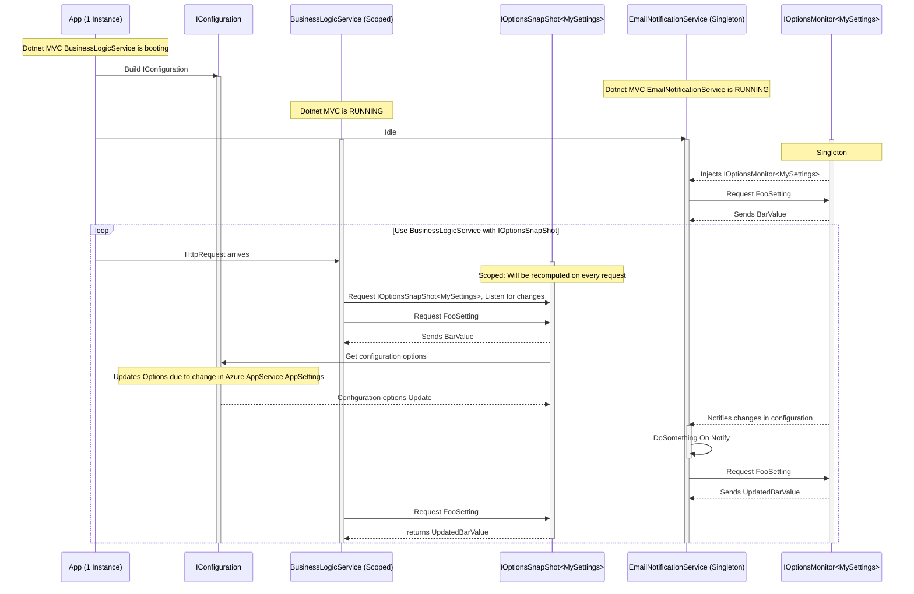

## Previously on...

In my previous blog posts, [I wrote about the modularity of the configuration that Dotnet 6 offers. About sources and sections and how to register them.](https://dotnet.kriebbels.me/configuration-the-tangle-of-layers-sections-and-sources-in-net-6-development) [I mentioned how to manually build the configuration object and how to use the default sources that Dotnet 6 offers. I also mentioned security-related information: using secrets.json, AppConfiguration Service and Azure key vault.](https://dotnet.kriebbels.me/dive-into-code-unleashing-the-dotnet-6-configuration-management)

## Context

When coaching individuals, I've observed that when transitioning from the DotNet Framework to Dotnet Core, people tend to instinctively want to work by what they know. That is not strange at all. In the article [Why Do Your Employees Resist New Tech?](https://hbr.org/2020/08/why-do-your-employees-resist-new-tech) are some reasons mentioned like lack of skills, costs, complexity, and infrastructure challenges. By writing these [blog posts](https://dotnet.kriebbels.me), I want to help inspire fellow developers to embrace the new way of working and actually show how *cool* is the stuff that Microsoft has realised! [Microsoft also promotes some good techniques on how to create architectures and code.](https://learn.microsoft.com/en-us/dotnet/architecture/modern-web-apps-azure/architectural-principles)

I notice that there is little awareness about using the strongly typed classes that represent (part of) sections and how to validate the settings on the startup of an application. A big difference in design is the possibility to monitor changes and ensure that the application reacts to those changes, without the need to reboot the application.

In this post, I mention how to consume configuration, and the logic behind the different ways by showing sequence diagrams made in Mermaid Live. I also show how to debug a startup error on an Azure app service when a configuration setting does not validate.

## Consume IConfiguration in Program.cs

I use this way of working when setting up my services or consuming settings in the `Program.cs`. However, I suggest binding sections to objects mentioned in my [previous post.](https://dotnet.kriebbels.me/dive-into-code-unleashing-the-dotnet-6-configuration-management) This ensures type safety and avoids working with strings.

To read from `IConfiguration` or `ConfigurationManager`, I can use the `GetValue` method and specify the configuration key, which can be composed of multiple sections separated by colons (`:`). That colon will be there when there is a hierarchy defined. In the case of the configuration key `--another--secret--value`, I need to read `another--secret--value`. This is explained in the section above named "Prefix Dashes".

```csharp
    _config["my:secret:value"]
    _config.GetValue<bool>("my:secret:value")
    _config["another--secret--value"]
    _config.GetValue<bool>("another--secret--value")
```

Another important thing to note is that when you use an `IConfiguration` object or custom binding to a class, the validation of settings will not be triggered. The validation specified by `ValidateOnStart` will be activated, as you might guess, at the start of the application. This means I cannot rely on validation because it will not be triggered before calling `app.Run()`, `app.Start()`, or `app.StartAsync`. After all, I am using configuration to set up my application.

## Consume `IOptions***<>` in the Services

I may use the `IConfiguration` and `ConfigurationManager` objects to configure my services. The idea is that I use the `IOptions<MySettings>` object in my services. DotNet will make the mapping between the sources and the `IOptions` objects for me. This just works nicely!

[](https://jeff-wheeler.com/in-the-arena/)

When you want to cringe again at how we need to do it in Net Framework, go read this old documentation: [How to: Create Custom Configuration Sections Using ConfigurationSection | Microsoft Learn](https://learn.microsoft.com/en-us/previous-versions/aspnet/2tw134k3(v=vs.100))

### Inject in a Service: `IOptions<>`, `IOptionsMonitor<>`, or `IOptionsSnapshot`

Let me register the `MySettings` object using the `.AddOptions` method.

```csharp
services.AddOptions<MySettings>(Configuration.GetSection("MySettings"));
```

In a service or any other class where I want to use the configuration, I can inject `IOptions<MySettings>` in the constructor:

```csharp
public class MyController : Controller
{
    private readonly IOptions<MySettings> _mySettings;

    public MyController(IOptions<MySettings> mySettings)
    {
        _mySettings = mySettings;
    }
    
    public IActionResult Index()
    {
        return View();
    }
}
```

That's it! Now I can use the `MySettings` configuration object in my code without worrying about parsing or loading configuration data myself.

[](https://steemit.com/fsharp/@marnee/cross-platform-development-with-net-core-and-f)

### Difference Between `IOptions`, `IOptionsSnapshot`, and `IOptionsMonitor`

Below is a comparison of the three options interfaces:

| Interface           | Lifetime    | Use Case                                  | Change Notification                |
|---------------------|-------------|--------------------------------------------|------------------------------------|
| `IOptions`          | Singleton   | Application-wide, static configuration     | No                                 |
| `IOptionsSnapshot`  | Scoped      | Per-request, updated per scope             | No (but reloaded per scope)        |
| `IOptionsMonitor`   | Singleton   | Application-wide, needs to react to changes| Yes                                |

#### `IOptions`

`IOptions` is the base interface for accessing configuration options. It is injected as a singleton service and cached for the lifetime of the application. It returns a single snapshot of the configured options at the time of its initialization.

```csharp
using Microsoft.Extensions.Options;

public class MyService
{
    private readonly IOptions<MySettings> _options;

    public MyService(IOptions<MySettings> options)
    {
        _options = options;
    }

    public string GetOptionValue()
    {
        return _options.Value.MyOptionValue;
    }
}
```

#### `IOptionsSnapshot`

`IOptionsSnapshot` is a variation of `IOptions` that updates its values dynamically as it listens for changes in the underlying configuration system. This makes it more suitable for use in long-lived scopes such as request-scope services.

```csharp
using Microsoft.Extensions.Options;

public class MyService
{
    private readonly IOptionsSnapshot<MySettings> _options;

    public MyService(IOptionsSnapshot<MySettings> options)
    {
        _options = options;
    }

    public string GetOptionValue()
    {
        return _options.Value.MyOptionValue;
    }
}
```

#### `IOptionsMonitor`

`IOptionsMonitor` is similar to `IOptionsSnapshot`, but with the added capability of allowing registration for change notifications. It is useful when you want to monitor changes to the configuration data and perform actions based on the changes.

```csharp
using Microsoft.Extensions.Options;

public class MyService : IDisposable
{
    private readonly IOptionsMonitor<MySettings> _options;
    private readonly IDisposable _optionsChangeToken;

    public MyService(IOptionsMonitor<MySettings> options)
    {
        _options = options;
        _optionsChangeToken = _options.OnChange((newOptions) => {
            // Perform actions based on the new options
        });
    }

    public string GetOptionValue()
    {
        return _options.CurrentValue.MyOptionValue;
    }

    public void Dispose()
    {
        _optionsChangeToken.Dispose();
    }
}
```

Let me illustrate the above using some real use cases.

Suppose I have an ASP.NET Core application that uses `IOptions` to access configurations related to the database connection string, cache settings, and other application settings. Since `IOptions` is cached for the lifetime of the application, it is useful when I need to access these configuration settings multiple times throughout the lifetime of the application. The mermaid diagram below illustrates this.

```mermaid
sequenceDiagram
    participant BusinessLogicService
    participant IOptions<MySettings>
    participant MySettings
    participant Configuration Source
    participant Configuration Cache

    loop [Read Options from Sources]
        IOptions<MySettings>->>Configuration Source: Read source
        Configuration Source-->>IOptions<MySettings>: Create MySettings
        IOptions<MySettings>->>Configuration Cache: Cache ConfigurationOptions for the lifetime of the application
    end

    loop
        BusinessLogicService->>IOptions<MySettings>: Request IOptions<MySettings>
        IOptions<MySettings>->>Configuration Cache: Request IOptions<MySettings>
        Configuration Cache-->>IOptions<MySettings>: IOptions<MySettings>
        IOptions<MySettings>-->>BusinessLogicService: Inject IOptions<MySettings>
    end
```

When I have a long-lived scoped service such as a request-scope service, I would need to use `IOptionsSnapshot`. For instance, suppose I have a request-scope service that provides caching for API responses, and I configure the cache duration using `IOptionsSnapshot`. In this case, `IOptionsSnapshot` ensures that the cache expiration time is updated in real-time as soon as the configuration value gets updated, making it more suitable for long-lived scoped services like request-scope services. The mermaid diagram below illustrates this.

```mermaid
sequenceDiagram
    participant BusinessLogicService as Scoped Service
    participant IOptionsSnapshot as IOptionsSnapshot<MySettings>
    participant IConfiguration
    participant Configuration Source
    Note over BusinessLogicService: Dotnet MVC App is booting
    loop [Read Options from Sources]
        Configuration Source->>IConfiguration: Read source
        IConfiguration-->>Configuration Source: Create IConfiguration
    end
    Note over BusinessLogicService(Scoped Service): Dotnet MVC App is RUNNING
    loop
        Note over BusinessLogicService(Scoped Service): HttpRequests comes in
        BusinessLogicService(Scoped Service)->>IOptionsSnapshot-MySettings>: Request IOptionsSnapshot<MySettings>
        IOptionsSnapshot-MySettings>>IConfiguration: Get configuration options
        IConfiguration-->>IOptionsSnapshot-MySettings>: Configuration options
        IOptionsSnapshot-MySettings>-->>BusinessLogicService(Scoped Service): Injects IOptionsSnapshot<MySettings>
        BusinessLogicService(Scoped Service)->>IOptionsSnapshot-MySettings>: Request FooSetting
        IOptionsSnapshot-MySettings>-->>BusinessLogicService(Scoped Service): returns BarValue
        IConfiguration->>Configuration Source: Listen for updates
        Configuration Source-->>IConfiguration: Notifies updates
        BusinessLogicService(Scoped Service)->>IOptionsSnapshot-MySettings>: Request FooSetting
        IOptionsSnapshot-MySettings>-->>BusinessLogicService(Scoped Service): returns BarUpdatedValue
        BusinessLogicService(Scoped Service)->>BusinessLogicService(Scoped Service): Dispose
    end
```

Suppose I have an application where I need to monitor changes to the configuration data and perform actions based on the changes. In this case, I would use `IOptionsMonitor`. For example, imagine that I have an email notification service in my application, and I have set the `MySettings` section in the Azure AppService AppSettings. If at some point I need to change the values of the `MySettings` section, it triggers change notifications, which the `IOptionsMonitor` listens to and subsequently performs necessary actions like reconnecting to the new server. The mermaid diagram below illustrates this and shows the difference with the `IOptionsSnapshot` as well.



### IOptions Startup Validation Checkup in Azure Portal

Remember the following line of code:

```cs
serviceCollection.AddOptions<MyViewOnSettings>("mysettings").ValidateOnStart().ValidateDataAnnotations();
```

When a service encounters validation errors during startup, it will return an HTTP 500 (.xx) response. When developing locally, I can run in debug mode to identify issues. To gain insight into what's happening in the cloud, Azure provides access to the Application Event Log, where I can find startup errors caused by the validation of options.

In the Azure App Service page, select the Diagnose and solve problems tab, then click on the Diagnostic Tools option. Within the Diagnostic Tools tab, choose Application Event Logs to view the list of events.

[](https://thebernardlim.com/azure-app-service-event-logs/)

Read more about this on the following page: [How to view Azure App Service Event Logs? - Bernard Lim | Azure | .NET | SharePoint | M365](https://thebernardlim.com/azure-app-service-event-logs/)

## Do You Want More?

While creating this post, I accessed a lot of sources. A couple of posts stood out.

[](https://makeameme.org/meme/give-credit-where-f897a5fa1f)

- [Configuration in ASP.NET Core | Microsoft Learn](https://learn.microsoft.com/en-us/aspnet/core/fundamentals/configuration/?view=aspnetcore-7.0)
- [Validated Strongly Typed IOptions (kaylumah.nl)](https://kaylumah.nl/2021/11/29/validated-strongly-typed-ioptions.html)
- [Configuration (andrewlock.net)](https://andrewlock.net/tag/configuration/)
- [Understanding IOptions, IOptionsMonitor, and IOptionsSnapshot in .NET 7 | Code4IT](https://www.code4it.dev/blog/ioptions-ioptionsmonitor-ioptionssnapshot/)
- [How to view Azure App Service Event Logs? - Bernard Lim | Azure | .NET | SharePoint | M365](https://thebernardlim.com/azure-app-service-event-logs/)
- [Options pattern in ASP.NET Core | Microsoft Learn](https://learn.microsoft.com/en-us/aspnet/core/fundamentals/configuration/options?view=aspnetcore-7.0#ios)

## Outro

This concludes the theory about Configuration. I mentioned in my first post I will make a drawing. That is underway. I am trying out some doodling techniques on my tablet. I will post it, with a summary and links to all these blog posts, later this year. For now, it is time to write about different topics.

Did you like this three-part series? What would you change? What information are you missing? Let us connect and engage!
