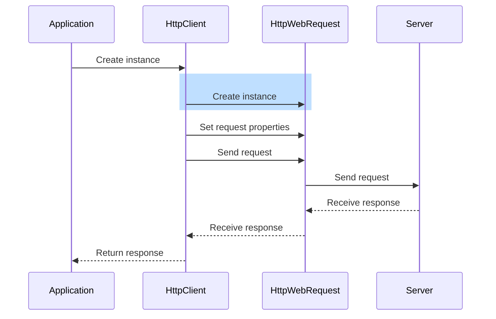
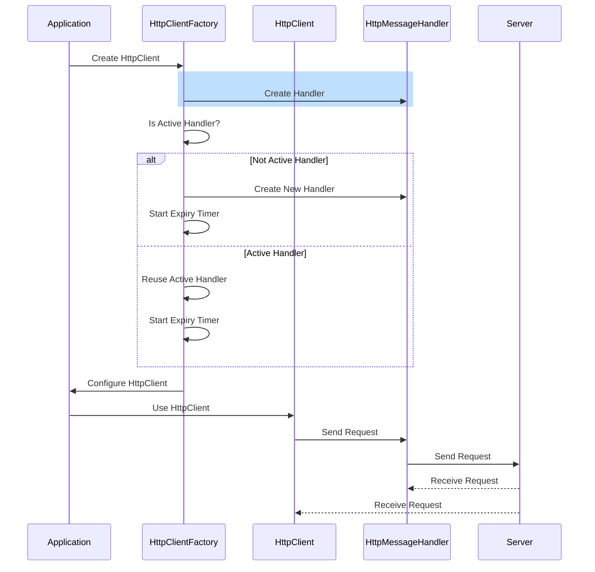

# Previously on...

Change is inevitable! I often find myself diving into new codebases and projects, each with its own set of challenges. [Previously I explored the IConfiguration of DotNet with references to Net Framework](https://dotnet.kriebbels.me/configuration-the-tangle-of-layers-sections-and-sources-in-net-6-development). I will explore now a scenario that I am tasked with modernizing an application's `HttpClient` usage.

# Context

I arrive at the customer's site, ready to dive into the codebase. As I explore the application, I notice that the `HttpClient` usage is outdated and relies on manual and repetitive configuration. Each request is created and managed individually, with setting [`BaseUri`](https://learn.microsoft.com/en-us/dotnet/api/system.net.http.httpclient.baseaddress?view=net-7.0), [`OAuth2` Headers](https://www.oauth.com/oauth2-servers/making-authenticated-requests/) and [`APIM` Subscription keys](https://learn.microsoft.com/en-us/azure/api-management/api-management-subscriptions) and disposing of the `HttpClient`. That repetitiveness leads to code duplication. Manual disposing of the HTTP client can lead to performance issues.

However that the codebase is in DotNet 6, why are developers still using the same way of working as in .Net Framework?

There are numerous reasons. Some people are working with .NET Framework for a long time! While the syntax is the same, DotNet is built from the ground up. Working with the same syntax gives a false sense of familiarity.

Another possibility is that developers may not be fully aware of the benefits and advantages of using HttpClient how it is intended to use.

Code sometimes seems just to simple too, which can feel like a hassle for the untrained. For simple use cases where only a few HTTP requests are made, using HttpClient with a `using` statement just seems easy to do.

Migrating an entire codebase to adopt a new way of working, without coaching and guidance, can be a time-consuming and resource-intensive process. Developers might prioritize other tasks and will take shortcuts, wich will lead to technical dept in the future.

## Problems with DotNet Framework HttpClient

The .Net Framework `HttpClient` had its problems. The `HttpClient` had limited control over connection management. It did not handle socket exceptions or connection failures gracefully. That leads to issues when dealing with unreliable networks or high-traffic scenarios.

It also has limited timeout-handling capabilities. I had to rely on workarounds or custom code to implement timeouts for HTTP requests.

In the old days, the `HttpClient` was not designed with dependency injection in mind. This made it challenging to mock or replace `HttpClient` instances during unit testing. It required creating a wrapper or using complex techniques to inject a mock implementation. The tightly coupled nature of `HttpClient` made it difficult to isolate and mock its behaviour.

The `HttpClient` had limited flexibility in handling request and response content. It lacked built-in support for [content negotiation](https://developer.mozilla.org/en-US/docs/Web/HTTP/Content_negotiation), deserialization, or handling different media types.

[Creating a new instance of HttpClient for each request](https://www.reddit.com/r/dotnet/comments/pzce7d/whats_the_deal_with_httpclient/) in the .NET Framework had performance implications. It resulted in the overhead: [DNS resolution](https://www.aspnetmonsters.com/2016/08/2016-08-27-httpclientwrong/) and [TCP connections](https://deaddesk.top/http-client-explained-with-netstat/)

# DotNet HttpClient

The HttpClient has a lot of improvements:

* in making HTTP requests:
    
    * performance,
        
    * efficiency
        
    * flexibility
        
* with features:
    
    * [connection pooling](https://learn.microsoft.com/en-us/dotnet/api/system.net.http.httpclient?view=net-8.0#:%7E:text=You%20can%20set%20some%20additional%20timeouts%20if%20you%20pass%20in%20a%20SocketsHttpHandler%20instance%20when%20constructing%20the%20HttpClient%20object%3A),
        
    * [automatic decompression](https://learn.microsoft.com/en-us/dotnet/api/system.net.http.httpclienthandler.automaticdecompression?view=net-7.0),
        
    * [timeout handling](https://learn.microsoft.com/en-us/dotnet/api/system.net.http.httpclient?view=net-8.0#:%7E:text=You%20can%20set%20some%20additional%20timeouts%20if%20you%20pass%20in%20a%20SocketsHttpHandler%20instance%20when%20constructing%20the%20HttpClient%20object%3A),
        
    * [HTTP/2 support](https://www.siakabaro.com/use-http-2-with-httpclient-in-net-6-0/)
        

## DotNet & Framework

In the .NET Framework, the `HttpClient` creates HTTP requests. Behind the scenes, `HttpClient` used the `HttpWebRequest` class to perform the actual network communication. This meant that each **HttpClient instance created a new underlying HttpWebRequest**.

Let us take a look at the sequence diagram:



The HttpClient has been completely reworked to address the limitations. The new `HttpClient` is a [cross-platform](https://learn.microsoft.com/en-us/dotnet/api/system.net.http.socketshttphandler?view=net-7.0) implementation. It uses the new `HttpMessageHandler`. That `HttpMessageHandler` provides an efficient and performant way to make HTTP requests.

Let's take a look at the updated sequence diagram to understand the changes.



In the image above, the HttpClient does not rely on the class HttpWebRequest. I The sequencediagram shows that there is a difference between setting up the Httpclient and using the `HttpClient`. The `HttpClient` uses the [HttpMessageHandler](https://github.com/dotnet/runtime/blob/release/7.0/src/libraries/Microsoft.Extensions.Http/src/DefaultHttpClientFactory.cs) to handle the http requests. There is no more overhead of creating a new instance for each request. This results in improved performance!

## DotNet HttpClient Features

Now that I have explored the changes in HttpClient, let's take a closer look at some of the new features and improvements.

The new HttpClient introduces connection pooling. This allows multiple requests to reuse the same underlying TCP connection. This significantly improves performance by reducing the overhead of establishing new connections for each request. The HttpClient handles the decompression like [`gzip`](https://en.wikipedia.org/wiki/Gzip) or [`deflate`](https://en.wikipedia.org/wiki/Deflate)! Besides connection pooling and auto decompression, the HTTP client provides better control over request timeouts. I can now set individual timeouts for different stages of the request. Those stages are:

* establishing a connection,
    
* sending the request,
    
* and receiving the response.
    

This will help my application handle timeouts and prevent bottlenecks.

To keep up with modern standards, the HttpClient supports HTTP/2. That is the latest version of the HTTP protocol. HTTP/2 offers improved performance by allowing multiple requests to be multiplexed over a single TCP connection. This results in faster web applications. Read more about it on [Cloudflare](https://www.cloudflare.com/en-gb/learning/performance/http2-vs-http1.1/).

# How to use it?

* Create your own HttpClient or... **( do not please)**
    
* Use the HttpExtension methods and thus use the `IHttpClientFactory`
    

[The HttpClientFactory is a feature introduced in .NET Core 2.1 and continued in .NET 5/6](https://stackoverflow.com/questions/18976042/httpclientfactory-create-vs-new-httpclient). That provides a centralized and efficient way to create and manage HttpClient instances.

Microsoft does lever us [official guidance](https://learn.microsoft.com/en-us/dotnet/fundamentals/networking/http/httpclient-guidelines) on what to use. `.AddHttpClient` and/or the `HttpClientFactory`.

> `HttpClient` instances created by `IHttpClientFactory` are intended to be **short-lived**.
> 
> * Recycling and recreating `HttpMessageHandler`'s when their lifetime expires is essential for `IHttpClientFactory` to ensure the handlers react to DNS changes. `HttpClient` is tied to a specific handler instance upon its creation, so new `HttpClient` instances should be requested in a timely manner to ensure the client will get the updated handler.
>     
> * Disposing of such `HttpClient` instances **created by the factory** will not lead to socket exhaustion, as its disposal **will not** trigger disposal of the `HttpMessageHandler`. `IHttpClientFactory` tracks and disposes of resources used to create `HttpClient` instances, specifically the `HttpMessageHandler` instances, as soon their lifetime expires and there's no `HttpClient` using them anymore.
>     

### Approaches

There are multiple ways of working with the HTTP client. I made a summary from [Use the IHttpClientFactory - .NET | Microsoft Learn](https://learn.microsoft.com/en-us/dotnet/core/extensions/httpclient-factory#httpclient-lifetime-management) into an overview table.

| Usage | How Registered in ServiceCollection | How Consumed in Code | When to Use | Pros | Cons | Important Notes | Who is Disposing the HttpClient? | Who is Disposing the Handler? |
| --- | --- | --- | --- | --- | --- | --- | --- | --- |
| Basic Usage | `services.AddHttpClient()` | `IHttpClientFactory.CreateClient()`OR`constructor(HttpClient httpClient)` | Refactoring an existing app that creates HttpClient instances. | Simple | No control over the lifetime of HttpClient instances. | **Automatic pooling** and management of HttpClientMessageHandler instances. | Disposed by the factory | Disposed by the factory |
| Named Clients | `services.AddHttpClient("Name", ...)` | `IHttpClientFactory.CreateClient("Name")` | Multiple distinct uses of HttpClient with different configurations. | Easy configuration of different clients with specific headers, base URLs, etc. | Requires manual client retrieval using the client name each time a request is made. | **Automatic pooling** and management of HttpClientMessageHandler instances, separate **for** each ***named* client**. | Disposed by the factory | Disposed by the factory |
| Typed Clients | `services.AddHttpClient<T>()` | `HttpClientFactory<T>.CreateClient(...)`OR `constructor(HttpClient httpClient)` | When consuming a specific HttpClient with typed handlers. | Strong typing and improved IntelliSense support. | Requires creating and maintaining a separate class for each typed client. | **Automatic pooling** and management of HttpClientMessageHandler instances, separate **for** each ***typed* client**. | Disposed by the factory | Disposed by the factory |
| Generated Clients | `services.AddRefitClient<T>()` | `IServiceProvider.GetRequiredService<T>()` OR `constructor(T refitClient)` | When using third-party libraries like Refit for REST APIs. | Dynamic generation of HttpClient implementations for REST APIs. | Limited control over the generated client configuration. | **Automatic pooling** and management of HttpClientMessageHandler instances, separate **for** each ***generated* client**. | Disposed by the **consumer** | Disposed by the **consumer** |

Using direct `HttpClient` injection involves manually configuring an instance of HttpClient with the handlers into the services. **Do not use this approach.**

The `IHttpClientFactory` provides a centralized way of managing and reusing `HttpClient` instances. This approach helps address issues related to long-lived `HttpClient` instances, including DNS changes, connection pooling, and proper resource disposal. By calling the `AddHttpClient` method on the service collection, there is a `HttpClient` is ready to be injected into the services.

This approach is suitable for smaller or simpler projects where direct injection is sufficient. [To quote Microsoft](https://learn.microsoft.com/en-us/dotnet/core/extensions/httpclient-factory#):

> Lifetime management of `HttpClient` instances created by `IHttpClientFactory` is completely different from instances created manually. The strategies are to use either **short-lived** clients created by `IHttpClientFactory` or **long-lived** clients with `PooledConnectionLifetime` set up. For more information, see the [**HttpClient lifetime management**](https://learn.microsoft.com/en-us/dotnet/core/extensions/httpclient-factory#httpclient-lifetime-management) section and [**Guidelines for using HTTP clients**](https://learn.microsoft.com/en-us/dotnet/fundamentals/networking/http/httpclient-guidelines).

I need to define multiple `HttpClient` configurations to access multiple endpoints. I have to use a key that uniquely identifies a HttpClient configuration. This is done by using `AddHttpClient("key")` on the service collection.

To use a specific configuration of the `HttpClient`, I inject the `IHttpClientFactory` and use the key that corresponds to that configuration. The `HttpClient` should be disposed of when using the IHttpClientFactory.

Instead of working with named `HttpClient`'s creations on the `IHttpClientFactory`, Typed clients are a convenient and type-safe way to work with. Register it with the dependency injection container using the `AddHttpClient<IServiceInterface,MyHttpClientConsumerService>` method. The service is registered in the container as **transient**! I do not need to register it again! Typed clients make HTTP calls more structured and maintainable. It is important that the `HttpClient` that is not injected into a singleton service! [I quote Microsoft on this one:](https://learn.microsoft.com/en-us/dotnet/core/extensions/httpclient-factory#avoid-typed-clients-in-singleton-services)

> Typed clients are expected to be **short-lived** in the same sense as `HttpClient` instances created by `IHttpClientFactory` (for more information, see [`HttpClient` lifetime management](https://learn.microsoft.com/en-us/dotnet/core/extensions/httpclient-factory#httpclient-lifetime-management)). As soon as a typed client instance is created, `IHttpClientFactory` has no control over it. If a typed client instance is captured in a singleton, it may prevent it from reacting to DNS changes, defeating one of the purposes of `IHttpClientFactory`.

When using **typed** clients, I have two options for creating them. The default approach uses the `IHttpClientFactory` behind the scenes, using `.AddHttpClient<,>` method. The `HttpClient` will be created and managed by the DI container. It simplifies the creation of `HttpClient` instances.

```csharp
// Define the typed client interface
public interface IMyTypedClient
{
    Task<MyModel> GetData();
}
public class MyTypedClient
{
    HttpClient _httpClient...
    public MyTypedClient(HttpClient httpClient)
    {
        _httpClient = httpClient;
    }

    public async Task<MyModel> GetData()
    {
        return _httpClient.GetAsync(...)
    }
}
// Register the typed client with the default IHttpClientFactory
services.AddHttpClient<IMyTypedClient, MyTypedClient>();

// Inject the typed client into a class or controller
private readonly IMyTypedClient _myTypedClient;

public MyClass(IMyTypedClient myTypedClient)
{
    _myTypedClient = myTypedClient;
}

// Usage
var data = await _myTypedClient.GetData();
```

I also can use the **Named** `HttpClient` instances. Named clients are useful for more advanced scenarios where I need fine-grained control over `HttpClient` settings. However, I need to use the `IHttpClientFactory` to create my **Named** `HttpClient` instance.

```csharp
// Register a named HttpClient instance with additional configurations
services.AddHttpClient("MyNamedClient", client =>
{
    client.BaseAddress = new Uri("https://api.example.com");
    // Other HttpClient configurations
});

// Inject the named client into a class or controller
private readonly HttpClient _myNamedClient;

public MyClass(IHttpClientFactory httpClientFactory)
{
    _myNamedClient = httpClientFactory.Create("MyNamedClient");
}

// Usage
var data = await _myNamedClient.GetAsync(".../Data");
```

# [Polly](https://github.com/App-vNext/Polly) integrates!

> Polly is a .NET resilience and transient-fault-handling library that allows developers to express policies such as Retry, Circuit Breaker, Timeout, Bulkhead Isolation, Rate-limiting and Fallback in a fluent and thread-safe manner.

Polly can be used with the `IHttpClientFactory`. The integration allows me to apply policies to the `HttpClient` instances created by the `IHttpClientFactory`.

```csharp
services.AddHttpClient("MyClient")
    .AddTransientHttpErrorPolicy(policy => policy.RetryAsync(3))
    .AddTransientHttpErrorPolicy(policy => policy.CircuitBreakerAsync(5, TimeSpan.FromSeconds(30)));
```

In this example, two Polly policies are applied to the `HttpClient` with the name "MyClient":

* `RetryAsync`: Retry failed requests up to 3 times.
    
* `CircuitBreakerAsync`: Break the circuit if 5 consecutive requests fail within a 30-second window.
    

It is not needed to have try-catch scenarios in the code itself to react on e.g. HTTP status codes and invent the [backoff interval](https://en.wikipedia.org/wiki/Exponential_backoff).

Explore the Polly documentation for more advanced usage and customization options!

Remember to configure Polly policies according to your application's specific needs! There is a potential impact on the underlying services and resources being called. E.g. if a request is retried multiple times, it can result in duplicate data creation, unintended modifications, or unintended deletion of resources.

# Mocking DotNet HttpClient

Because the `HttpClient` is just a facade, I do not mock the `HttpClient`, but rather the `HttpMessageHandler` that the `HttpClient` uses. By using a mocked `HttpMessageHandler`, I can control the behaviour of the `HttpClient`. This allows me to test my code without making actual network requests.

```csharp
// Create a mocked HttpMessageHandler
var mockHandler = new Mock<HttpMessageHandler>();
mockHandler
    .Protected()
    .Setup<Task<HttpResponseMessage>>(
        "SendAsync",
        ItExpr.IsAny<HttpRequestMessage>(),
        ItExpr.IsAny<CancellationToken>()
    )
    .ReturnsAsync(new HttpResponseMessage(HttpStatusCode.OK));

var httpClient = new HttpClient(mockHandler.Object);

// Use the HttpClient in your unit tests
var response = await httpClient.GetAsync("https://api.example.com/users");

// Assert the expected behavior
Assert.Equal(HttpStatusCode.OK, response.StatusCode);
```

In the code above, I use a mocked `HttpMessageHandler`. Notice that I do not mock the `HttpClient`. The `HttpClient` is just a facade. The actual work happens with the `HttpMessageHandler`**s.**

When I want to test more integrated with multiple classes, I override my registrations in my service collection. This enables me to mock the `HttpClient` and control its behaviour in the grand scheme of things. The `HttpClient`'s `HttpMessageHandler` can be replaced with a mocked version without modifying the code under test.

```csharp
// Create a mocked HttpMessageHandler
var mockHandler = new Mock<HttpMessageHandler>();
mockHandler
    .Protected()
    .Setup<Task<HttpResponseMessage>>(
        "SendAsync",
        ItExpr.IsAny<HttpRequestMessage>(),
        ItExpr.IsAny<CancellationToken>()
    )
    .ReturnsAsync(new HttpResponseMessage(HttpStatusCode.OK));

// Create a new ServiceCollection
var services = new ServiceCollection();

// Register the HttpClient with the mocked HttpMessageHandler
services.AddHttpClient("MyHttpClient")
    .ConfigurePrimaryHttpMessageHandler(() => mockHandler.Object);

// Build the ServiceProvider
var serviceProvider = services.BuildServiceProvider();

// Resolve the HttpClient from the ServiceProvider
var httpClient = serviceProvider.GetRequiredService<IHttpClientFactory>()
    .CreateClient("MyHttpClient");

// Use the HttpClient in your unit tests
var response = await httpClient.GetAsync("https://api.example.com/users");

// Assert the expected behavior
Assert.Equal(HttpStatusCode.OK, response.StatusCode);
```

In the above example, I create a mocked `HttpMessageHandler` using `Moq`. The test is set up to return an HTTP 200 OK response for any request. I register the `HttpClient` with the mocked `HttpMessageHandler` in the ServiceCollection. I do that by using the `AddHttpClient` method and configure the primary `HttpMessageHandler`. Finally, I resolve the `HttpClient` from the `ServiceProvider` and use it in the unit test.

# Outro

I did have some difficulties writing this post. There is enough documentation to find, but all the different ways of creating an HttpClient and the lifetime of the service and instances threw me off.

However, I think I managed to explain what the evolution of the HttpClient went trough and how to use the HttpClient in Dotnet 6.


