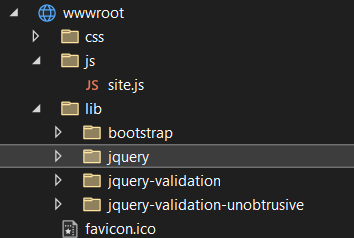
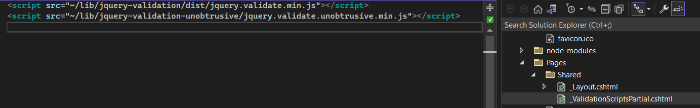
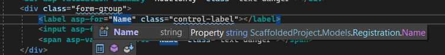
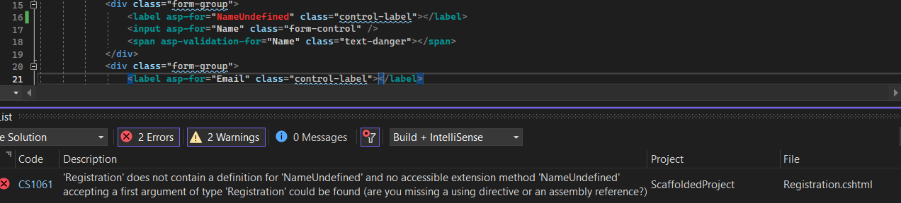
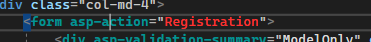
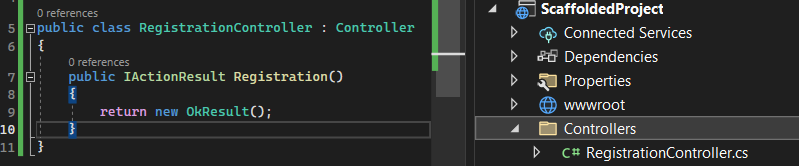
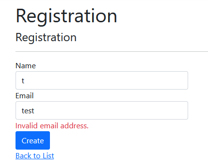

---
date: 2023-07-22
title: "Exploring Asp.net Core MVC: An In-Depth Look at JQuery Validate Scripts"
datePublished: Sat Jul 22 2023 18:29:12 GMT+0000 (Coordinated Universal Time)
cuid: clkecgo23000509jo4a3v7831
slug: exploring-aspnet-core-mvc-an-in-depth-look-at-jquery-validate-scripts
cover: /assets/images/blog/2023-07-22-exploring-aspnet-core-mvc-an-in-depth-look-at-jquery-validate-scripts/2023-07-22-exploring-aspnet-core-mvc-an-in-depth-look-at-jquery-validate-scripts.cover.jpeg
tags: mvc, jquery, aspnet-core, validation, unobtrusive

---

# Previously on...

[In a previous blog post, I described LibMan or Npm for a new project.](https://dotnet.kriebbels.me/upgrade-your-client-side-script-approach-in-a-basic-dotnet-aspnet-core-mvc-app) I explored how to manage the required scripts.

I find it important to understand the history of things. This helps me to learn why we use this technology, and what were the shortcomings of the previous tech. [Understanding history helps build the future.](https://www.uopeople.edu/blog/why-is-history-important/)

# Context

During my education at [BINF at Hogeschool Gent](https://www.hogent.be/sites/hogent/assets/File/DOW/TI%20201103%20VIRA%20HoGent.pdf), I was primarily taught ASP.NET WebForms as the go-to framework for web development. I focused more on backend development in my career. A new project starts and I realized that I missed out on the advancements in web development. Creating a scaffolded Asp.net core MVC Project led me to understand the history a bit better of ASP.NET MVC, AJAX, and jQuery.

## ASP.NET WebForms drawbacks

ASP.NET WebForms is a framework introduced by Microsoft for building web applications using the .NET platform. It was similar to Windows Forms development. That allowed us to create web pages that closely resembled desktop user interfaces.

However, using ASP.NET WebForms has several drawbacks. I will not go into the details of what it was in detail. I will address the issues that web forms had.

* The tight integration of server controls with HTML and JavaScript made it difficult to test and maintain applications.
    
* The complex view state management mechanism resulted in large and complex view states, negatively impacting performance.
    
* The postback model used in WebForms caused full page reloads for each user interaction. That leads to slower user experiences.
    

## Introduction of AJAX and ASP.NET AJAX

In 2005, the concept of AJAX (Asynchronous JavaScript and XML) emerged as a way to enable server communication but without a full page reload! Microsoft recognized the potential of AJAX and integrated it into the ASP.NET framework with the release of ASP.NET AJAX in 2007.

Using Ajax in web forms provided developers with server controls, client libraries, and toolkits. Features such as partial page rendering, update panels, and rich client-side controls improved the interactivity of web applications.

## ASP.NET MVC and jQuery integration

Despite the advancements brought by AJAX, the tight coupling, view state, and postback model concerns persisted in WebForms. In response, Microsoft introduced ASP.NET MVC in 2007 as a flexible framework that followed the Model-View-Controller architectural pattern. This pattern promotes a clear separation of concerns and facilitated the separation of UI elements from their underlying logic.

To simplify client-side development within ASP.NET MVC, jQuery was integrated. jQuery provides a user-friendly API for DOM manipulation, event handling, adhoc backend calls and animations.

## HtmlHelpers or TagHelpers

I want to mention the way that Asp.net core MVC Razor pages are built. In the case of client validation, it does not seem to matter much what approach is used: TagHelpers or HtmlHelpers. `jQuery Validate` searches for data attributes on the generated HTML.

Tag Helpers in ASP.NET Core are components that enable server-side code to participate in generating and processing HTML elements. They provide a more **HTML-centric way of working** with server-side code.

```html
<!-- Tag Helper: <a> element with an `asp-controller` attribute -->
<a asp-controller="Home" asp-action="Index">Home</a>
```

In the above code snippet, the `<a>`\-element is a Tag Helper. The `asp-controller` and `asp-action` attributes are Tag Helper attributes that help generate the appropriate `href` attribute for the anchor element.

HTML Helpers are methods in ASP.NET Core that **assist** in generating HTML markup. They are invoked within Razor views and help create HTML elements with the necessary attribute values.

```html
<!-- HTML Helper: <a> element with controller and action parameters -->
@Html.ActionLink("Home", "Index", "Home")
```

`Html.ActionLink` is an HTML Helper method. It generates an anchor element with the text "Home" and sets the `href` attribute based on the specified controller and action values.

To quote the docs from Microsoft

> The Visual Studio editor helps you write **all** of the markup in the Tag Helper approach of the register form, while Visual Studio provides no help for most of the code in the HTML Helpers approach. [IntelliSense support for Tag Helpers](https://learn.microsoft.com/en-us/aspnet/core/mvc/views/tag-helpers/intro?view=aspnetcore-7.0#intellisense-support-for-tag-helpers) goes into detail on working with Tag Helpers in the Visual Studio editor.

## Client-side validation in ASP.NET MVC

In WebForms, server-side validation was the primary method employed. However, we developers added the client-side validation to enhance the user experience. The postbacks in web forms were too slow to have to wait on the validation. We had to code the validation rules twice: in javascript and on the backend. Clientside validation was there for the user experience and the serverside validation was there for the same basic validation to ensure no user can circumvent the rules. The backend could also do more advanced validation.

Asp.net core MVC has a different approach. jQuery Validation was introduced into the framework. This plugin allows us to define validation rules and messages for form fields. Rules can be specified using HTML attributes, enabling customization and client-side validation setup.



To streamline the integration of client-side validation into ASP.NET MVC, the jQuery Validate Unobtrusive plugin was introduced. This plugin utilizes HTML5 data attributes to specify validation rules.

I come to the point where I understand why the following scripts are here.



But now I got the question, how are the Html 5 data attributes used in the scaffolded project and do I still need to code my validation rules twice, once on the backend and now using HTML 5 data attributes? I will explore this by creating a Registration form and working my way through this until I understand it.

# How ASP.NET core MVC validation works

In this example, I show how C# data attributes are used in ASP.NET MVC to generate validation. The client-side validation scripts use the HTML5 `data-val-*` attributes to perform client-side validation.

## Step 1: Create a Model Class

Create a model class that represents the data you want to capture from the user. For this example, let's say we have a simple Registration model with two properties: `Name` and `Email`.

```csharp
public record Registration
{
    [Required(ErrorMessage = "Name is required.")]
    public string Name { get; set; }

    [Required(ErrorMessage = "Email is required.")]
    [EmailAddress(ErrorMessage = "Invalid email address.")]
    public string Email { get; set; }
}
```

Here, we are using C# validation attributes like `[Required]` and `[EmailAddress]` to define the validation rules for the `Name` and `Email` properties.

## Step 2: Create a View

Create a view that is strongly typed to the Registration model. I do this by right-clicking and selecting *Creating a RazorPage* based on the model *Registration*.

```xml
@page
@model ScaffoldedProject.Models.Registration

@{
    ViewData["Title"] = "Registration";
}

<h1>Registration</h1>

<h4>Registration</h4>
<hr />
<div class="row">
    <div class="col-md-4">
        <form asp-action="Registration">
            <div asp-validation-summary="ModelOnly" class="text-danger"></div>
            <div class="form-group">
                <label asp-for="Name" class="control-label"></label>
                <input asp-for="Name" class="form-control" />
                <span asp-validation-for="Name" class="text-danger"></span>
            </div>
            <div class="form-group">
                <label asp-for="Email" class="control-label"></label>
                <input asp-for="Email" class="form-control" />
                <span asp-validation-for="Email" class="text-danger"></span>
            </div>
            <div class="form-group">
                <input type="submit" value="Create" class="btn btn-primary" />
            </div>
        </form>
    </div>
</div>

<div>
    <a asp-action="Index">Back to List</a>
</div>

@section Scripts {
    @{await Html.RenderPartialAsync("_ValidationScriptsPartial");}
}
```

In the example VS2022 provided, I can see that tag helper such as `asp-for`, `asp-validation-summary`, `asp-validation-for`, and `asp-action` is used to generate the HTML form elements, display validation summary and field-specific validation messages, and define the form submit action.

The `asp-validation-*` tag helpers are responsible for rendering the data attributes needed for client-side validation. These data attributes are then utilized by the `jquery.validate.unobtrusive.js` script to perform client-side validation based on the rules defined in the C# validation attributes.

### What about Intellisense and type safety?

When working with HTML, I got intellisense:



When I choose a property that does not exist in the model, I do get a build error as well.



I got the Registration in Red, because VS2022 does not find a controller



I fixed this error by creating a RegistrationController in a folder called Controllers



## Step 3: Render the View

When you run the application and browse to the URL associated with this view, the HTML form elements will be rendered based on the model and the validation attributes. The generated HTML will include data attributes based on the validation attributes:

* the `Required` attribute applied to the `Name` property of the RegistrationModel
    
    ```csharp
        [Required(ErrorMessage = "Name is required.")]
        public string Name { get; set; }
    ```
    
    using the following snippet of the razor from above
    
    ```xml
               <div class="form-group">
                    <label asp-for="Name" class="control-label"></label>
                    <input asp-for="Name" class="form-control" />
                    <span asp-validation-for="Name" class="text-danger"></span>
                </div>
    ```
    
    Results in the following generated HTML.
    
    ```xml
    <div class="form-group">
                    <label class="control-label" for="Name">Name</label>
                    <input class="form-control input-validation-error" type="text" data-val="true" data-val-required="Name is required." id="Name" name="Name" value="" aria-describedby="Name-error" aria-invalid="true">
                    <span class="text-danger field-validation-error" data-valmsg-for="Name" data-valmsg-replace="true"><span id="Name-error" class="">Name is required.</span></span>
    </div>
    ```
    
    the same story applies for the `EmailAddress` attribute on the `Email` property
    
    ```xml
    <div class="form-group">
                    <label class="control-label" for="Email">Email</label>
                    <input class="form-control input-validation-error" type="email" data-val="true" data-val-email="Invalid email address." data-val-required="Email is required." id="Email" name="Email" value="" aria-describedby="Email-error" aria-invalid="true">
                    <span class="text-danger field-validation-error" data-valmsg-for="Email" data-valmsg-replace="true"><span id="Email-error" class="">Email is required.</span></span>
    </div>
    ```
    

These data attributes are used by jQuery Validate and jQuery Validate Unobtrusive. In Summary, These scripts perform client-side validation, defined in the C# data attributes.

## Step 4: Client-side Validation

The `data-val-required` attribute and the `data-val-email` attribute will be used by jQuery Validate to validate the required and email fields respectively. jQuery Validate will be able to do this because jQuery Validate Unobtrusive defined the rules and added support to those rules in the jQuery Validate framework.



The above text displays after the `inputbox` loses focus.

# Difference between jQuery Validate and jQuery Validate Unobtrusive

The difference between jQuery Validate and jQuery Validate Unobtrusive lies in how they handle client-side validation based on the data attributes generated from C# validation attributes.

The two scripts, `jquery.validate.js` and `jquery.validate.unobtrusive.js` are included in the `ValidationscriptsPartial.cshtml` in an ASP.NET core MVC project.


## jQuery Validate

This script allows you to define validation rules and error messages for form fields using a flexible API. I can customize the validation rules and messages for each field. It supports custom validation methods and remote validation.

jQuery Validate will scan the HTML form elements for the data attributes and applies the specified validation rules based on those attributes. When the form is submitted, jQuery Validate intercepts the submission and validates the fields based on the defined rules. If any validation errors occur, it displays error messages and prevents form submission until all fields are valid.

### Example

In the code of `jquery.validate` I found the following code for `required` and `email`.

```javascript
// https://jqueryvalidation.org/jQuery.validator.methods/
	methods: {

		// https://jqueryvalidation.org/required-method/
		required: function( value, element, param ) {

			// Check if dependency is met
			if ( !this.depend( param, element ) ) {
				return "dependency-mismatch";
			}
			if ( element.nodeName.toLowerCase() === "select" ) {

				// Could be an array for select-multiple or a string, both are fine this way
				var val = $( element ).val();
				return val && val.length > 0;
			}
			if ( this.checkable( element ) ) {
				return this.getLength( value, element ) > 0;
			}
			return value !== undefined && value !== null && value.length > 0;
		},

		// https://jqueryvalidation.org/email-method/
		email: function( value, element ) {

			// From https://html.spec.whatwg.org/multipage/forms.html#valid-e-mail-address
			// Retrieved 2014-01-14
			// If you have a problem with this implementation, report a bug against the above spec
			// Or use custom methods to implement your own email validation
			return this.optional( element ) || /^[a-zA-Z0-9.!#$%&'*+\/=?^_`{|}~-]+@[a-zA-Z0-9](?:[a-zA-Z0-9-]{0,61}[a-zA-Z0-9])?(?:\.[a-zA-Z0-9](?:[a-zA-Z0-9-]{0,61}[a-zA-Z0-9])?)*$/.test( value );
		},
```

So I can see that jQuery Validate offers the rules that I need.

## jQuery Validate Unobtrusive

This script is an additional script that works in conjunction with jQuery Validate and ASP.NET MVC. It helps bridge the gap between C# validation attributes and jQuery Validate by applying the validation rules defined in C# to the client-side validation. Note that only the attributes in the jQuery Validate Ubobtrusive can be used. When I want to use custom attributes, I will need to do some extra work.

When I include the `jquery.validate.unobtrusive.js` file, it reads the data attributes and wires up jQuery Validate to use those rules for client-side validation. It takes care of mapping the C# validation attributes (such as Required, StringLength, etc.) to the appropriate jQuery Validate rules.

`jquery.validate.unobtrusive.js` depends on `jquery.validate.js`. It does not override or replace the core functionality provided by `jquery.validate.js`.

### Example

In the code of `jquery.validate.unobtrusive.js` I found the following code for `email` attribute.

```javascript
    adapters....addBool("email")....;

   adapters.addBool = function (adapterName, ruleName) {
        /// <summary>Adds a new adapter to convert unobtrusive HTML into a jQuery Validate validation, where
        /// the jQuery Validate validation rule has no parameter values.</summary>
        /// <param name="adapterName" type="String">The name of the adapter to be added. This matches the name used
        /// in the data-val-nnnn HTML attribute (where nnnn is the adapter name).</param>
        /// <param name="ruleName" type="String" optional="true">[Optional] The name of the jQuery Validate rule. If not provided, the value
        /// of adapterName will be used instead.</param>
        /// <returns type="jQuery.validator.unobtrusive.adapters" />
        return this.add(adapterName, function (options) {
            setValidationValues(options, ruleName || adapterName, true);
        });
    };
```

And of course for the `required` attribute.

```javascript
   
 adapters.add("required", function (options) {
        // jQuery Validate equates "required" with "mandatory" for checkbox elements
        if (options.element.tagName.toUpperCase() !== "INPUT" || options.element.type.toUpperCase() !== "CHECKBOX") {
            setValidationValues(options, "required", true);
        }
    });

     function setValidationValues(options, ruleName, value) {
        options.rules[ruleName] = value;
        if (options.message) {
            options.messages[ruleName] = options.message;
        }
    }
```

# Can I update `jQuery`, `jQuery Validate` and `jQuery Validate Unobtrusive`?

Now I understand the link between everything, and after writing my previous post about LibMan and npm, I can answer this question.

The generated `data-val-*` attributes are the interface for the validation rules. When using the tag helpers, that happens using the `asp-validation-for` attribute.

I can confidently update to a more recent version of jQuery Validate Unobtrusive. This is the framework I need to manage. It depends on jQuery Validate and jQuery. When updating to a newer script Unobtrusive script, I can refer to the [release notes](https://github.com/aspnet/jquery-validation-unobtrusive/releases) of this framework.


[I will not use LibMan but instead, opt for npm. If I have other dependencies that utilize jQuery and jQuery Validate, I can easily identify conflicts when updating.](https://dotnet.kriebbels.me/upgrade-your-client-side-script-approach-in-a-basic-dotnet-aspnet-core-mvc-app)

# Outro

I've shared the history and evolution I learned of ASP.NET MVC, AJAX, and jQuery. With the release of ASP.NET MVC, the integration of jQuery provides a user-friendly API for client-side development. This integration, combined with the use of data attributes and validation attributes in ASP.NET MVC, allows for seamless client-side validation. There is also an evolution towards tag helpers instead of Html helpers.

By utilizing C# validation attributes, I can easily define validation rules for our model properties which are automatically translated into HTML form elements with corresponding data attributes.

Understanding this process has given me the confidence to update these scripts using tools like npm to manage dependencies and avoid conflicts within my application.

In one of my next posts, I will figure out how to add support for FluentValidation and how to support custom attributes on my models.

# Sources

[Tag Helpers in](https://learn.microsoft.com/en-us/aspnet/core/mvc/views/tag-helpers/intro?view=aspnetcore-7.0) [ASP.NET](http://ASP.NET) [Core | Microsoft Learn](https://learn.microsoft.com/en-us/aspnet/core/mvc/views/tag-helpers/intro?view=aspnetcore-7.0)

[https://learn.microsoft.com/en-us/aspnet/core/tutorials/razor-pages/razor-pages-start?view=aspnetcore-7.0&tabs=visual-studio](https://learn.microsoft.com/en-us/aspnet/core/tutorials/razor-pages/razor-pages-start?view=aspnetcore-7.0&tabs=visual-studio)

[Releases · aspnet/jquery-validation-unobtrusive (](https://github.com/aspnet/jquery-validation-unobtrusive/releases)[github.com](http://github.com)[)](https://github.com/aspnet/jquery-validation-unobtrusive/releases)

[ASP.NET](http://ASP.NET) [Web Forms - Wikipedia](https://en.wikipedia.org/wiki/ASP.NET_Web_Forms)

[The History of](https://www.dotnetcurry.com/aspnet/1492/aspnet-history-part-1) [ASP.NET](http://ASP.NET) [– Part I | DotNetCurry](https://www.dotnetcurry.com/aspnet/1492/aspnet-history-part-1)

[Upgrade Your Client-Side Script Approach in a Basic Dotnet](https://dotnet.kriebbels.me/upgrade-your-client-side-script-approach-in-a-basic-dotnet-aspnet-core-mvc-app) [Asp.Net](http://Asp.Net) [Core MVC App (](https://dotnet.kriebbels.me/upgrade-your-client-side-script-approach-in-a-basic-dotnet-aspnet-core-mvc-app)[kriebbels.me](http://kriebbels.me)[)](https://dotnet.kriebbels.me/upgrade-your-client-side-script-approach-in-a-basic-dotnet-aspnet-core-mvc-app)

[Does anyone know the history of](https://stackoverflow.com/questions/1333488/does-anyone-know-the-history-of-asp-net-webforms) [ASP.NET](http://ASP.NET) [Webforms? - Stack Overflow](https://stackoverflow.com/questions/1333488/does-anyone-know-the-history-of-asp-net-webforms)


