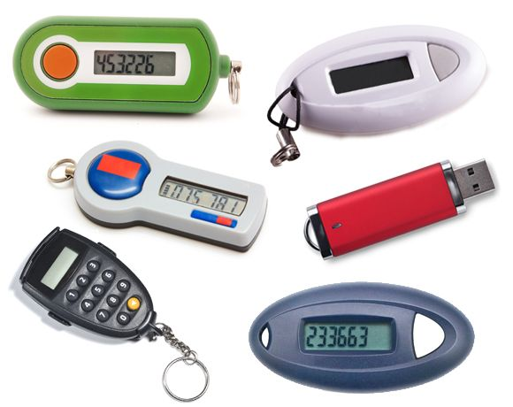

---
title: "When two-factor authentication is useless"
datePublished: Sun Mar 05 2023 08:39:29 GMT+0000 (Coordinated Universal Time)
cuid: clev56vw1000109i524xt4425
slug: when-two-factor-authentication-is-useless
canonical: https://dotnet.kriebbels.me/when-two-factor-authentication-is-useless
cover: ./2023-03-05-when-two-factor-authentication-is-useless.cover.jpeg
tags: security, privacy, 2fa, databreach, lastpass

---

# Previously on...

[In my previous post, I stated that I will begin a series that will give the reader insight into my journey of protecting my data](https://dotnet.kriebbels.me/how-to-know-if-your-data-is-leaked). I summed up multiple subjects I want to explore. I already put my IoT devices on my guest network. But that is for another post.

# Context

This week, it came to our ears in [Tweakers.net](https://tweakers.net/nieuws/207282/lastpass-hack-gebruikte-plex-kwetsbaarheid-die-drie-jaar-geleden-al-was-gedicht.html), [TikTok](https://www.tiktok.com/discover/lastpass) and other sources that a data breach happened at the company LastPass. [LastPass is a company that is owned by LogMeIn](https://www.pcmag.com/news/lastpass-becomes-independent-firm-but-its-still-owned-by-private-equity). [LastPass](https://www.lastpass.com/) has a product that is a password manager. A password manager should keep all of your passwords safe in a vault. In a follow-up post, I will write about the importance and dangers of password managers.

[A PCMag investigation](https://www.pcmag.com/news/lastpass-employee-couldve-prevented-hack-with-a-software-update) found that the senior DevOps programmer of LastPass installed malware, allowing hackers to record the victim's keystrokes and obtain the master password. LastPass recently revealed that hackers accessed its cloud backups through this programmer, gaining access to customer data.

This could have been avoided when the system was protected with two-factor authentication, right... right?

# What is two-factor authentication?

Two-factor authentication (2FA) is a security process that requires a user to provide two forms of identification to access a system or application. The two factors of identification typically include something the user knows (such as a password or PIN) and something the user has (such as a physical token or a mobile device). By requiring two forms of identification, 2FA makes it more difficult for an attacker to gain unauthorized access to a system or application, even if they have obtained the user's password.

## Types of two-factor authentication

By now you figured out that by enabling 2FA, you protect your login against password breaches. Even if a hacker knows your password, they won't be able to log in without the second factor of authentication. You have multiple forms of two-factor authentication.

1. SMS Authentication: This involves sending a unique code to your phone via SMS, which you then enter into the website or app you're trying to access. While this method is convenient, it is not the most secure option, as hackers can intercept text messages, trick you into giving up the code, or even clone your phone number. Therefore, SMS authentication is not recommended for high-security scenarios.
    
    
    
2. Authenticator Apps: Authenticator apps like Google Authenticator, Authy, and Microsoft Authenticator generate time-based one-time passwords (TOTP) that can be used as the second factor for authentication. These apps are more secure than SMS authentication since they don't rely on SMS, and the generated codes are unique and expire after a short time. However, if someone gains access to your phone or the authentication app itself, they can generate the codes and bypass the authentication. So, it's still important to protect your phone and authentication app with a strong password or PIN.
    
    
    
3. Hardware Tokens: Hardware tokens are physical devices that generate one-time passwords or use public key cryptography to authenticate the user. They are more secure than SMS and authenticator apps because they are not vulnerable to online attacks or phishing. [Even reverse engineering them is hard.](https://flow.gi/SecurIDReverseEngineering/) However, hardware tokens can be lost or stolen, and they may not be as convenient to carry around as a phone. [In 2011, there was a data breach in one of those companies. The information was leaked on how those numbers could be generated. Every hardware token was vulnerable back then...](https://www.wired.com/story/the-full-story-of-the-stunning-rsa-hack-can-finally-be-told/)
    
    
    
4. Biometric Authentication: Biometric authentication uses physical characteristics like fingerprints, facial recognition, or iris scans to verify your identity. This method is more secure than the others since biometric features are unique to each individual and can't be easily replicated or stolen. However, biometric authentication is not foolproof, as there have been instances of [hackers bypassing fingerprint sensors](https://bitrebels.com/business/how-hackers-bypass-fingerprint-scanners/) or using [deep fake technology to trick facial recognition systems](https://www.theregister.com/2022/05/22/ai_in_brief/).
    
    
    

## Multiple culprits... but 2FA should protect you, right?

Well, it all comes down to the user. LastPass has protected its vaults with 2FA. Only four seniors within the company have access to that vault. The hackers attempted to log in to the server using a keylogger. The 2FA protection they used, asked for approval. The senior developer approved the login, so the hackers were able to access the vault.

# Outro

Security is only as strong as the people who use it. I have worked at some companies where usernames and passwords were shared among developers. One developer wants to access the vault. It is the responsible guard of the vault who approves the login. I suspect this was happening as well at LastPass. Otherwise, I cannot understand why the senior developer approved the login if he did not initiate it.

The whole internet is focused on the vulnerability of the software that was not patched, and there was no separation of home devices and work devices. If everything fails, we should be able to rely on our 2FA. Otherwise, what is the point of setting it up?

I do have issues with the strength of security sometimes. It holds you back and that is frustrating. The internet is a crowded place with a lot of people who want to do good. However, it's also filled with malicious actors who are constantly looking for ways to exploit vulnerabilities and gain unauthorized access to sensitive information. This is why companies need to prioritize security measures and implement the latest technology to protect themselves and their users. It may seem like an inconvenience, but in the end, it's better to err on the side of caution and take every possible step to ensure the safety of our online identities and data.
