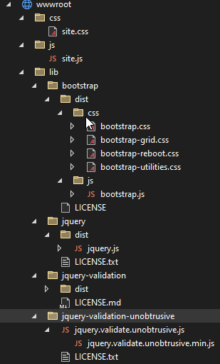
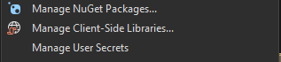
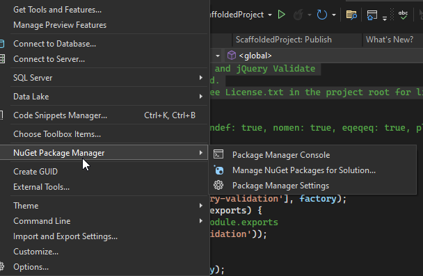
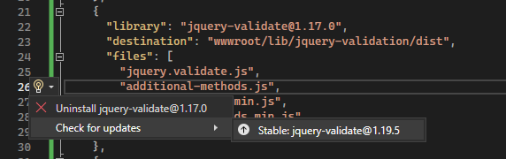
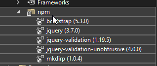
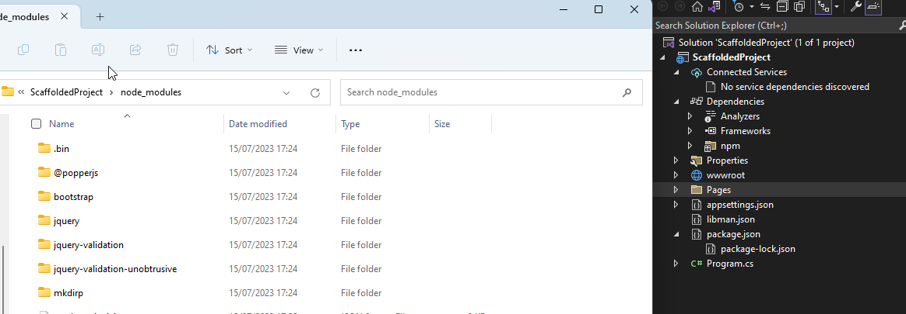

---
title: "Upgrade Your Client-Side Script Approach in a Basic Dotnet Asp.Net Core MVC App"
datePublished: Sun Jul 16 2023 06:44:07 GMT+0000 (Coordinated Universal Time)
cuid: clk52mt5r000a0al67sls6s7r
slug: upgrade-your-client-side-script-approach-in-a-basic-dotnet-aspnet-core-mvc-app
cover: ./2023-07-16-upgrade-your-client-side-script-approach-in-a-basic-dotnet-aspnet-core-mvc-app.cover.jpeg
tags: mvc, npm, aspnet-core, dotnet, libman

---

# Previously on...

In my previous articles, I discussed [DevOps](https://dotnet.kriebbels.me/series/devops), [DotNet](https://dotnet.kriebbels.me/series/dotnet) and [Security](https://dotnet.kriebbels.me/series/security). This article builds upon those three components and explores the role of package managers in managing server-side and client-side libraries in a .NET MVC project.

# Context

I find myself working on a new Asp.Net Core project. In the previous projects, the pen-testers and the SAST scan informed me that I use old versions of javascript libraries like jQuery. Managing and updating these libraries are not provided by default it seems. This led me to explore how to manage those files.

At the beginning of time, we used linked files and created scripts. We as developers manually copied and included libraries in our projects. Over time, the development community has witnessed an evolution in the way libraries are managed.

All this was prone to errors and made updates difficult. For the backend developers, GAC was the first solution to try to manage the DLL hell. The introduction of package managers like NuGet was a successor. It offered a centralized repository for clientside and serverside libraries. The goal was to simplify management and the updating process. Javascript developers needed something less coupled to NuGet and npm was born.

JavaScript has been the go-to language for some backend applications but more for web applications. To manage client-side libraries, we developers have relied on tools like npm and Yarn. These package managers allow us to integrate libraries and frameworks such as jQuery, AngularJS, and React.

JavaScript package managers like npm and yarn are popular. Npm has become the choice. It has compatibility with server-side JavaScript frameworks like Node.js.

In the .NET world, a newly scaffolded ASP.NET Core project does not include clientside package management for the already given client libraries.

First thing first. I am talking about package managers. What is the purpose of a package manager so I can understand it better? What do I need to do because it is not included in a default scaffolded ASP.Net Core project?

# Why a package manager?

Package managers serve an important role in software development:

* Simplifying Dependency Management
    

Managing dependencies manually can quickly become complex and error-prone. Package managers automate the process of library installation. No more copy and paste.

* Ensuring Version Control
    

Each library update may introduce bug fixes, security patches, or new features. Package managers help enforce version control by providing a centralized repository of libraries and their corresponding versions. This allows me to select the most suitable version and traceability.

* Streamlining interdependencies
    

Package managers enable reproducible builds, ensuring that the same set of libraries and versions are used across different machines or deployments. That will reduce the risk of compatibility issues because the package manager will try to figure out what common packages are compatible with each other.

* Discoverability
    

Package managers provide a centralized repository or registry where I can discover new libraries, frameworks, and tools.

* Security and Maintenance
    

By regularly updating packages through package managers, I can address security concerns and reduce the risk of bugs and attacks.

# Show me something already

I will scaffold an asp.net core MVC project. I will investigate the javascript files. Discover what package managers there are. I will try to manage them using a package manager and convert them to use another one.

## An Asp.Net Core MVC Fresh Project

Let us look at what I received after I created an Asp.Net Core MVC Application using VS 2022.



I notice a lot of given client javascript files.

* `site.js`: This file is a custom JavaScript file where I can write my client-side javascript code.
    
* `bootstrap.js`: This file is the JavaScript component of the Bootstrap framework. It adds dynamic behaviour to the Bootstrap UI components.
    
* ```typescript
    /*!
      * Bootstrap v5.1.0 (https://getbootstrap.com/)
      * Copyright 2011-2021 The Bootstrap Authors (https://github.com/twbs/bootstrap/graphs/contributors)
      * Licensed under MIT (https://github.com/twbs/bootstrap/blob/main/LICENSE)
      */
    ```
    
* `jquery.js`: This is the jQuery library file. It provides an API for manipulating and interacting with HTML elements.
    
    ```typescript
    /*!
     * jQuery JavaScript Library v3.5.1
     * https://jquery.com/
     *
     * Includes Sizzle.js
     * https://sizzlejs.com/
     *
     * Copyright JS Foundation and other contributors
     * Released under the MIT license
     * https://jquery.org/license
     *
     * Date: 2020-05-04T22:49Z
     */
    ```
    
* `jquery.validate.js`: This is a popular jQuery called jQuery Validation plugin that provides extensive form validation capabilities.
    
    ```typescript
     * jQuery Validation Plugin v1.17.0
     *
     * https://jqueryvalidation.org/
    ```
    
* `jquery.validate.unobtrusive.js`: This file is a jQuery plugin that works in conjunction with jQuery Validation and the ASP.NET Core MVC framework. The purpose of jQuery Validation Unobtrusive is to validate user input on the client side before submitting the form to the server. More on that in a later blog post.
    
    ```typescript
    // Unobtrusive validation support library for jQuery and jQuery Validate
    // Copyright (c) .NET Foundation. All rights reserved.
    // Licensed under the Apache License, Version 2.0. See License.txt in the project root for license information.
    // @version v3.2.11
    ```
    

I can safely say that four of the five files are part of a package. The downside is that Microsoft delivers us library as files. That gives us the possibility to add or change code. From the moment that I or somebody else does this, hell can break loose later on in the development cycle. Imagine a bugfix or I want to use new features. But for that, I need a new file. Updating the file will translate into losing the functionality of the changes I made. So I need to compare the sources... Those practices are not anymore in this day and age.

Let us try to add some package management.

# What Package Manager do we have?

As a dotnet backend developer, I use NuGet. When I take on the role of a FrontEnd developer, I seem to have these choices:

1. **npm** (Node Package Manager) is the default package manager for the JavaScript/Typescript ecosystem. It is widely used for managing dependencies.
    
2. **Yarn** is a fast and reliable package manager developed by Facebook. It aims to address some performance and security issues found in npm. Yarn uses the same `package.json` format as npm and is compatible with existing npm packages.
    
3. **Pnpm** is a fast and space-efficient package manager that reduces duplication of dependencies across projects. It uses a unique approach called "shared dependencies" to save disk space and improve installation speed.
    

But what does Microsoft offer? Microsoft has something that is called LibMan.

# Enter LibMan

LibMan (short for Library Manager) is a client-side library acquisition tool and not a traditional package manager. It is part of the Microsoft ecosystem and is primarily used in combination with ASP.NET Core projects to manage client-side library assets.

LibMan simplifies acquiring client-side libraries. It is designed to integrate with ASP.NET Core projects. It allows me to specify the libraries I require. It will download the files directly from external sources like Content Delivery Networks (CDNs), GitHub repositories or other locations.

It does not provide the same level of dependency management and version control as npm or Yarn.

Let me try out LibMan.

## Creating a `LibMan.json`

Since VS 2017 there is support for LibMan. I use Visual Studio 2022 Community 17.6.4. When I right-click on my project I get the possibility to manage ClientSide Libraries.



However, In the Menu Project, I only have a user interface for NuGet Manager.



After I click on `Manage Client-Side Libraries`, a `libman.json` file is created.

There I can define library location. This file includes information about the libraries, versions, target paths and source. The target paths are already used in the HTML and JavaScript files that I receive when I create an asp.net core MVC project from scratch. Because I do not change the target path, all should still work as intended.

For this project, I reversed-engineered it to the following `libman.json` file:

```json
{
  "version": "1.0",
  "defaultProvider": "cdnjs",
  "libraries": [
    {
      "library": "bootstrap@5.1.0",
      "destination": "wwwroot/lib/bootstrap/dist",
      "files": [
        "js/bootstrap.js",
        "js/bootstrap.min.js"
      ]
    },
    {
      "library": "jquery@3.5.1",
      "destination": "wwwroot/lib/jquery/dist",
      "files": [
        "jquery.js",
        "jquery.min.js"
      ]
    },
    {
      "library": "jquery-validate@1.17.0",
      "destination": "wwwroot/lib/jquery-validation/dist",
      "files": [
        "jquery.validate.js",
        "additional-methods.js",
        "jquery.validate.min.js",
        "additional-methods.min.js"
      ]
    },
    {
      "library": "jquery-validation-unobtrusive@3.2.11",
      "destination": "wwwroot/lib/jquery-validation-unobtrusive/",
      "files": [
        "jquery.validate.unobtrusive.js",
        "jquery.validate.unobtrusive.min.js"

      ]
    }
  ]
}
```

When saving the file, Visual Studio goes to work and I got the following output:

```plaintext
Restore operation started
Restoring libraries for project ScaffoldedProject
Restoring library bootstrap@5.1.0... (ScaffoldedProject)
Downloading file https://cdnjs.cloudflare.com/ajax/libs/bootstrap/5.1.0/js/bootstrap.js... (ScaffoldedProject)
Downloading file https://cdnjs.cloudflare.com/ajax/libs/bootstrap/5.1.0/js/bootstrap.min.js... (ScaffoldedProject)
wwwroot/lib/bootstrap/dist/js/bootstrap.js written to destination (ScaffoldedProject)
wwwroot/lib/bootstrap/dist/js/bootstrap.min.js written to destination (ScaffoldedProject)
Restoring library jquery@3.5.1... (ScaffoldedProject)
Downloading file https://cdnjs.cloudflare.com/ajax/libs/jquery/3.5.1/jquery.js... (ScaffoldedProject)
Downloading file https://cdnjs.cloudflare.com/ajax/libs/jquery/3.5.1/jquery.min.js... (ScaffoldedProject)
wwwroot/lib/jquery/dist/jquery.js written to destination (ScaffoldedProject)
wwwroot/lib/jquery/dist/jquery.min.js written to destination (ScaffoldedProject)
Restoring library jquery-validate@1.17.0... (ScaffoldedProject)
Downloading file https://cdnjs.cloudflare.com/ajax/libs/jquery-validate/1.17.0/jquery.validate.js... (ScaffoldedProject)
Downloading file https://cdnjs.cloudflare.com/ajax/libs/jquery-validate/1.17.0/additional-methods.js... (ScaffoldedProject)
Downloading file https://cdnjs.cloudflare.com/ajax/libs/jquery-validate/1.17.0/jquery.validate.min.js... (ScaffoldedProject)
Downloading file https://cdnjs.cloudflare.com/ajax/libs/jquery-validate/1.17.0/additional-methods.min.js... (ScaffoldedProject)
wwwroot/lib/jquery-validation/dist/jquery.validate.js written to destination (ScaffoldedProject)
wwwroot/lib/jquery-validation/dist/additional-methods.js written to destination (ScaffoldedProject)
wwwroot/lib/jquery-validation/dist/jquery.validate.min.js written to destination (ScaffoldedProject)
wwwroot/lib/jquery-validation/dist/additional-methods.min.js written to destination (ScaffoldedProject)
Restoring library jquery-validation-unobtrusive@3.2.11... (ScaffoldedProject)
Downloading file https://cdnjs.cloudflare.com/ajax/libs/jquery-validation-unobtrusive/3.2.11/jquery.validate.unobtrusive.js... (ScaffoldedProject)
Downloading file https://cdnjs.cloudflare.com/ajax/libs/jquery-validation-unobtrusive/3.2.11/jquery.validate.unobtrusive.min.js... (ScaffoldedProject)
wwwroot/lib/jquery-validation-unobtrusive/jquery.validate.unobtrusive.js written to destination (ScaffoldedProject)
wwwroot/lib/jquery-validation-unobtrusive/jquery.validate.unobtrusive.min.js written to destination (ScaffoldedProject)
Restore operation completed
```

When I do not have access to Visual Studio, I can use the CLI with the following command: `libman restore`.

## Updating packages

Can we now update safely to the latest minor? Because the package uses SemVer, I should be able to update it without problems. However, updating a Major version will need some extra investigation. I quote SemVer.org

> Given a version number MAJOR.MINOR.PATCH, increment the:
> 
> 1. MAJOR version when you make incompatible API changes
>     
> 2. MINOR version when you add functionality in a backward compatible manner
>     
> 3. PATCH version when you make backward compatible bug fixes
>     
> 
> Additional labels for pre-release and build metadata are available as extensions to the MAJOR.MINOR.PATCH format.

In the libman.json, Visual Studio offers a tooltip with more information about a package:



In the image above I notice that there is a newer version. Security-wise, I should always use the latest stable version that is most compatible with what I use or need.

The update `libman.json` looks like this (redacted):

```json
**redacted**
    {
      "library": "bootstrap@5.3.0",
**redacted**
    },
    {
      "library": "jquery@3.7.0",
**redacted**
    },
    {
      "library": "jquery-validate@1.19.5",
**redacted**
    },
    {
      "library": "jquery-validation-unobtrusive@4.0.0",
**redacted**
```

`Bootstrap`, `JQuery` and `JQuery-Validate` is updated to the latest Minor. That ensures backward compatibility with new features. However, the `jQuery-Validation-unobstrusive` got a new Major version. This means that breaking changes can occur. Not only in the library itself but in what it uses as a dependency. When I look at the GitHub repository, I notice that the package manager NuGet is used and for [jQuery NuGet Version 1.8](https://www.nuget.org/packages/Microsoft.jQuery.Unobtrusive.Validation#dependencies-body-tab) is used. So I already start to feel the pain of manually working out the dependencies between all those files.

## So... why not npm or yarn or ...

LibMan is not a full-fledged package manager. I will use npm and yarn as a comparison.

npm and Yarn have:

* a lot of packages from the **official** package registry. They excel in managing complex dependency trees and versioning control. This all makes it easier to ensure compatibility between different packages.
    
* large and active developer communities, which means there is extensive community support, documentation, and tutorials available. LibMan is only an acquiring tool.
    
* build configuration options. This allows me to define custom scripts, and automate tasks. This flexibility can be beneficial for large-scale projects or when you require more fine-grained control over build processes.
    
* good compatibility with build tools like Webpack, Babel, and ESLint.
    
* support for plugins and extensions that further extend their capabilities.
    

In this project, there are dependencies between them. It makes more sense to ensure compatibility between all those files.

What would that look like? To mimic the functionality of the `libman.json` file using npm, I can leverage npm's `package.json` file. I can manage the dependencies as regular npm packages. The following is `package.json` file that replicates the `libman.json` configurations:

```json
{
  "name": "@Scaffold-1.0.0",
   "version": "1.0.0",
  "scripts": {
    "update-libs": "npm update bootstrap jquery jquery-validation jquery-validation-unobtrusive"
  },
  "dependencies": {
    "bootstrap": "^5.3.0",
    "jquery": "^3.7.0",
    "jquery-validation": "^1.19.5",
    "jquery-validation-unobtrusive": "^4.0.0"
  },
  "devDependencies": {  }
}
```

In this `package.json` file:

* All the required libraries (`bootstrap`, `jquery`, `jquery-validation`, `jquery-validation-unobtrusive`) are defined as regular dependencies under the `"dependencies"` section.
    
* The script allows me to update the libraries later using the `npm run update-libs` command if newer versions become available.
    

To install the dependencies and set up the required folder structure, I can run `npm install` or I can do a right click in Visual Studio and choose `Restore Packages`. This will install the defined packages, and create the necessary directories under `node_modules`.

```plaintext
PATH=.\node_modules\.bin;C:\Program Files\Microsoft Visual Studio\2022\Community\MSBuild\Microsoft\VisualStudio\NodeJs\win-x64;C:\Program Files\Microsoft Visual Studio\2022\Community\MSBuild\Microsoft\VisualStudio\NodeJs;C:\Program Files\Microsoft Visual Studio\2022\Community\Web\External;%PATH%;C:\Program Files\Microsoft Visual Studio\2022\Community\Common7\IDE\CommonExtensions\Microsoft\TeamFoundation\Team Explorer\Git\cmd
"C:\Program Files\Microsoft Visual Studio\2022\Community\MSBuild\Microsoft\VisualStudio\NodeJs\npm.CMD" install
added 6 packages, and audited 7 packages in 6s
2 packages are looking for funding
  run `npm fund` for details
```

With this setup, I can handle the installation, updating, and version control of the specified libraries in a similar way to `libman.json`. Visual Studio visualises this on the project level, under dependencies.



The files are downloaded where npm handles them, in `node_modules`.



And now the pain begins. I need to change all the html files that have referenced the lib folder. I also need to ensure that only the needed files from the `node_modules` are available when the project is published. I include the following in my `csproj` file.

```xml
<ItemGroup>
  <None Include="node_modules\**\*"
        CopyToPublishDirectory="PreserveNewest"
        CopyToPublishDirectoryExclude="**/*.ts; **/*.map"
        CopyToPublishDirectoryAlways="false" />

  <Content Include="node_modules\**\*.min.js"
           CopyToPublishDirectory="PreserveNewest"
           CopyToPublishDirectoryAlways="false" />
</ItemGroup>
```

The funny thing is that when I add the `node_modules` folder, it disappears from the Dependencies in the Solution Explorer... Down the rabbit hole, I go. I notice that there are other dependencies, that I did not specify using `LibMan.json`


However, here I will end the blog post. I think I made it clear what the difference is between LibMan and e.g. npm and why I should address this from the start before I do my coding to ensure I have a working version. I should at least use LibMan, to protect the project from people that want to manually changes the javascript files.

# Outro

I have explored the importance and purpose of package managers. I find package managers to be indispensable tools in my workflow. I do not understand why the scaffolded project does not come with preconfigured `libman.json` or with a `package.json`

LibMan offers a direct link to a source and will make it harder for us developers to change the javascript files to change something. Having such a `libman.json`, makes it easier to migrate to a later version. It gives a sense of urgency to try to update these files to the latest (minor) version, ensuring we have the latest secure versions.

However, the fun begins when you want to use more packages and have common dependencies. From then on, npm will help you out.

What do you think? What did I miss? Do you have any other insights? Let me know! Let us engage.

# Sources

Below I give an overview of the sources I used to write this.

[javascript client package managers - Google Search](https://www.google.com/search?q=javascript+client+package+managers&oq=javascript+client+package+managers&aqs=edge..69i57j0i546l2.8172j0j4&sourceid=chrome&ie=UTF-8)

[JavaScript package managers compared: npm, Yarn, or pnpm? - LogRocket Blog](https://blog.logrocket.com/javascript-package-managers-compared/)

[Which package manager to choose for your next javascript project? | by Himanshu Garadiya | Jun, 2023 | Medium](https://medium.com/@garadiya0/which-package-manager-to-choose-for-your-next-javascript-project-13eab214a05c?source=tag_page---------32-84--------------------aa75c5a1_98b6_401a_8774_bb6d743c4e45-------17)

[Package Managers in JavaScript (](https://www.c-sharpcorner.com/blogs/package-managers-in-javascript)[c-sharpcorner.com](http://c-sharpcorner.com)[)](https://www.c-sharpcorner.com/blogs/package-managers-in-javascript)

[Bower is dead, long live npm. And Yarn. And webpack. | Snyk](https://snyk.io/blog/bower-is-dead/)

[Semantic Versioning 2.0.0 | Semantic Versioning (](https://semver.org/)[semver.org](http://semver.org)[)](https://semver.org/)

[Add nuspec and build file (#77) · aspnet/jquery-validation-unobtrusive@6c2113e (](https://github.com/aspnet/jquery-validation-unobtrusive/commit/6c2113ee25f10092b206cb409c6d3e33a9ee44c8#diff-e4bed5b736f205989dd4fdb6d78acfe9126577983d325d378ce91794d74e63c8)[github.com](http://github.com)[)](https://github.com/aspnet/jquery-validation-unobtrusive/commit/6c2113ee25f10092b206cb409c6d3e33a9ee44c8#diff-e4bed5b736f205989dd4fdb6d78acfe9126577983d325d378ce91794d74e63c8)

[https://jspm.org/](https://jspm.org/)

[Client-side library acquisition in](https://learn.microsoft.com/en-us/aspnet/core/client-side/libman/?view=aspnetcore-7.0) [ASP.NET](http://ASP.NET) [Core with LibMan | Microsoft Learn](https://learn.microsoft.com/en-us/aspnet/core/client-side/libman/?view=aspnetcore-7.0)

[Use LibMan with](https://learn.microsoft.com/en-us/aspnet/core/client-side/libman/libman-vs?view=aspnetcore-7.0) [ASP.NET](http://ASP.NET) [Core in Visual Studio | Microsoft Learn](https://learn.microsoft.com/en-us/aspnet/core/client-side/libman/libman-vs?view=aspnetcore-7.0)

[aspnet/LibraryManager (](https://github.com/aspnet/LibraryManager)[github.com](http://github.com)[)](https://github.com/aspnet/LibraryManager)

[npm (](https://www.npmjs.com/)[npmjs.com](http://npmjs.com)[)](https://www.npmjs.com/)

[An alternative way to use Visual Studio with npm | by EasyLOB | Medium](https://medium.com/@easylob/a-alternative-way-to-use-visual-studio-with-npm-5427d938ff05)
