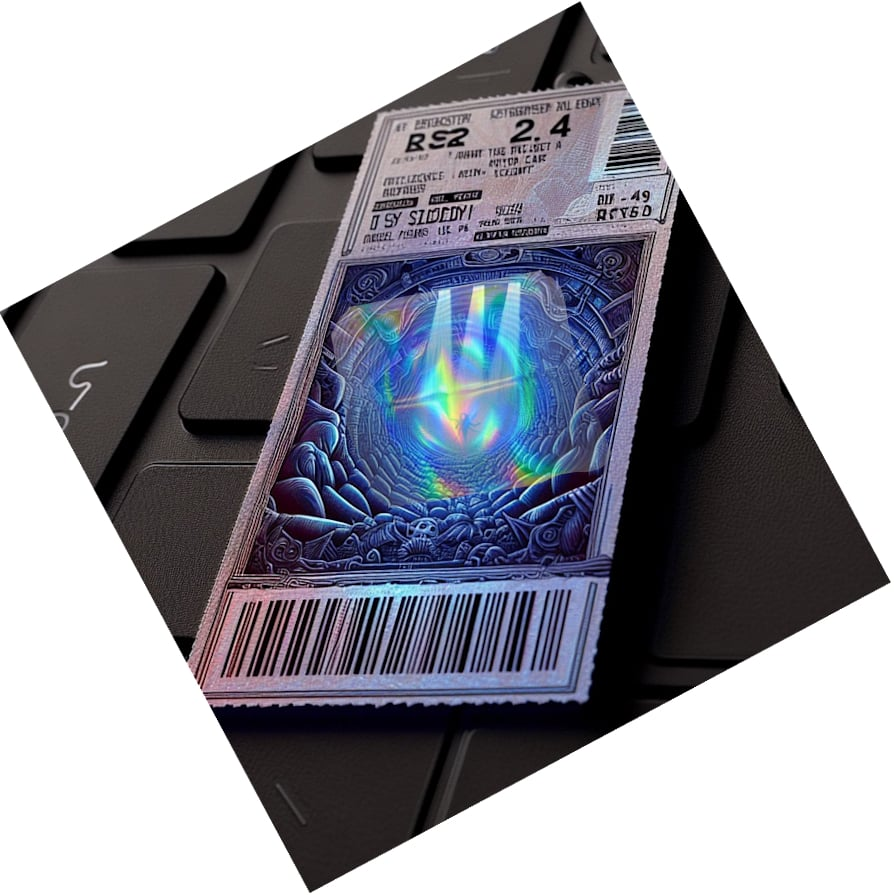
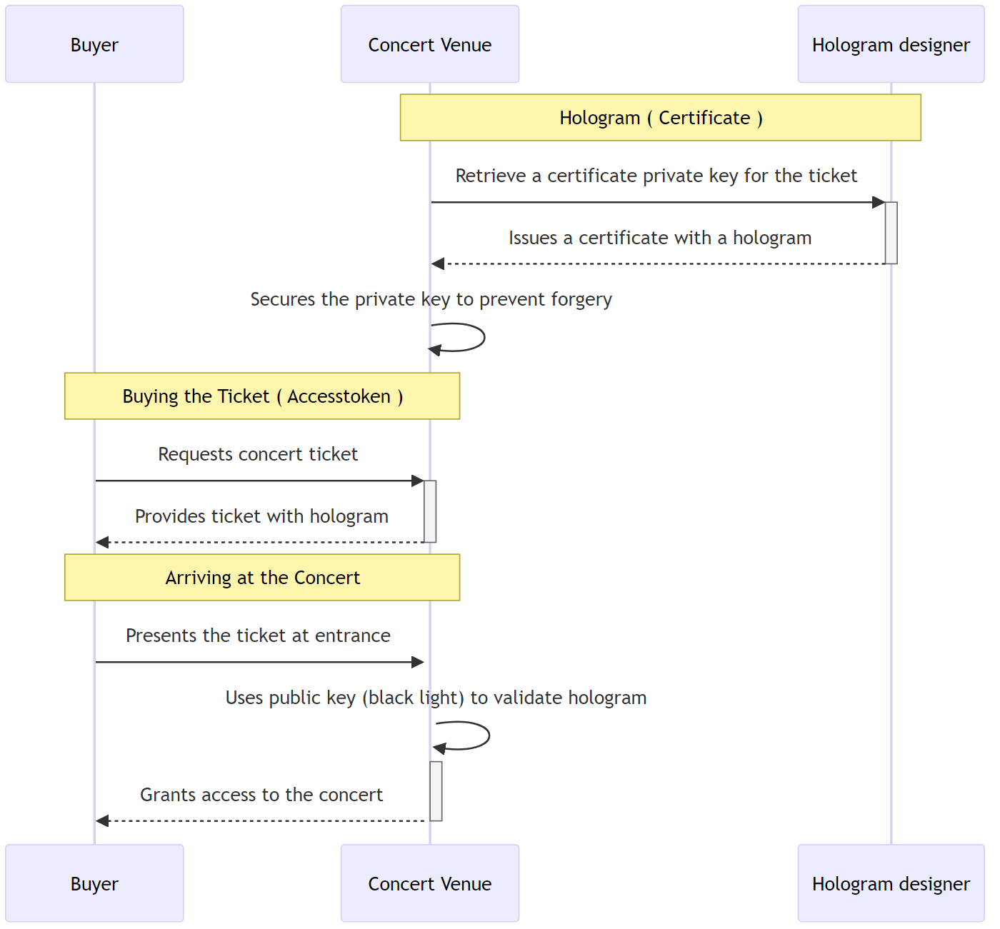
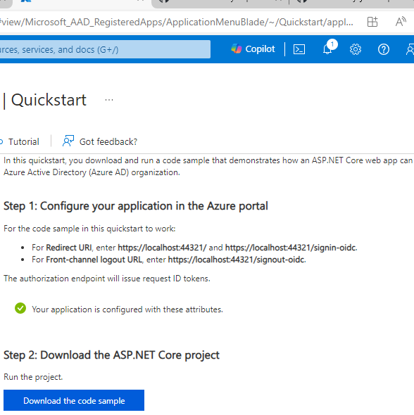

---
date: 2024-05-05
title: "Signature validation required? Microsoft Says No."
seoTitle: "Does Microsoft Rejects OIDC Signature Validation Requirement?"
seoDescription: "Explore the security risks of Microsoft's `AddMicrosoftAccount()` method not validating token signatures, and the implications for OIDC systems"
datePublished: Sun May 05 2024 18:26:20 GMT+0000 (Coordinated Universal Time)
cuid: clvtv6bj700060amdg2kk88ri
slug: signature-validation-required-microsoft-says-no
cover: /assets/images/blog/2024-05-05-signature-validation-required-microsoft-says-no/2024-05-05-signature-validation-required-microsoft-says-no.cover.jpeg
tags: microsoft, testing, dotnet, nuget, openid-connect, aspnetcore, entra

---

# No signature validation using AddMicrosoftAccount()

TLDR; Microsoft's `AddMicrosoftAccount()` method does not do signature validation for tokens, which poses potential security risks. This article explores the implications of this, using an analogy of concert ticket validation, to explain the importance of signature validation in OpenID Connect (OIDC) systems. It also delves into Microsoft's approach to OIDC, highlighting some integration challenges and the risks of not properly validating signatures, especially in scenarios where secure communication channels cannot be guaranteed.

NuGet Packages mentioned:

* [NuGet Gallery | Microsoft.AspNetCore.Authentication.MicrosoftAccount 8.0.4](https://www.nuget.org/packages/Microsoft.AspNetCore.Authentication.MicrosoftAccount)
    
* [NuGet Gallery | Microsoft.AspNetCore.Authentication.OpenIdConnect 8.0.4](https://www.nuget.org/packages/Microsoft.AspNetCore.Authentication.OpenIdConnect)
    

## [Previously on](https://www.nuget.org/packages/Microsoft.AspNetCore.Authentication.OpenIdConnect)

[In a previous piece for XPRT Magazine, I wrote an art](https://www.nuget.org/packages/Microsoft.AspNetCore.Authentication.OpenIdConnect)[icl](https://www.nuget.org/packages/Microsoft.AspNetCore.Authentication.MicrosoftAccount)e about mocking your [OpenID Connect Provider](https://xebia.com/blog/mock-your-openid-connect-provider). For the latest magazine, I rewrote the application that allowed me to demonstrate how to mock the authorization code flow with PKCE. This modification is important for a live demo at [Techorama, which is held annually](https://www.techorama.be). I will be attending as a speaker on this subject. Moreover, during the event of [Dotnet Friday](https://dotnetfriday.nl/), a question about mocking OIDC (OpenID Connect) for Microsoft Entra was raised, prompting an exploration of OIDC's capabilities with Microsoft accounts. However, without any experience, I cannot say where the difficulties lay.

## Context

Lately, my fascination with web development and identity security has taken a new turn. While prepping for a tech demo, I stumbled upon complexities that many developers face—using OAuth and OpenID Connect for securing apps in a testing context, using a browser. It's compelling how these systems are vital yet somewhat obscured in daily coding routines.

The tech scene itself is evolving, with an increasing emphasis on robust security protocols. Recent breaches and escalated security mandates make it imperative for applications to be fortified yet user-friendly. Hence, the dive into the authenticity mechanisms of OIDC with a focus on e.g. Microsoft Entra was not merely by chance but a necessity. As I worked through integrating Microsoft accounts into the authentication flow of my demo app, it revealed facets and pitfalls of current authentication packages.

## Introduction to OIDC and Its Necessity

If you've ever logged into a service or app using your Facebook, Google, or Microsoft account, then you've encountered OpenID Connect (OIDC) without perhaps realizing it. This protocol is extensively used because it streamlines the authentication process for millions of users across various platforms by allowing them to sign in with existing identities. This is a better scenario than providing another company with your credentials. Those companies are mentioned a lot in the news. [According to EU-law, companies have an obligation to inform the user about what information is stolen.](https://www.clearygottlieb.com/-/media/files/alert-memos-2018/eu-regulated-companies-faced-with-personal-data-breach--reconciling-obligations-under-gdpr--mar.pdf)

### What is OIDC? — An Analogy

Imagine you're attending a concert where the ticket purchase is done through an app using Google Pay, which doesn't expose your bank account details. Here, the concert venue represents the application you want access to.


Google acts as the OIDC service — and validates your purchase without sharing your sensitive bank details—and the ticket represents the authorization given to you by OIDC to access the venue.

In this analogy, your ticket is not just a piece of paper but contains a sophisticated hologram (representing a digital certificate).



This hologram shows that the ticket is genuine when inspected under a specific light (the public key) matching a sticker (the private key) you were given when purchasing the ticket. This matching process ensures the ticket’s authenticity privately without exposing sensitive data—a core principle in OIDC using Authorization Code Flow with PKCE (Proof Key for Code Exchange). PKCE adds an extra layer of security, ensuring that even if the criminals grab your ticket, they can’t misuse it because they cannot provide the purchase proof that the concert venue will ask on entrance.




### Why OIDC?

The necessity of OIDC lies in its ability to standardize secure and scalable user authentication across diverse digital systems. Using familiar accounts like Facebook, Google, or Microsoft for authentication doesn’t just reduce the burden of managing multiple usernames and passwords for users; it also outsources the security responsibilities to entities that specialize in security, thereby enhancing overall safety. By using OIDC, businesses can offload much of the cybersecurity risks associated with user data management and password protection.

## Experiencing OIDC with Microsoft Entra

While my experiences are limited to working with Auth0 by Okta, other providers that provide OpenID as well, e.g., Entra. However, I do know Microsoft from the past. That Microsoft does use a standard but creates a dialect from that standard.

Let us find out if they now abide by the standard.

### Integration Challenges

[For a working source code](https://github.com/kriebb/MockOpenIdConnectIdpAspnetcore/tree/4ca8f4fd4aaa41f6539f504020ba7b321bdefc3f), to mock out the OIDC using the Microsoft Account package.

[This link](https://github.com/kriebb/MockOpenIdConnectIdpAspnetcore/tree/804153f8ba7eff309e8f053bf5f84d474de1dbfd) is the commit that gives you a working example using the OIDC package.

#### Conflicting and outdated sources

When you download from Entry a sample application for Asp.NET Core, you get a deprecated one.



It lets me download the following:

`active-directory-aspnetcore-webapp-openidconnect-v2-aspnetcore3-1.zip`

While their documentation seems up-to-date on what library you should use, I find not matching information in the code samples.

For example:

The following is found on the quick-start: `https://learn.microsoft.com/en-gb/entra/identity-platform/quickstart-web-app-dotnet-core-sign-in`

However, because I wanted to showcase that when you use the Microsoft Account NuGet package, I wanted to try that out. Just going forward without looking too much into it.

`Microsoft.AspNetCore.Authentication.MicrosoftAccount` is available for long-term support! (Currently, that is version 8.0.4, and on the NuGet site, it links to the main page as a project source: `https://github.com/dotnet/aspnetcore/tree/v8.0.4`) This repository contains the generic OIDC NuGet package source code, as well as the Microsoft Account one. `https://github.com/dotnet/aspnetcore/blob/main/src/Security/Authentication/`

#### `sub` is not provided

When mocking out Entra, I noticed some small changes between the sample I used for the Microsoft Account and the one from the OpenIdConnect Generic package.

Notice in the example below, there is no `sub` claim to be found, and you get by default more claims than in the generic OIDC Library.

[Get a user - Microsoft Graph v1.0 | Microsoft Learn](https://learn.microsoft.com/en-us/graph/api/user-get?view=graph-rest-1.0&tabs=http)

```csharp
public sealed record UserInfoEndpointResponseBody(
    [property: JsonPropertyName("@odata.context")] string ODataContext,
    [property: JsonPropertyName("businessPhones")] string[] BusinessPhones,
    [property: JsonPropertyName("displayName")] string DisplayName,
    [property: JsonPropertyName("givenName")] string GivenName,
    [property: JsonPropertyName("jobTitle")] string? JobTitle,
    [property: JsonPropertyName("mail")] string Mail,
    [property: JsonPropertyName("mobilePhone")] string? MobilePhone,
    [property: JsonPropertyName("officeLocation")] string? OfficeLocation,
    [property: JsonPropertyName("preferredLanguage")] string? PreferredLanguage,
    [property: JsonPropertyName("surname")] string Surname,
    [property: JsonPropertyName("userPrincipalName")] string UserPrincipalName,
    [property: JsonPropertyName("id")] string Id
);
```

This is the refactored sample I used for the OIDC Library according to this link:

[Microsoft identity platform UserInfo endpoint - Microsoft identity platform | Microsoft Learn](https://learn.microsoft.com/en-us/entra/identity-platform/userinfo#consider-using-an-id-token-instead)

```csharp
public sealed record UserInfoEndpointResponseBody(
    [property: JsonPropertyName("@odata.context")] string ODataContext,
    [property: JsonPropertyName("sub")] string Id,
    [property: JsonPropertyName("name")] string DisplayName,
    [property: JsonPropertyName("given_name")] string GivenName,
    [property: JsonPropertyName("family_name")] string Surname,
    [property: JsonPropertyName("preferred_username")] string UserPrincipalName,
    [property: JsonPropertyName("email")] string Mail,
    [property: JsonPropertyName("phone_number")] string? MobilePhone,
    [property: JsonPropertyName("locale")] string? PreferredLanguage
);
```

#### token signature is not validated

In the Microsoft Account library, there is no code that gives me the option to validate the signature. It just does not validate. Using the given commit, you will notice that the JWKS endpoint is not consulted: `https://github.com/dotnet/aspnetcore/blob/main/src/Security/Authentication/MicrosoftAccount/src/MicrosoftAccountHandler.cs`

### Signature Validation Analogy: Concert Tickets

Imagine you've purchased a ticket to see your favourite band perform live. This ticket allows you entry into the concert venue, but it’s not just any ticket. It’s embedded with a unique holographic seal that proves it's genuine. This is akin to the cryptographic signature on a token in the OIDC process.

Now, suppose a scalper tries to sell counterfeit tickets outside the venue. The venue security (acting as the client in the OIDC process) uses a special light (public key) to check the authenticity of the holographic seal (signature) on your ticket (the token). If the holographic seal lights up correctly, it confirms the ticket wasn't tampered with and is valid, allowing you entrance to the concert. If the ticket fails this test, it means it might have been tampered with, similar to a potential token modification in a cyberattack.

### Importance of Signature Validation

In the context of the concert:

— **Prevention of Fraud:** Just as the holographic seal prevents counterfeit or altered tickets from passing as genuine, signature validation in OIDC prevents tampered tokens from being used to falsely claim an identity or permissions.

— **Security Protocol Integrity:** Should the holographic seal be poorly crafted, allowing fake tickets to appear valid, the entire security protocol of the venue would be undermined, just as weak or absent signature validation can expose a system to breaches.

#### Potential Risks Without Proper Validation

During a concert:

1. **Unauthorized Access:** If someone with a counterfeited or tampered ticket gets past security, similar to a cyberattacker using a manipulated token, they gain unauthorized access. This could lead to overcrowding, an unpleasant experience for genuine ticket holders, or other security risks.
    
2. [**Horizontal and Vertical Attacks**](https://purplesec.us/privilege-escalation-attacks/)**:** In concert terms, a horizontal attack might involve attendees accessing areas reserved for other ticket holders of the same level (e.g., general admission), whereas a vertical attack would be akin to someone with a general admission ticket gaining entry to a VIP area. Without signature validation, similar breaches in software systems can lead to unauthorized data or functionality access.
    

#### Let me dive into the source code of the OIDC Library

When using the OIDC Library, it is stated that the default signature is not validated by default. `https://github.com/dotnet/aspnetcore/blob/main/src/Security/Authentication/OpenIdConnect/src/OpenIdConnectHandler.cs`

Notice the line in the code: `https://openid.net/specs/openid-connect-core-1_0.html#IDTokenValidation`

The decision to allow TLS validation in place of explicit signature checking in direct communication scenarios acknowledges the security provided by modern TLS configurations. This means that the token should not go over any proxies or any other systems that can deep inspect packages and thus give the possibility to intercept and temper. A token is always fetched using the supplied `Backchannel` of the library. That means that the Web Application will fetch the token. The end user is never involved in this process. When you deploy in Azure, you should be able to trust Azure about the inspection that they do or not do with your traffic. Note that everything with tokens is fascinating to hackers:

* T[oken Theft Playbook](https://learn.microsoft.com/en-us/security/operations/token-theft-playbook): Token theft occurs when threat actors compromise and replay tokens issued to a user, bypassing multifactor authentication and gaining access to organizational resources. This page includes prerequisites like access to Microsoft Entra ID sign-in and audit logs, recommendations such as enabling advanced hunting features, and requirements for configuring a SIEM (Security Information and Event Management) tool for centralized log visibility and threat detection.
    
* [**Compromised Microsoft Key**](https://www.bing.com/aclick?ld=e8RdcFD6fLirJmy-looP-E2DVUCUzKghqWLrM6Ddr1TTvzNP7pFWSmiRyjbDXjX94MITkHu2csa02k-oegDhF0VL9tuRHvFzikkNX-Gtom2BH5zvITQjZtZ__BzB_g9RgaqwW6b9104UGJbyMewAXOE5l7ZqFbCX0jA0QX73YSlbw2WBbC&u=aHR0cHMlM2ElMmYlMmZ3d3cud2l6LmlvJTJmJTNmdXRtX3NvdXJjZSUzZGJpbmclMjZ1dG1fbWVkaXVtJTNkcHBjJTI2dXRtX2NhbXBhaWduJTNkYnJhbmQtc2VhcmNoLWVtZWElMjZ1dG1fdGVybSUzZHdpeiUyNTIwaW8lMjZ1dG1fY29udGVudCUzZFdpeiUyNTIwaW8lMjZ1dG1fZGV2aWNlJTNkbSUyNm1zY2xraWQlM2Q2MDdlMjE4MDRlZGExNTU2ZWQ1YTQ3Yjc4NzA4MDQ1YQ&rlid=607e21804eda1556ed5a47b78708045a): The incident involved the threat actor acquiring a private encryption key (MSA key) and using it to forge access tokens for Outlook Web Access (OWA) and [Outlook.com](http://Outlook.com). The compromised key could have allowed the threat actor to forge access tokens for various Azure Active Directory applications.
    

However, having not to validate the signature means that it simplifies implementations by reducing overhead where secure communication channels can be guaranteed. Remember that in any scenario where the communication may involve indirect or less secure channels, signature validation becomes a MUST for ensuring that the ID Token has not been tampered with or falsified in transit.

Thus, do not use the Microsoft Account library because you cannot configure the library to validate the signature in case there is no direct communication. I fail to see why you want to use the Microsoft Account library.

The links below indicate that `AddMicrosoftAccount()` is deprecated. But the source code in the package does not have any of the annotations that it will/is deprecated or obsolete.

* The Closed issue on `https://github.com/dotnet/AspNetCore.Docs/issues/14455` references the still open issue `https://github.com/dotnet/aspnetcore/issues/10037` from `May 7, 2019`.
    

## Outro

Reflecting on this journey of navigating through OIDC and Microsoft Entra, I am both enlightened and a bit overwhelmed. The nuances of modern identity management systems like OIDC are vast. Yet, understanding them is not just about building secure applications, but also about empowering them to be robust in the face of evolving digital threats. My goal has been to bring to light the often overlooked aspects of app security — a commitment I will continue to explore and share insights on.


