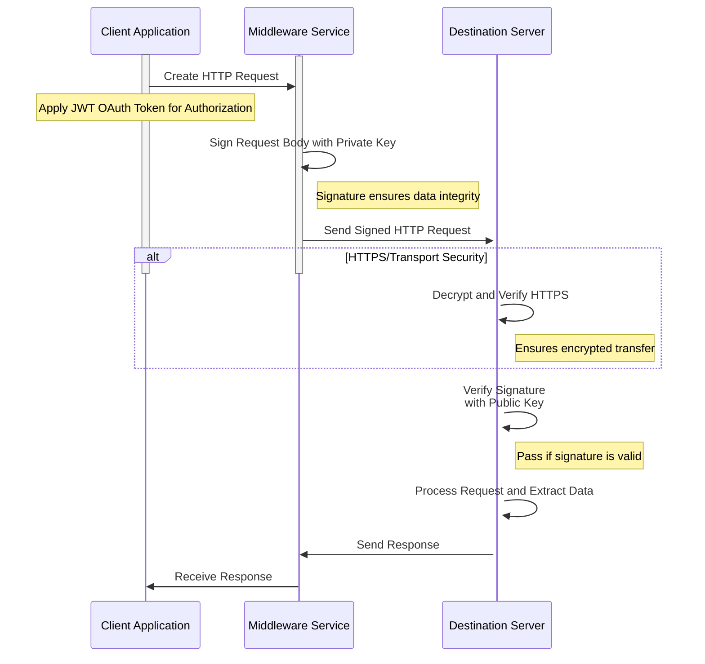
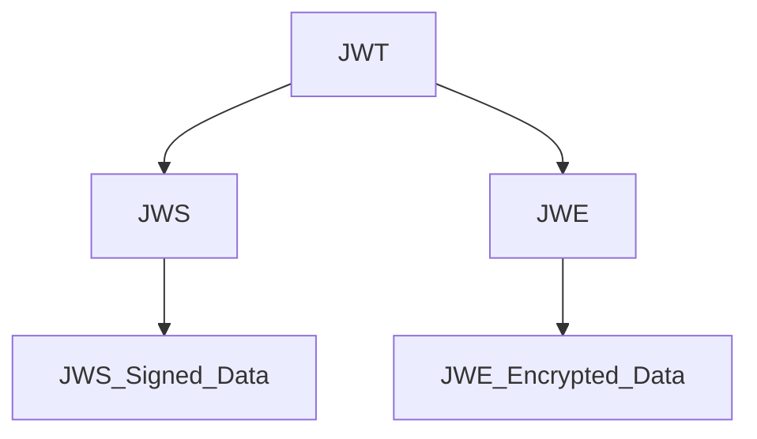
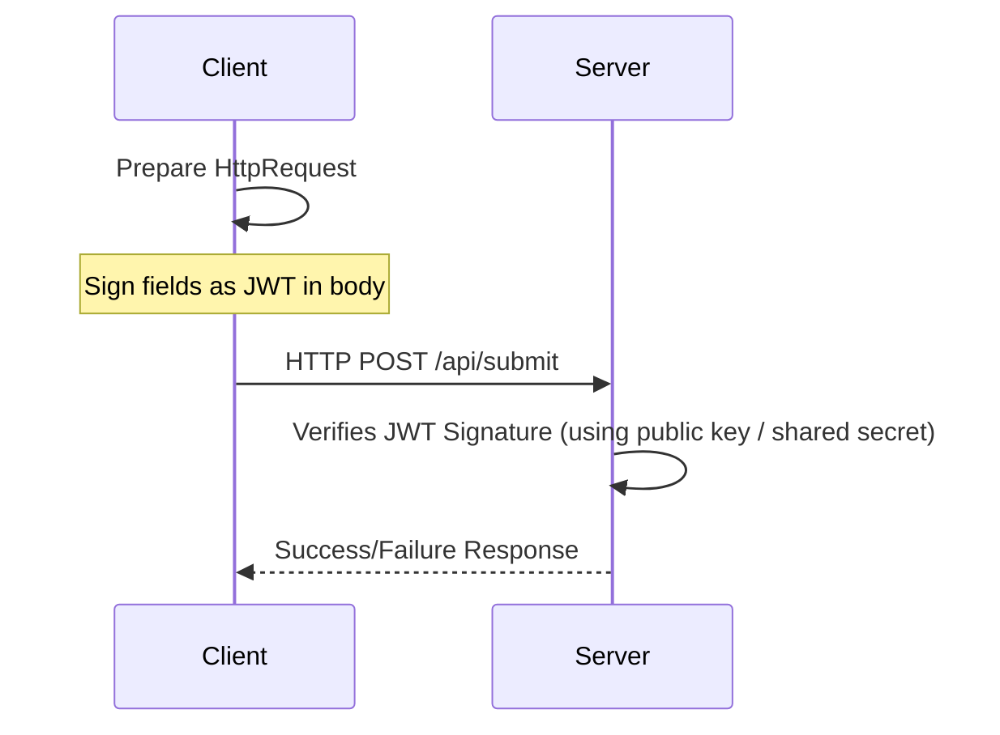
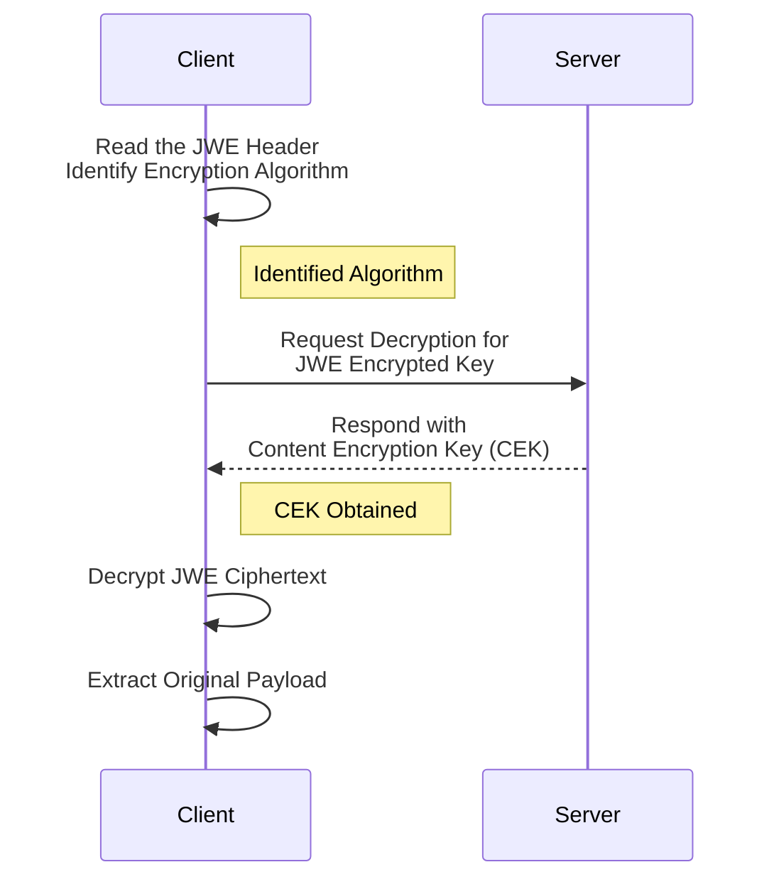
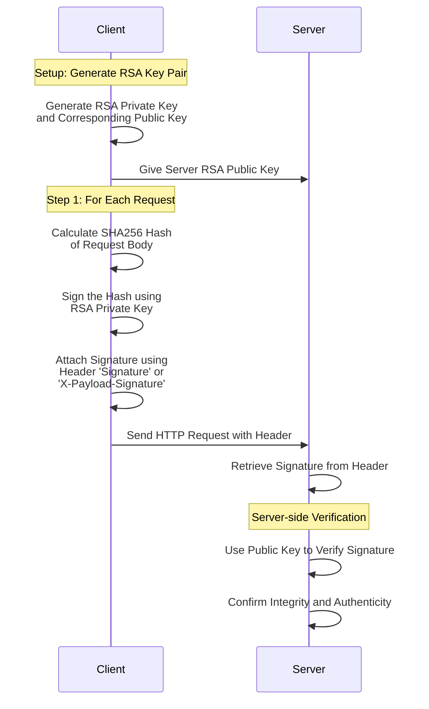

# Tamperproof HTTP Requests

In this article we explore data integrity and authenticity when dealing with sensitive information.

This section outlines the fundamental importance of making HTTP request bodies tamperproof, particularly when handling personally identifiable information (PII). We introduce digital signatures as a key mechanism for data integrity.

## Why should you care?

When extending the user registration process, using Auth0 (an OIDC Provider), it is important to ensure data integrity and authenticity. Particularly when dealing with sensitive information that could lead to personal identity identification (PII) like the national register numbers. 

In this blog post, I will explore difficult ways how to achieve this. Making the `HTTP` request body is tamper-proof is **a** step in protecting data as it moves from one server to another. The use of signatures for `HTTP` request bodies provides a robust mechanism for ensuring data integrity and security in this context. Frameworks like `JOSE` (JSON Object Signing and Encryption) can help in this matter.

A lot of the internet is already protected by using the `HTTPS` protocol, right? Well, `HTTPS` only encrypts the data; it does not guarantee that the content is not tampered with during transit. `HTTPS` provides a secure channel but does not protect against all types of tampering. For instance, if data is decrypted and re-encoded, the integrity may be compromised without detection. In scenarios where sensitive data is transferred – such as through webhooks – signing the request body ensures the data's integrity independently of the transport layer's security.

`HTTP` request body signatures add a layer of security by allowing the recipient to verify that the body has not been altered in transit. They act as a digital signature, much like those used in emails, ensuring the integrity of the sent content. 


I will also investigate if using an access or ID token could help in this matter. 

## Previously on ...

Here, we recap earlier discussions on signatures and OpenID Connect, setting the stage for a deeper exploration into data security practices in HTTP requests.

I wrote about OpenID Connect before and how to mock your provider, and thus creating and faking tokens...

- https://dotnet.kriebbels.me/oauth2-open-id-connect-accessidtoken
- https://dotnet.kriebbels.me/signature-validation-required-microsoft-says-no
- https://dotnet.kriebbels.me/how-to-read-a-claim-from-a-token-in-dotnet-6
- https://xebia.com/blog/openid-connect-mocking-you/
- https://xebia.com/blog/openid-connect-mocking-you/

I did a talk as well on how to mock your OIDC Provider:
- https://www.visug.be/Events/92
- https://www.updateconference.net/en/2023/session/mock-your-openid-connect-provider

This article aims to further expand upon previously covered concepts and enhance understanding.

## Understanding `JWT`, `JOSE` and Access/ID/... Tokens

Before we explore individual token types, this section provides an overview of `JWT` and its role within the broader `JOSE` ecosystem. That is important for safeguarding data communicated via OpenID Connect and OAuth2 protocols.

OpenID Connect and OAuth2 protocols often leverage `JWT` to communicate authorization and identification details.

Discussions with colleagues and customers highlight common misuses of `JWT` as information repositories, necessitating a balance between security and data sensitivity.

There are a lot of tokens in the OpenID Connect world, but because the goal of this document is about making something tamperproof, we will focus on the access token as an example.

## Access Tokens Explained

In this section, gain insights into access tokens, particularly within the `JWT` format, and how they serve as credentials for accessing protected resources, highlighting their role in ensuring authenticity and confidentiality.

An **access token** is a credential used to access protected resources. When used in a `JWT` format, it typically contains claims about the user and any permissions granted. These tokens can be JSON Web Signature (`JWS`) or `JSON` Web Encryption (`JWE`) encoded to ensure authenticity and confidentiality, respectively.

[

](https://mermaid.live/edit#pako:eNp1VV1v2jAU_StW9ko3Stu1RVMlIKmqTd1QiTpp4sUkF7hqsDPboU1R__uu4wRMwhyJJNfn3M9DvAsSmUIwDDT8LUAkECJfKb6ZC0Yr58pggjkXhk0yBLpx3TyN8jzDhBuUoot-xDTN4JUrsAzvbQZqiwl0GXYDlEWHoA2KynFtdWj3yxODW26gTqNlPERqbdTundVRz-7uDvAhmyiwwIc4nrIn2w1dO_8pySwt2_GGVekl-_47Zr9GhVmzWL6AYEupmH2VCt-9thxitALOcCWaSGws05K9IjmbKpfxDyi9-ApXa8PkkrU9cFNQW0FoummWcsMZCgMrhaY8kYDrA1FBpBUf0lbJdeMyU9lnX2LFhc6lsiNKioNbu1I4OY7WVnsodrk8vIRCSFSZk8Aor2dQuCxd_APluA8NL6orJ_FaPpVjbMLLRjVU576mYzE4YyeROvi-t98W6s4NpliQ4P83l4Y-5VozXDK9nw1qtuUZpr6KO1GnSiZAzEYPtg3RG5WSGBbSUFu0IxXYUT4BzUhoODHyRrVPkABuYQ8NesEG1IZjSv__nSXOA7OGDcyDIT0uOHkLep79mSvkiwy0BezqcoJc4YarciIzqRzz0-Xoth8NarKHieHN-Lj7anVxY6lSUD5yMLmKbiMPqSGRIm3FvY7Ci8H5KVTX41U4-trve1gD9DFqObzv2-sEqOsvvLCXB81QgA-4qJYHWEph7vkGs9IhHiDbAn0PeY-NqNFZj2kS8pm2emzRZvheT-n8Mn_zNrlS8nUNPPUQnwew8SCCZDt-WR3PIYxGYQvTHlYn_8pRtw_R-ObmutWHeI3JiyB9O9DA5mz3P-big2TICyNnpUiCoVEF9IIip-9YcxQ1RkjRSPXojqvq1OoFdHL8kZIgS55p-PgHSf46VA)

An **ID token** contains information about the user when access is granted. This is always in a `JWT` format. 

These tokens can (should!) have a `JSON` Web Signature (`JWS`). This ensures authenticity.

When the information is really sensitive, they can be encrypted using the `JSON` Web Encryption (`JWE`) to ensure confidentiality.

### Making the tokens tamperproof

Learn how the `JOSE` framework enables tamper proofing of access tokens. This section describes the use of JSON Web Signatures and `JSON` Web Encryption for securing token integrity and confidentiality.

By making the access token tamperproof, the `JOSE` framework is used to Secure the Payload.

The **JSON Object Signing and Encryption** (JOSE) framework offers a suite of technologies to secure communications:

- **`JWT`**: JSON-based claims as a token.
- **`JWS`**: JSON Web Signatures to secure and protect against tampering.
- **`JWE`**: JSON Web Encryption to protect sensitive data.
- **`JWK`**: JSON Web Key defines cryptographic keys in JSON.

`JOSE` enables you to sign and encrypt HTTP request bodies, ensuring integrity and confidentiality.

[

](https://mermaid.live/edit#pako:eNptk21rwjAQx79Kyd7WoVXnw2BQbWQM9qqywSjI2Z422CYliZtO_O5LW5Ws9fIi4e53_4S73InEIkEyJVsJReosg-eIO8bePpdOp_Ni9rDloTdPeGVWIdtyTFYBaLhF6ZVfUR7LY6GvAHFJjjIHlpiLTyUeEZ1ijhGZmuMalDm5lv8DJIN1hqoETrV-RArJcpDHuciErDMfBv6kS71LssUs8aBtblFZm5sJmaC0SW8-pBNqkQpjwZPGvSMa9L3ePaqtOAz8p27XYjVKzRqCi2657kBtvaBfLgvNGEcb6FdmARvB9QJylh1r4hWzb9QsBtfxTaEz11HAVUehZJtGWsh-L13qDYqDFQQpxU-KkFjEo4e5hXChcbbb_u9DQP2gwTSb1Xp_JdSuA52Nx6NGHZYpi3cclaohr3xzGT9H_Gy-Iey1CI88JlMt9-iSfZGAxoCBGYecTDeQKePFhGkh3-tBqebFJQXwLyGuzPkPp639yA)

## Understanding the Versatility of JSON Web Tokens

`JSON` Web Tokens (`JWT`) are often thought of as mere access tokens, but their potential extends far beyond this basic use case. A `JWT is a compact, URL-safe means of representing claims between two parties. These tokens are particularly useful in scenarios that require verification and integrity. In this documentation, we will explore how `JWT`s can be utilized beyond traditional access tokens and how they can ensure the integrity and non-tamperability of HTTP request bodies.

## The Concept of 'Super Tokens'!

Overloading access tokens or ID tokens with too much information can lead to what is known as "super tokens". These are risky because they could get logged in various places (e.g., proxies, logs), potentially exposing sensitive data unnecessarily. Instead, balancing token content with just enough claim data ensures better security and usability.

Including too much in a single token can lead to technical problems as well. When a token gets to big, it can not be saved into a cookie, or used in the URL of a browser.

Storing large amounts of data in a token can lead to performance issues. Tokens should remain lightweight to travel over networks efficiently.

Super tokens present a single point of failure. If a super token is compromised, it can grant extensive access, leading to potentially severe security breaches. Managing permissions using super tokens ensure that only the right users have access to certain parts of a system can become complex and error-prone.

### What should not be stored in a token?

- Highly sensitive data such as passwords, credit card details, or private keys should never be stored in tokens. This is because tokens are often stored in less secure environments, such as cookies or local storage, which could lead to exposure if an attacker gains access.

- Information that is subject to frequent change should not be stored in tokens, as updating a token across a system can be cumbersome. A token is valid for the specified time. This means that, in that time window, that data is valid.

## `HTTP` Header vs `HTTP` Body?

Tokens are commonly attached to `HTTP` headers for authentication purposes. For instance, an access token in the header can authenticate API requests.

Headers should only contain information necessary for message transmission like authentication tokens and content type identifiers. Headers should be lightweight and used to convey metadata.

The body is used for the main content of the `HTTP` message. Sensitive data that is sensitive, dynamic or is not used for authorization should be safely passed here... 

However, it becomes essential to ensure the tamper-proofing of the request body.

And thus, we have the reason why I did some digging into this topic:
Making the body tamperproof can be done by 
- Levering the `JOSE` framework
- Using a Signature in the `HTTP` Header

## `JWT` Structure

Above, we discussed that the `JOSE` framework has two formats: 
- `JWT`
- `JWE`

A `JWT` consists of three parts:

1. **Header**: Contains the type of token (`JWT`) and the hashing algorithm used.
2. **Payload**: A set of claims, which can be any information you want to share.
3. **Signature**: Used to verify the integrity and authenticity of the token.

Example of a `JWT` signed with a shared secret (HS256):

```json
// Header
{
  "alg": "HS256",
  "typ": "JWT"
}

// Payload
{
  "sub": "1234567890",
  "name": "John Doe",
  "scope": "openid profile email",
  "country": "belgium",
  "email": "john@doe.com"
}

// Signature
HMACSHA256(
  base64UrlEncode(header) + "." +
  base64UrlEncode(payload),
  secret
)
```

### Body and `JWT` in `HTTP` Requests

In this section, read how `JWT` can enhance HTTP request body security, ensuring data sent is from an authentic source. We cover encoding sensitive data within JWTs for tamper proofing.

While `JWT` are commonly used for authentication, they are not limited to being access tokens. They can also serve as secure message carriers or embedded within HTTP request bodies to ensure data integrity. 

The following steps outline the process:

- By applying `JWT` encoding on the body of an HTTP request, any alteration to the body would be detected through signature verification. This ensures that the data is indeed from an authentic source and has not been tampered with on its way to the server.

- You can encode sensitive parts of the HTTP message (for example, headers or the body itself) into the `JWT` payload. Only an entity with the correct secret or public key can validate the `JWT` and trust the data.

- Using `JWT` not in an authorization context simplifies the process. There's no need for a centralized authority to verify token signatures. Just an agreement between two parties and where to find a shared secret or the location of the public key.

#### Example HTTP Request

[

](https://mermaid.live/edit#pako:eNptlFFv2yAQx78KYi-b5C5p0q6tHyolsaNo0raotjpp8svZviQoGDzAXd0o3304JBK1Cy_o-N3_juPgQAtZIg2pxr8NigIjBlsFVSaIHTUowwpWgzBkwRkKM7QnqF5QObtjrh4f3SIka4WWRbIypn7qIuizwk9pkEjrSC5owraCbBjyUhPQ5PvvlDBBclm2PW0XMCSrNF2T9a8kJSOo2Ug3ecXO6g7x2GdUzGo72S4SmMam9bnRTGxJ3eScFWSPLRkRvbMJl0RjodB8eafnHSxpigK1Hi2B8U7pCXUthUYa0ApVBay0NT103hk1O6wwo6Fd5qDtKvDsz6AY5Bx1BxxcuIzWilWg2oXkUjnPTzezh3E8OTt7TIqvxueWpzHk5lKVqHxysriNH2KPtGeWouzFvYuj6eT6I2qoeBvNvo3HHmvQNkpPcDnu5gfQUC-adtNDORPoA9PT8ICNFGYJFeOtI1bIX9D2KgRkZgvNA6JB6Cvd9UPPLWFv51u6vqlfvU1QSv7bIZQe8XWClYcI287z_fb9PUTxLOox_csa5H8SGtYhnt_f3_XqkO5YsRe2CR006XLu9o-ZONo2hMbIpBUFDY1qMKBNXYK5PG8aboBra8WSGal-uD_g9BUE1D7rP1JemON_9h5PoA)

An example use case could be a secure data submission where JSON payload (representing a transaction) is signed using `JWT` technology before it is sent to prevent unauthorized changes. The National Register Number (`nrn`) is the real identification of the user.

```http
POST /transaction HTTP/1.1
Date: Fri, 11 Oct 2024 09:38:52 GMT
Host: api.dummy.com
Content-Type: application/json

{
  "amount": "1500",
  "currency": "USD",
  "recipient": "Alice",
  "jwt": "eyJhbGciOiJSUzI1NiJ9.ewogICJucm4iOiI4MzEyMDcwMjQ1MCIKfQ.ezfyvYmmQ4Cq8nXS1Hy0Duo9i-4yooV3BHk3NLbF2dKMnBgpymsigq951AQ1d_sXEfVOGlOqXSGynV8PL2vR52lO1vOXHU8Cm4yoCgCAwyG5k9XWCi9DSiBj8SXT0xLxXI94p0Oy7COhNUeEnoVrRRJ4XeTLB0bBPuFVjFgJT4435ZnkRMsY7oHe7czSdg1lL-ZgFjirq2YVAbx5wI1DyJ0QPiIVN126pZ-Tsx06I9pCukQARPDqLMESszmd7rx1e4OcaW4GnFicGSkQ8pqOYIXzfSpT-NNlHSlygSioCrF9VgwPbPZDyzqJNcrAQovMrLCyIliD92GPeVHinQdrog"
}
```

After decoding the field `jwt`, it should resemble the following request

```http
POST /transaction HTTP/1.1
Date: Fri, 11 Oct 2024 09:38:52 GMT
Host: api.dummy.com
Content-Type: application/json

{
  "amount": "1500",
  "currency": "USD",
  "recipient": "Alice",
  "jwt": {
        "nrn": "83120702450"
    }
}
```

Or you can sign the entire body with the needed change on the [`Content-Type` header](https://datatracker.ietf.org/doc/html/rfc7519)

```http
POST /transaction HTTP/1.1
Date: Fri, 11 Oct 2024 09:38:52 GMT
Host: api.dummy.com
Content-Type: application/jwt

eyJhbGciOiJSUzI1NiJ9.ewogICJhbW91bnQiOiAiMTUwMCIsCiAgImN1cnJlbmN5IjogIlVTRCIsCiAgInJlY2lwaWVudCI6ICJBbGljZSIsCiAgImp3dCI6IHsKICAgICAgICAibnJuIjogIjgzMTIwNzAyNDUwIgogICAgfQp9.QCC1KQn9lTAaPXqokVySRdMlLRoC4ALiQjagyyZbSPkicFe5HyEUZoEB9PtXLMM8LCc9-vt4ygiRhitImT_WLHNmBSBkubrbUwO8FxZ_GSZFuPrA5vnk4F63Ro6N86krvE46cHOX3-q-2AByl82leRlv_LywTfQIw-TnOvwfNaL5bCGDa9rv7bbZd2LD7FusV0t7_oU0ZCPpOHq-FolKQCLOy9RUzXzkxWDlYNw5AlTfkQ_RYV9QjwmfNYMwh2BnmpxfBSDc0aqSfPmcvD2c_J27hznGjkCORLYjNoprhJw2_F8JDuVF38JxD-8Kvr-G0_x5E0oLRF5aBLdc1vp-tQ
```

## JSON Web Encryption (JWE)

This section explains the structure and utility of JWE tokens, detailing their multiple encryption layers to provide comprehensive data security.

JWE tokens encapsulate multiple encryption layers. Here's a breakdown of its structure:

- **`JWE` Encrypted Key**: This is the encrypted version of the Content Encryption Key (`CEK`). The `CEK` is essential for decrypting the actual payload.

- **`JWE` Initialization Vector**: This element maximizes security by ensuring that identical data never results in the same encryption output.

- **`JWE` Authentication Tag**: This ensures that the data integrity is maintained, verifying that the data has not been tampered with.

- **`JWE` Ciphertext**: This is the encrypted data payload that you aim to secure.

### Example: Deciphering the `JWE` Token

To decrypt a `JWE` token, follow these steps:

1. Understand the `JWE` Header:
    - Identify the encryption algorithm used from the JWE header.
2. Request Decryption for `JWE` Encrypted Key:
    - Send a request to the server to obtain the Content Encryption Key (`CEK`).
3. Decrypt the Payload:
    - Using the `CEK`, decrypt the `JWE` ciphertext to extract the original payload.

[

](https://mermaid.live/edit#pako:eNp9lG9vmzAQxr-K5b3ZJLKlSbu20RQpAaJu1dRpqTZp4o0DR7AKNjs7bWiU777jTysX2pk3xv7dPQ93xgce6wT4jBv4uwMVQyDFFkURKUajFGhlLEuhLPNzCcoO19eA94Dtesuw0XzeTWfsJ4iE2QzYt98hu6IXQPZlg5_m7GtCgEwrFqoYq9JKrdgi32qUNuv0lbbAUG4zy3T6nLILlJD0eUe_tVXr03cZywJ4Fkk1Ng5qR502pbqGqk3SRrLRy68wpVYJeyCtJtbXytZSjndKwN774fWH_3mnfXazsUIqSN6sWee1KZkvywzQwt6-iYd7iyK27IbUpBI5-yGqXIuEe7wALIRMqL-HOjzi1IkCIj6j6UYYmnnO-i-BUmxyMDVwaPUiXqIsBFa-zjW2ke9OF5fjcNIFO8wt2XS5VTOG3FIjnQOXnPhn4WXokAZiKnhP9zwMppOT16hhxrNg8Xk8dlhLZZS9hKtx_bwCDfMF0_px0Jx66ALTZjhASmdkJQqZVy1xBfk90H8jPLagQuceM0KZkQGUaS9sLR-7Lp2clntnUyDqh4x-I4f4OIHCQeqDt7zbvuxDEC6CHtNv1sB_k2hYh3B5cXHeq8NtJuM7Bca00KT2XO8fI3WkYyh2Vq8rFfOZxR14fFcmwj5dNXyWitzQKiTSavze3kfNteRxumL-aP3EHP8BMjp9qQ)

### `JWS` Verification

Understand the process of using JWS verification to confirm the integrity of data post-decryption, ensuring its trustworthiness.

After decryption, if the data includes a `JWS` token, its integrity can be confirmed through verification. This step ensures that the data has not been altered and is indeed from a trusted source.

## Using Signature in Header

We discuss the technique of signing HTTP requests by attaching a digital signature to the header, enabling servers to verify request authenticity and integrity.

The concept of signing involves creating a digital signature for the body of a `HTTP` request. This digital signature is then included in the request headers, allowing the server to validate the request's authenticity and integrity.

- The Request Body: The sensitive data you want to protect.
- `RSA`-`SHA256` Signature: A cryptographic hash of the request body, encrypted with a private key. This hash is sent to the server for verification.

### Steps

- Generate `RSA` Key Pair: You need a `RSA` private key for signing and a corresponding public key for signature verification
  
- For each request
  - sign the Request: Calculate the `SHA256` hash of the request body, and encrypt the hash using your private key

  - Attach Signature to Header: Include your signature e.g. with a header name `Signature` or `X-Payload-Signature` header when you send your HTTP request.

  - Server-side Verification: The server uses the public key to verify the received signature and the integrity of the request body.

[

](https://mermaid.live/edit#pako:eNp1lG9v2jAQxr-Klb3oG9go_R9NlQKEMU2TUMOqaeKNSQ44NbGzs0ObVf3usxMKJmmSFxjf73l8vnP86sUyAc_3FPwtQMQwQb4hni0FM0_OSWOMOReajVMEodvzEdAOaCnqiJAamDQTe943cV3kPvsGAoib4EMUsB9QsjlHqjU1yfr39wfRCT0n3NmxUX1d0Zd7LhI2lkSgcikSFBs2L1YpxhZoOdbpGUfcwf5PbepIOlPXkLNzn00lsZDHW_Zgi6R0Z9pjnsZFanONZsHw6prNuNpWOcv1u5iNZFJ2OkS4EUxvoVKyQpndVfpGHTr1gdY2UWvDdUHgWMyAJ2ZzZ4fYGZNURc5-9-e8TCVP-sdgZyUjMPWfLRbzw46eUW9Zbf9ezH2lXd0DaEKwXTgktyaZHYSnPTiuZn_7ChNgj0C4xphrlN3L_FLgNJdpWcvK47Kd0rEUa6SMfRcaNoS6ZPaoBYXph7DnXZdez8uAMo6J-WRerdHSM9EMlp5vhiuuzKjnzD9yQr5KQVngtV556eWEGadyLFNJtfLTZXA3CId7scMs4EW73LR62txIkqmiSw7HV-Fd6JAKYvO9NNa9CScXw_OPqLbj1SS4HgwcVoO5BxqG04F9P4DafpML-zpoigJc4KJ6HGAthZ7yDNOyJmaQ7sC0hvdYYAqd9pjiQvWV7XhDFuG_fZfOL_MXJ8iJ5PPWHEKH-DyEzEHssRw9bU77MAmDSYNpNquVf2XUrkM4ur29adRhscX4SYBSNTS0Odv421K8mWPICy2jUsSer6mAnlfkibkb9re35695qswsJKgl_ayv-Oqm73nm1v4j5Tvz9h9uau9G)

```http

POST /transaction HTTP/1.1
Date: Fri, 11 Oct 2024 09:38:52 GMT
Host: api.dummy.com
Digest: SHA-512=tVL/etooLtB3qNVs693Ka1xpbsjgJvf8Xb/gprvktjYRnNPac9eEWw7XVrXxbfuLh45eLiGBLMEeepHvZ2cuvA==
Signature: keyId="aa2bd832-191e-4d2b-98d4-b0d4778844f9",created=1728639532,algorithm="hs2019",headers="(request-target) host digest (created)",signature="aAaII33mSJsfuXuTRJet5tJF6cQuYL77+b0gU1UZQMVjrz6jf1uNm5ixjN/CiId8Q5lTf9N308MH9ktSGWvzrtq67v73hG9PxEtCWuUR5tEiBdUk4Jt8xYszAuJYfGCqkFeoIiB8dbWNcTRRrZSAJAUPbSoY4eVyl0w91zvsr2wv8Gu3vo18XxHqtccOA0yHV4HVdJdbX1l0XLicTILTC2U27gxbpL8qsHZ1jgGByk/Wmm3KHmFtgEVGLVj3kbc712r5l54se4cSoQGst+rAy3xk//07x3icjLynObflLtpy3qqZgAR1L01xH1ISK7WCsy7G8e8ueQuGU5hAbir0lA=="
Content-Length: 91
Content-Type: application/json

{
  "amount": "1500",
  "currency": "USD",
  "recipient": "Alice",
  "nrn": "83120702450"
}
```

## Conclusion

Reflecting on the information presented, this conclusion underscores the role of `JWT` and related technologies in securing sensitive information across web communications.

I have come to an understanding that a `JWT` is a format, a simple carrier format and can be used broader than only a token in the header.

`JWT` and `JWE` are part of the `JOSE` (JSON Object Signing and Encryption) framework. `JWT` is popular now, because Oauth2 and OpenID Connect uses the `JWT` for formatting the access and ID tokens. And using that framework, helps us safeguards sensitive information

When an access or ID token is uses the `JWT` format, it should not be used as an information repository. The `JWT` format can benefit your application architecture, by formatting the `HTTP` Request body.

However, there are other possibilities that keep the `HTTP` Request Body human-readable, by only adding a signature `HTTP` Headers.


## Sources

A list of tools, references, and resources consulted while writing this article provides you with additional context and avenues for further exploration into this topic.

### Tools to play with

- [JOSE Generator](https://mkjose.org/)
- [Private and Public Key Generator](https://mkjwk.org/)
- [Tool that helps you gain insight in creating a signature for a HTTP Request Body](https://documentation.ibanity.com/support/http-signature-generator)
  - [UUID4 generator, to be used in the tool above](https://generate-uuid.com/which-uuid-version-should-you-use)
  
### Sources for this article

- [belgianmobileid aka ITSME information about JOSE](https://belgianmobileid.github.io/slate/jose)
- https://medium.com/@idenisko/understanding-the-jwe-token-a-practical-guide-942224f6a9b6
- https://developer.visa.com/pages/encryption_guide/jwe-jws
- https://auth0.com/docs/get-started/apis/configure-json-web-encryption
- https://openid.net/developers/certified-openid-connect-implementations/
- https://openid.net/specs/draft-jones-json-web-encryption-02.html
- https://jwt.io/introduction/
- https://oauth.net/2/
- https://dev.to/ariefwara/rest-api-body-payload-signature-2277
- https://hookdeck.com/webhooks/guides/how-to-implement-sha256-webhook-signature-verification
- [`Content-Type: application/jwt`](https://datatracker.ietf.org/doc/html/rfc7519)
- [`Content-Type: application/json`](https://datatracker.ietf.org/doc/html/rfc4627)
- [A really nice read on how protecting data is used in Open Banking in Europe. Even design principles are listed](https://www.openbankingeurope.eu/media/2096/obe-json-web-signature-profile-for-open-banking.pdf)


