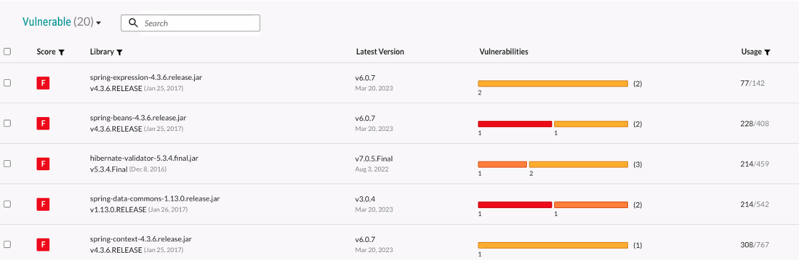
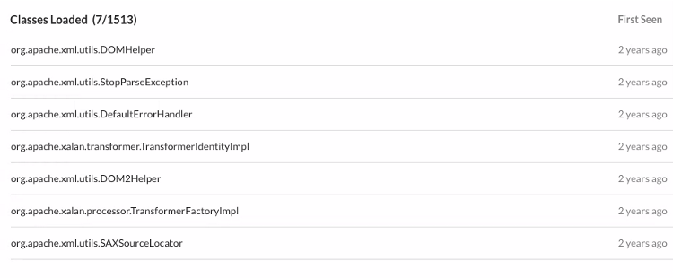
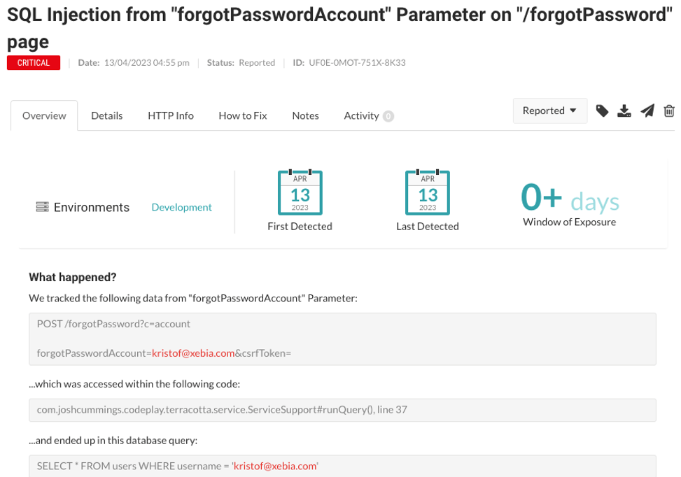
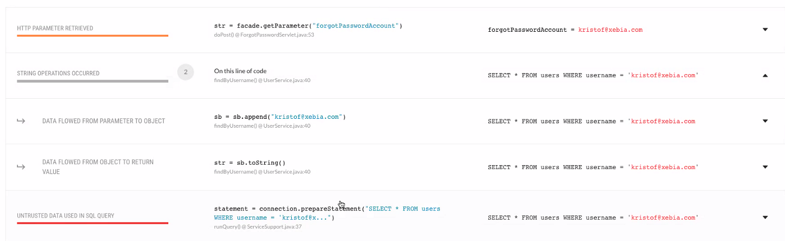

---
date: 2025-04-19
title: "Enable developers to generate safe and secure code"
seoTitle: "Empower developers to create secure code"
seoDescription: "Discover secure coding practices and tools, such as SAST, IAST, DAST, and RASP, to avoid security flaws in your apps"
datePublished: Sun Apr 16 2023 05:30:39 GMT+0000 (Coordinated Universal Time)
cuid: clgiyxtr8049nmsnv0xwq3h7y
slug: enable-developers-to-generate-safe-and-secure-code
cover: /assets/images/blog/enable-developers-to-generate-safe-and-secure-code/2025-04-19-enable-developers-to-generate-safe-and-secure-code.cover.png
tags: application-security, rasp, sast, dast, iast
featured: true
---

# Previously on...

[In my previous blog post](https://dotnet.kriebbels.me/the-hidden-dangers-of-jsons-hunger-silenced), I wrote about JSON RCE attacks. The possibility of such an attack exists, was brought to my attention in a report by [CheckMarx](https://checkmarx.com/cxsast-source-code-scanning/). I heard about SAST scans from the product team that I worked with. Our team was also briefed about application security by [Wesley Cabus](https://hashnode.com/@wcabus) on a knowledge-sharing moment at a [Xebia | Xpirit Tuesday](https://pages.xebia.com/knowledge-base-times-social-distancing).

# Context

I am trying to gain a better understanding of how I can code with a security mindset. Although I have heard of [Checkmarx](https://checkmarx.com/cxsast-source-code-scanning/), I did not got any insight into the process how security reports came to be. I still have many questions about the process. For example, why does it take two days before results are available? Why is this information only available at the end of the process? Additionally, I am confused as to why security is only available at the end of the development lifecycle. What about the packages that are used in the project? [In a previous post](https://dotnet.kriebbels.me/the-hidden-dangers-of-jsons-hunger-silenced), I wrote about the RCE (Remote Code Execution) that could be done with version 11 of Newtonsoft, but in the project, versions 12 and 13 were used. However, the SAST still flagged it.

Recently, I came across a company called [Contrast Security](https://www.contrastsecurity.com/) on [LinkedIn](https://www.linkedin.com/company/contrast-security). I was able to schedule a meeting with them. During this meeting, I received an introduction to application security. Next followed was a demo of their [product Contrast Assess](https://www.contrastsecurity.com/contrast-assess). They stressed that they offered a [community edition](https://www.contrastsecurity.com/contrast-community-edition). The community edition is free to play with. I want to stress that I am not affiliated, but I cannot hide that I am an enthusiast. I still need to play with the community edition.

Before I can show off how their community edition works, I believe it is important to understand application security. As developers, it is important to know what to use and when.

Contrast Security mentioned that other colleagues of mine at Xebia, have taken interest in their products: [Carlo Klerk](https://www.linkedin.com/in/carloklerk) and [Maarten Plat](https://www.linkedin.com/in/maartenplat/) from the Xebia Security team. Funny how small the world is. Xebia is off course a big company, it is hard to know all my colleagues.

Maarten Plat is busy with a 5-part blog series about this subject. [Part one tackles the subject SAST](https://xebia.com/blog/how-to-make-your-web-application-more-secure-by-using-static-application-security-testing-part-1-of-5-in-application-security-testing-series/). [Part two tackles the part DAST](https://xebia.com/blog/how-to-make-your-web-application-more-secure-by-using-dynamic-application-security-testing-dast-part-2-of-application-security-testing-series/). Other blog posts will tackle IAST and SCA. The last part will be about integrating those tools into a Continuous Integration (CI) pipeline. Maarten also made a tutorial about one of the products of Contrast Security, so be sure to follow him! Let us read below what all those abbreviations mean...

# Application Security

It is crucial to understand what tools are used during the development and product lifecycle. Writing secure code is essential. When you add a package with vulnerabilities or use an insecure way of working, you want to be notified as soon as possible. The same mindset applies to writing unit tests, automate your deployment to allow (automated) integration testing. This allows a better understanding of business, infrastructure and security requirements.

## At the beginning of a lifecycle

Even before you have runnable code, your work can already be insecure. The longer you wait to adjust this, the harder it is going to be. Read more about [Mitigating technical debt with developer-driven security (](https://www.securecodewarrior.com/article/mitigating-technical-debt)[securecodewarrior.com](http://securecodewarrior.com)[)](https://www.securecodewarrior.com/article/mitigating-technical-debt)

[On the website of contrast security, you can learn how to code securely.](https://www.contrastsecurity.com/developer/learn#Contrast-Secure-Code-Lessons)

### Static Code Scanning

[Static Application Security Testing (SAST)](https://en.wikipedia.org/wiki/Static_program_analysis) is a process that analyzes the source code to find security vulnerabilities. Some popular SAST tools are Checkmarx, SonarQube, and Fortify. SAST is very useful at the beginning of a greenfield development project. There are no real deliverables yet. [It can take a lot of time to scan the entire repository](https://salesforce.stackexchange.com/questions/158186/why-is-checkmarx-taking-so-long-to-complete).

However, there seem to be SAST tools out there that can also integrate into the CI pipeline. The downside of using the SAST tool is that you as a developer need to investigate false positives and negative negatives.

A great comparison of SAST tools is defined in the following [blog post](https://www.mend.io/resources/blog/best-sast-tools/). There you can read that an effective SAST tool should support the shift-left philosophy. That means it allows security testing to be done earlier in the software development lifecycle. It should scan entire repositories, integrate seamlessly with the CI/CD pipeline, and offer fast scanning speeds. A SAST tool should minimize false positives and promote developer productivity by providing useful suggestions and resources for code fixes and library updates. [The OWASP Foundation also states this. They also specify a list of vendors of SAST tools...](https://owasp.org/www-community/Source_Code_Analysis_Tools)

As a developer, I want to have great feedback with not much of false positives or negative negatives. My experience is that CheckMarx will choke itself when a developer writes loosely coupled code, using dependency injection. Because my colleague did not write its code loosely, he got a bunch of reported problems and I did not. However, there are cases mentioned in his report that I should apply as well.

As mentioned before, these tools will scan your repositories and make an in-memory model of your code. This way, they can try to see where possible problems exist. If you add code that is not used, the tool will know that and give you remarks on it. Even if that codepath is not used. But we all delete our dead code, right?

%[https://www.youtube.com/watch?v=pNlxH07iRZY] 

### Software Composition Analysis

Software Composition Analysis (SCA) is done by tools that manage the packages you use in your application. You want to make sure you use safe packages. [JFrog](https://jfrog.com/), [Mend](https://www.mend.io/), [Snyk](https://snyk.io/), [Contrast SCA](https://www.contrastsecurity.com/contrast-sca), and [Dependency-Check](https://jeremylong.github.io/DependencyCheck/) are some tools that are used for that.

[JFrog has a good blog post that tells you about the dangers of using third-party packages.](https://jfrog.com/blog/a-year-of-supply-chain-attacks-how-to-protect-your-sdlc/) I created a summary of how they suggest you can protect yourself from an attack like that. JFrog recommends:

* establishing a [vetting process for your supply chain](https://supplychaingamechanger.com/what-is-the-best-supplier-vetting-process/),
    
* shift security left in the [SDLC](https://en.wikipedia.org/wiki/Systems_development_life_cycle),
    
* [verify binary code integrity](https://en.wikipedia.org/wiki/Code_integrity),
    
* require an [SBOM](https://en.wikipedia.org/wiki/Software_supply_chain) for all software,
    
* protect your SDLC with multi-factor authentication,
    
* avoid [dependency confusion](https://medium.com/@alex.birsan/dependency-confusion-4a5d60fec610)
    
* avoid [typosquatting](https://en.wikipedia.org/wiki/Typosquatting) attacks,
    
* and [use version pinning](https://the-guild.dev/blog/how-should-you-pin-dependencies-and-why) for packages.
    

A lot of these recommendations need an investigation that goes beyond the scope of this blog post... I linked corresponding definitions and other blog posts that are worth reading.

Below you find an example of the JFrog Artifactory.

I loved the way that Contrast Security presented their SCA tool to me: [Contrast SCA | Software Supply Chain Security and Risk Management | Contrast Security](https://www.contrastsecurity.com/contrast-sca). Contrast Security does not only list the packages with known vulnerabilities but also identifies what code the developer uses from the package. E.g. when there is a vulnerable unused package in your repository, Contrast shows you are not using that package, thus you should not care about it. Another use case would be identifying where a vulnerable package is used in the organisation: [remember Log4J](https://www.reddit.com/r/msp/comments/rdba36/critical_rce_vulnerability_is_affecting_java/), a lot of companies needed to identify manually if they were using that vulnerable package.

## During the cycle of development and testing

Interactive Application Security Testing (IAST) is more dynamic and interactive than SAST. From what I understand is that IAST is useful for integration tests or local tests where you get direct feedback.

When I did my research for this blog post, [I noticed that Contrast Security has a vision of what to use in the CI/CD pipeline](https://www.contrastsecurity.com/hubfs/DocumentsPDF/Contrast-Scan-Modern-Application-Security-Scanning_Solution%20Brief_Final.pdf?hsLang=en). In summary, they find that traditional scanning tools are slow, compute-intensive, and expensive, hindering development pipelines and CI/CD processes. Their product uses instrumentation technology to attach to an application and observe how it handles requests during runtime. Instrumentation is also used by e.g. [New Relic](https://newrelic.com/) and [Azure Application Insights](https://learn.microsoft.com/en-us/azure/azure-monitor/app/app-insights-overview?tabs=net).

Visit the blog site [mytechramblings](https://www.mytechramblings.com/posts/getting-started-with-opentelemetry-metrics-and-dotnet-part-2/). There you find a real-life example of how to instrument code. Explaining instrumentation is not part of the scope of this blog post.

In the images below, you can find an example request, where the email address `kristof@xebia.com` is not properly handled by the application.

Their tool observes that

* there isn’t sufficient validation and sanitization of the user input in this request. That is a confirmation that there is an SQL injection flaw.
    
* the unsanitized input, which is the email address, ends up being used directly in the SQL Query. That is displayed in red in the image below.
    

Contrast tries to help the developer by giving a similar overview in the form of a stack trace. That overview shows the problem, where to fix that problem and gives guidance on how to remediate it.

The following video that I found gives a demo about Contrast Security. However, that one is 4 years old. Although the UI is outdated, you can get a good grasp on how such a tool can work.

%[https://www.youtube.com/watch?v=XiLc8piqJQY] 

## When you have a deliverable, before production

Dynamic Application Security Testing (DAST) is a process that analyzes the application in its running state to find security vulnerabilities. Examples of DAST tools are OWASP [ZAP](https://www.zaproxy.org/), [Burp Suite](https://portswigger.net/burp), and [Acunetix](https://www.acunetix.com/). I already downloaded [YSOSerial.Net](https://github.com/pwntester/ysoserial.net) for [my previous blog post](https://dotnet.kriebbels.me/the-hidden-dangers-of-jsons-hunger-silenced). However, when I cloned that repository, compiled that project and ran that, Windows Defender did not let me start that executable... You can find a great example of the usage of YSOSerial.Net in the following video.

%[https://www.youtube.com/watch?v=eDfGpu3iE4Q] 

Another popular tool is [Burp Suite](https://portswigger.net/burp). I recommend watching the next video on it.

%[https://www.youtube.com/watch?v=IWWYNDiwYOA] 

DAST is useful to test your application before you go into production. It is more difficult to find and understand errors. Unlike SAST, DAST is using your application as a black box. DAST does not know a thing about the application under test. Such a tool allows you to see if any known attacks are going to work on your application. My [blog post about JSON RCE Attack was a way of DAST](https://dotnet.kriebbels.me/the-hidden-dangers-of-jsons-hunger-silenced).

## After deployment

Also after deployment, there is a need for protection. I will discuss RASP (Runtime Application Self-Protection) and WAF (Web Application Firewalls).

Runtime Application Self-Protection (RASP) tools help you detect errors in real-time. Some popular RASP tools are [Sqreen](https://www.sqreen.com/), [Aqua](https://avd.aquasec.com/misconfig/aws/waf/), and [Wallarm](https://www.wallarm.com/). [Contrast Security also has a tool that does this](https://www.contrastsecurity.com/contrast-protect).

Web Application Firewalls or WAFs can be configured with specific rules to identify and block known attack patterns such as [SQL injection](https://www.stackhawk.com/blog/net-sql-injection-guide-examples-and-prevention/) and [cross-site scripting (XSS)](https://websitesecuritystore.com/blog/real-world-cross-site-scripting-examples/) based on signatures.

[The difference with Runtime Application Self-Protection, or RASP](https://geekflare.com/rasp-tools/), is a security technology deployed within the application itself. RASP provides real-time protection against attacks by monitoring the application's behaviour. It responds to threats as they arise. RASP is also capable of detecting and blocking attacks that were not previously known by looking at the behaviour. E.g. When a user tries to use a SQL injection attack, the tool will be able to detect that and throws an exception that results in an Internal Server Error. To see it in action, [Contrast has a video](https://www.contrastsecurity.com/security-influencers/contrast-vs-the-log4j2-cve-a-demonstration?wvideo=80y2qkb6aq) to show how their product defends against the Log4J exploit.

# Outro

I did my best to not let this post be a Contrast Security advertisement. I want to give them credit because they did take the time to explain to me the basics of application security. With that demo and the information is given, I did my research and learned a lot. I hope I can sparkle your interest in Application Security as well, so we can all code with a security mindset.

I want to test out the community edition that Contrast Security offers. I will share my experiences as well. That can be something to play with on an innovation day that is organized at Xpirit | Xebia. I do not know at this point where to find the time... But I promise I will add this to my to-do list.

