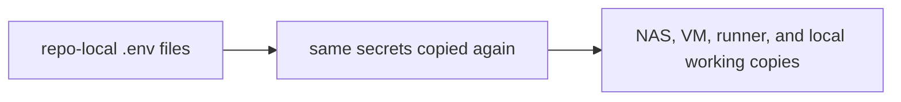
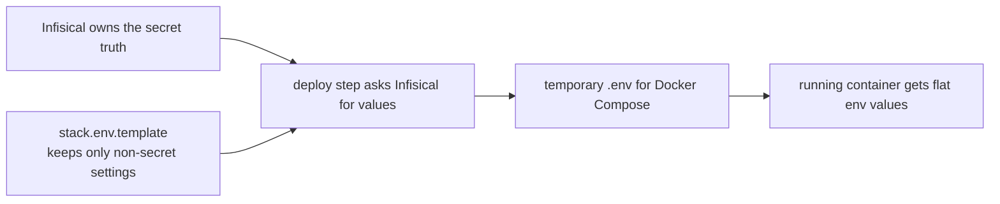
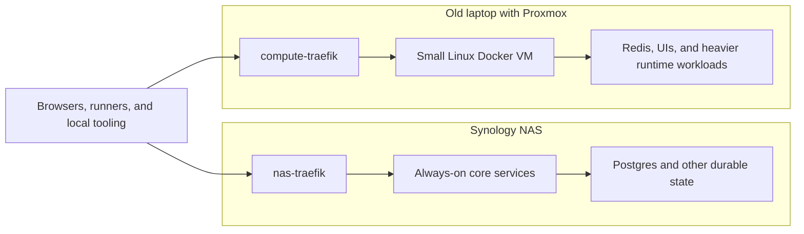

# Why I Finally Moved My HomeLab Secrets Out of `.env` Files

This is part 1 of a 3-part series.

- Coming next: `How I Designed My Infisical Secret Architecture`
- Then: `Infisical, Gitea Actions, and the Secret Zero Problem`

It has been a while since I published a technical post here.

The blog went quiet, but the work did not. In the meantime I started my company, spent a period at Liantis, and eventually landed back at AXA in a .NET-heavy role where I also help with system analysis, some Angular work, and the kind of DevOps support that takes pressure off the people who live in that space full time.

In the background the same thread kept running through everything else: HomeLab consolidation, local LLM experiments, and the bigger question underneath all of that. At what point does a small setup stop being a pile of useful scripts and start behaving like infrastructure? A short period at Liantis also made platform engineering click for me in a way it had not before.

It felt like the right post to return with because it sits exactly where several threads meet for me: .NET delivery, GitOps hygiene, self-hosted infrastructure, AI-assisted engineering, and secret management. The migration to Infisical was not a side quest. It was the point where those threads finally collided hard enough that I could not ignore them anymore.

## Previously On

A normal "Previously On" does not really work here, because the real context is not one previous post. It is the shape the HomeLab had grown into, and the way AI started forcing me to look at it differently.

I had multiple Docker stacks spread across a Synology NAS, a separate compute VM, and several repositories where `stack.env.template`, `.env`, and `stack.env` had accumulated over time. I keep those Compose definitions manageable through Dockge. None of that looked dramatic on its own. The problem was the pattern. Secrets and token-like values kept showing up as ordinary text in too many places.

That started to matter more once I leaned harder into AI-assisted development. Gemini, Codex, Copilot, and other tools kept warning about tokens, suspicious values, and repo contents that looked too close to secrets. Those warnings were sometimes annoying. They were also useful. They forced me to look at the setup without the sentimental HomeLab excuse.

I had told myself some version of the same story for too long: it is local, it is private, it is only the HomeLab, it is fine for now. That story only works until the HomeLab starts shaping my actual engineering habits. Once that happened, the cost of keeping secrets scattered across files stopped being theoretical.

## The Intake

The intake was simple. I wanted secrets to stop living as duplicated text files spread across the environment.

There was no dramatic breach. There was a slower accumulation of friction. AI tooling kept tripping over token-like values. I kept copying the same provider credentials between the NAS, the VM, and local working copies. Rotation felt heavier than it should. At some point I realized I could no longer answer a basic question cleanly: who actually owns this secret?

That is the kind of thing I mean by secret debt.

<!-- visual-slot: post1-infisical-overview-tight
type: screenshot
source: infisical authenticated overview
goal: show the vault as an operational control plane, not only as an installed product
see: docs/INFISICAL_VISUAL_STORYBOARD.md
-->


What you see in the screenshot above is the moment the migration stopped being a vague cleanup idea and became a real operating surface. The important part is not that Infisical has a web UI. The important part is that the HomeLab now has a control plane where secret ownership can live outside the repos.

Secret debt is not only "too many passwords." It is the operational drag that appears when secrets are duplicated, stored too close to code, edited by hand in multiple places, and difficult to rotate without anxiety. The debt stays quiet until the day it does not. Then it shows up as a stale `.env`, an unexpected `401`, or a runner that still uses last week's value.

I saw that pattern often enough that it stopped feeling like a minor inconvenience. It started to look like a problem in how the HomeLab was organized and deployed.

A platform problem is not solved by one careful afternoon of editing `.env` files. It needs a source of truth, a repeatable flow, and boundaries that survive a tired evening or a rushed deployment. That is the level at which I wanted to fix this.

Before, the secret flow really looked like this:



That was the part I wanted to get rid of. The vault was not missing yet. The problem was that the copies had become the operating model.

After the migration, the shape became this:



What the diagram above tells you is not that Docker Compose suddenly stopped wanting flat values. It still wants them. The improvement is that the flat file only exists at deployment time, instead of being copied around as the long-lived truth. Before, the copies were the normal way of working. After, the copy only exists at the last handoff where the runtime still needs it.

## Why This Became Worth Fixing Now

My HomeLab is no longer just a place where I run a few containers. It has become the place where I test delivery habits, ways of organizing the HomeLab, AI-assisted workflows, and local-first infrastructure. That changes the standard.

If I want the HomeLab to make me better at real delivery and platform work, I cannot keep teaching myself that duplicated secrets next to repos are normal. If I want to use LLMs seriously, I also cannot keep making them reason about token-like leftovers in ordinary working copies. And if local AI is going to become part of the workflow, code, config, and secrets need cleaner boundaries first.

That is the real reason this migration became worth doing. The old setup still worked, but it was quietly training me in habits I did not want to keep.

## What The LLMs Started Teaching Me

One of the ironies here is that the pressure to clean this up partly came from the tools that are supposed to help me move faster.

An LLM does not care about the HomeLab story I tell myself. It sees token-like strings, suspicious files, and blurry boundaries. Then it reacts accordingly. Sometimes that is useful. Sometimes it is irritating. Usually it is both.

What matters is not whether every warning is morally correct. What matters is that the warnings are exposing weak boundaries. If a repo keeps triggering secret heuristics, then the boundary between code and operational trust is still too soft. That matters even more once the models are helping with infrastructure investigation, planning, documentation, and patching. I want those tools to behave more like expensive consultants than curious interns rummaging through leftovers.

One of the more useful things the tooling taught me was how to turn vague discomfort into a concrete design problem. The same thing happened again and again: a model ran into token-like files, or a workflow blurred config and secret in a way that made the whole conversation noisier than it should have been. That was frustrating, but it was also useful feedback. It meant too much operational meaning was still leaking into ordinary repo state.

## Show And Tell: The Intake In My Own Words

The chat history around this migration is useful because it shows that the intake was never abstract. It was practical from the start, and it looked exactly like the kind of thing I would actually go back and grep later.

```text
~/.gemini/tmp/<user>/chats/2026-03-*/session-*.md
/home/kristof/git/nas-infra-infisical/

excerpt:
on our nas and docker compute we work with secrets in the *.env files
ensure we use infisical for this

note that not everything in a .env file or stack.env file is a secret or a token

make sure git repos are up to date before making changes so you can revert
after using infisical and it works we can rewrite the history
```

That combination captures how I wanted to approach the migration. I wanted progress, but I wanted reversibility as well. I wanted better boundaries, but I did not want fake absolutism. Not every value in an env file is a secret. Ports, project names, and non-sensitive defaults still belong in normal configuration. The real problem was not that env files existed. The real problem was that sensitive values were living in places where they should not.

That distinction shaped the whole design.

A tiny example helps more here than another paragraph:

```dotenv
# old mixed shape
COMPOSE_PROJECT_NAME=traefik
TRAEFIK_HTTP_PORT=80
TRAEFIK_HTTPS_PORT=443
CLOUDFLARE_API_TOKEN=cf_v1_abcd***
LETSENCRYPT_EMAIL=admin@itkriebbels.be
```

It is not a dramatic file, and that is exactly why it is useful. Most of the file looks normal. Only one or two values are genuinely sensitive. That is how secret sprawl becomes easy to defend for too long. The mixed shape feels harmless until tooling, rotation, and automation start treating it like a blurry trust boundary.

## Why This Also Became A Privacy Story

At first glance, this is an infrastructure hygiene story. It is that. It is also a privacy story in a more practical sense.

Once I started using cloud LLMs seriously, I had to ask a different set of questions. Which repositories should these tools see? Which files should they never need to inspect? How much sensitive operational state am I normalizing into everyday context windows without noticing?

I do not think the useful answer is fearmongering. I still use cloud LLMs because they genuinely help. They help me think faster, compare options, write better, and move through dull work with less friction. That is precisely why I care about reducing the amount of sensitive material that sits near ordinary working context.

The local LLM lab matters to me for the same reason. I do not think local models replace the strongest cloud models today. I do think they give me a cleaner split. Local models are useful for sensitive inspection, infra-heavy logs, and token-adjacent work. Cloud models remain useful for higher-level reasoning, writing, and comparison once the context is already clean enough. That split only becomes credible if the secret story underneath it is also credible.

## Why "It Must Work Without Internet" Matters

When I say I wanted this to work without internet, I do not mean I expect my internet connection to fail every week. I mean I do not want basic internal secret discipline to depend on public internet access.

That matters because it changes what kind of system I am building. If the HomeLab keeps functioning when the outside world is noisy, I learn better instincts. If every local problem gets solved by public SaaS on day one, I teach myself a much narrower model of infrastructure than the one I actually want to practice.

That is one reason Infisical appealed to me. I wanted a secret control plane that belonged to the environment it served.

## Why Not Bitwarden?

Before landing on Infisical, the most obvious alternative was Bitwarden Secrets Manager.

Bitwarden came into the picture for a very ordinary reason: I was paying the yearly subscription anyway. That made Bitwarden Secrets Manager a fair comparison from the start, not a straw man.

The part that pushed me away was the shape of the problem. I was not trying to answer "where do I store one more sensitive string?" I was trying to answer how runners should fetch stack-specific secrets, how shared provider credentials should be owned once, and how the whole thing should keep working locally without dragging sensitive material through too many repos and working copies. That is much closer to platform design than to personal credential storage.

The decisive requirement was local-first operation. I wanted the HomeLab to keep its own secret control plane close to the workloads it serves. I also want a future where local development can use a local Infisical-facing path or proxy of my own instead of assuming the wider network is always part of the answer. Once that became a hard requirement, the comparison changed. Bitwarden Secrets Manager is a sensible product in the right family. It just does not line up with the operating model I want this environment to teach me.

## What Changed

The migration touched a broad slice of the HomeLab: `paperless-private`, `traefik`, `immich` on the VM, `litellm` on the VM, `gk-shield`, `gk-mailfence`, `gk-fixtures`, and `compute-traefik` on the VM, among others that share the same operating model. The `gk-` prefix is my Gatekeeper project family, so those names are part of the same personal platform story rather than random one-offs.



What the diagram above tells you is how I want the HomeLab to stay split physically. The NAS carries the durable side, especially databases and state that should stay close to the disks. The old laptop carries the compute side: Redis, heavier runtimes, and the UI-heavy workloads that make more sense there. There is a Traefik on each side because there are two routing surfaces in practice, not one. I will come back to that later, but it matters here because the secret architecture sits on top of that split.

The change was not simply "take the old `.env` values and paste them into a vault." In practice it meant:

1. self-hosting Infisical on the NAS at `http://192.168.5.90:8081`
2. creating one central project that acts as the operational vault for the HomeLab
3. reorganizing secrets around products and providers instead of copying them per stack
4. introducing machine identities for Gitea runner workflows
5. updating deployments so stacks receive secrets during the pipeline instead of carrying them around as long-lived repo artifacts

If I had to compress the change into one sentence, it would be this: I was not trying to centralize duplication. I was trying to replace duplication with architecture.

One saved chat fragment captures the mood of the migration better than a polished summary ever could:

```text
~/.codex/history.jsonl
~/.codex/archived_sessions/<session-id>.jsonl

excerpt:
llms keep complaining about tokens found, even it is only in my local homelab...
```

That sentence is useful because it shows the tension honestly. My first instinct was still to defend the local mess because it was local. The tools did not care about that argument. They kept forcing the same question back on me: if this boundary is messy enough that even normal tooling trips over it, why am I still defending it?

## Why Infisical Fits This Environment

Infisical is not just a prettier place to put environment variables. In this setup it became the control plane for secret distribution.

That distinction matters because the wrong mental model recreates the old mess behind a nicer UI. If I think of Infisical as the place where I dump passwords, I still end up with sprawl. If I think of it as the place where secret ownership and distribution live, I start designing runtimes, runners, and stacks around a cleaner source of truth.

For my environment, the important properties were self-hosting, machine identity workflows, imports and references, a usable CLI, and local-first operation. I wanted the vault model to fit the HomeLab I actually have.

That last point is easy to underestimate. I did not want to adopt a product and then spend the next year working around the fact that it assumes a different world than mine. The HomeLab has a Synology NAS, a VM, Macvlan quirks, local DNS habits, Gitea runners, and a strong desire to remain useful even when the internet is irrelevant or temporarily absent. The product needed to fit that world.

## The AI Angle

This migration also sits inside my broader AI workflow, even though I do not want AI to run infrastructure blindly.

What I do want is a cleaner setup for AI-assisted work. I want repos that contain less accidental secret material. I want working copies that are easier to reason about. I want automation with clearer trust boundaries. I want the HomeLab to support LLM experiments without normalizing sloppy secret habits as the cost of experimentation. Part of that is also coaching Gemini and Codex better: clearer instructions, better guardrails, and fewer leftover files for them to stumble over.

Part of why this post felt worth writing is that secret management, GitOps, HomeLab operations, machine identities, developer tooling, and AI-assisted engineering are no longer separate topics for me. They are different edges of the same system.


What the illustration above shows is one HomeLab seen from several sides at once. The vault, the runners, the local workflows, and the AI tooling all pull on the same setup. That is why this stopped feeling like “just one more secret tool” and started feeling like part of the same environment I was already trying to understand better.

## What’s Next

Coming next is the architecture post: why I organized secrets by product instead of by stack, how imports and references changed the design, and why that model is cleaner than duplicating values into every consumer.

Then I will get into the GitOps and machine-identity side: Universal Auth, the Secret Zero problem, `infisical run`, `infisical export --expand`, and the networking details that made the final setup behave correctly.

The series titles are already set:

- Part 2: `How I Designed My Infisical Secret Architecture`
- Part 3: `Infisical, Gitea Actions, and the Secret Zero Problem`

## Outro

That, in the end, is the real reason I made the move.

This was not only about cleaning up secrets. It was also about learning better habits, giving AI tooling clearer boundaries, and building a HomeLab that teaches me the kind of platform discipline I actually want to keep.

Once I looked at it that way, moving to Infisical stopped feeling like over-engineering. It felt late.
