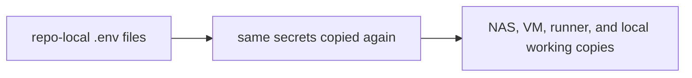
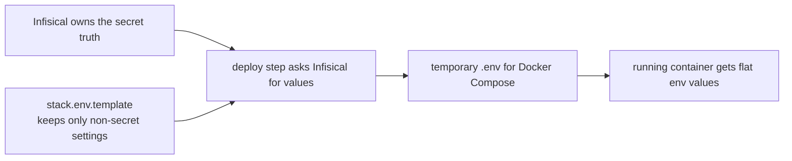
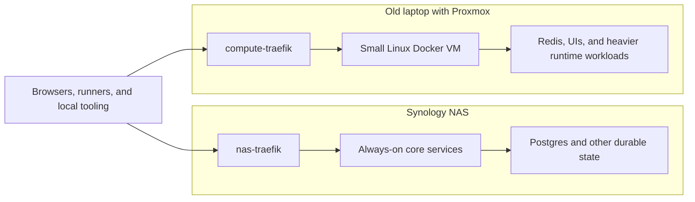

# Why I Finally Moved My HomeLab Secrets Out of `.env` Files

This is part 1 of a 3-part series.

- Coming next: `How I Designed My Infisical Secret Architecture`
- Then: `Infisical, Gitea Actions, and the Secret Zero Problem`

My technical posts went quiet for a while, but the systems around me did not.

During that stretch I started my company, spent some time at Liantis, and later returned to AXA in a .NET-heavy role. A lot of that work lives in the overlap between code, analysis, some Angular, and the kind of DevOps support that keeps delivery from stalling.

At home I was doing the same kind of work in miniature. I kept consolidating the HomeLab, testing local LLM workflows, and noticing that the setup no longer felt like a loose pile of containers. It had started to behave like infrastructure I relied on. My time at Liantis also pushed me toward platform engineering thinking in a way that finally stuck.

That is why this felt like the right post to return with. It sits at the intersection of .NET delivery, GitOps hygiene, self-hosted infrastructure, AI-assisted engineering, and secret management. Moving to Infisical was the moment those threads stopped being separate concerns and started pressing on the same design problem.

## Previously On

A normal "Previously On" does not really work here because the real context is not one older post. It is the shape the HomeLab had grown into, and the way AI started forcing me to inspect that shape more honestly.

I had Docker stacks spread across a Synology NAS, a separate compute VM, and several repositories where `stack.env.template`, `.env`, and `stack.env` had accumulated over time. I keep those Compose definitions manageable through Dockge. None of that was dramatic on its own. The problem was the pattern: secrets and token-like values kept showing up as ordinary text in too many places.

That started to matter more once I leaned harder into AI-assisted development. Gemini, Codex, Copilot, and other tools kept warning about tokens, suspicious values, and repo contents that looked too close to secrets. Those warnings were sometimes annoying. They were also useful. They forced me to look at the setup without the sentimental HomeLab excuse.

For too long I kept giving myself the same excuse: it is local, it is private, it is only the HomeLab, I will clean it up later. That excuse gets weaker once the HomeLab starts influencing how I think about delivery, automation, and repo hygiene in my day job as well.

## The Intake

The starting point was simple enough: I wanted secrets out of the copied text files scattered across the environment.

There was no dramatic breach behind this change. What kept building instead was friction. AI tooling kept tripping over token-like values. I kept moving the same provider credentials between the NAS, the VM, and local working copies. Rotating anything felt heavier than it should. After a while I could not answer a basic question cleanly anymore: who actually owned a given secret?

That is what I mean by secret debt.

<!-- visual-slot: post1-infisical-overview-tight
type: screenshot
source: infisical authenticated overview
goal: show the vault as an operational control plane, not only as an installed product
see: docs/INFISICAL_VISUAL_STORYBOARD.md
-->


The screenshot above marks the point where the migration stopped feeling like vague cleanup and started feeling operational. The useful part was not the presence of a web UI. The useful part was finally having a control plane where secret ownership could live outside the repos.

When I say secret debt, I do not mean only "too many passwords." I mean the drag that appears when secrets are duplicated, kept too close to code, edited by hand in several places, and annoying enough to rotate that I postpone it. That kind of debt stays quiet until it turns into a stale `.env`, an unexpected `401`, or a runner still using last week's value.

I ran into that pattern often enough that it stopped looking like a minor nuisance. It was really an architecture problem, which meant I was not going to fix it with one careful evening of `.env` edits. I needed a source of truth and a deployment flow that still made sense when I was tired or in a hurry.

Before, the secret flow really looked like this:



That was the part I wanted to get rid of. The vault was not missing yet. The problem was that the copies had become the operating model.

After the migration, the shape became this:



Docker Compose still wants flat values. That part did not change. What changed is where the long-lived truth lives. Before, copied env files were the normal operating model. After the migration, the flat file only exists at the last handoff where the runtime still needs it.

## Why This Became Worth Fixing Now

The HomeLab had become my test bench for delivery habits. I use it to try GitOps flows, split workloads between the NAS and the VM, and see what breaks when AI tooling has to reason about real repo state instead of a neat demo project.

Once I looked at it that way, duplicated secrets next to repos stopped feeling like harmless clutter. They were part of the habits I was reinforcing. If I want this environment to make me better at platform work, the boundary between code, config, and secrets has to hold up here too.

## What The LLMs Started Teaching Me

One of the ironies here is that the pressure to clean this up partly came from the tools that are supposed to help me move faster.

An LLM does not care about my story about "just a local lab." It sees token-like strings, suspicious files, and awkward boundaries, then it starts complaining. That is sometimes irritating, but it is also useful.

I did not need every warning to be perfect for the pattern to be obvious. If Gemini or Codex kept stumbling over token-like files in ordinary repos, I had left too much operational meaning in the wrong places. That gets more expensive once the same tools are helping me inspect infrastructure, compare options, write docs, and patch repos. I want those tools to behave more like expensive consultants than curious interns rummaging through leftovers.

What the tooling did well was turn vague discomfort into a concrete design problem. The same thing kept happening: a model hit token-like files, or a workflow blurred config and secret enough to make the conversation noisy. That frustration was also feedback. It meant too much trust-sensitive information was still leaking into ordinary repo state.

## Show And Tell: The Intake In My Own Words

The chat history around this migration is useful because it shows that the intake was never abstract. It was practical from the start, and it looked exactly like the kind of thing I would actually go back and grep later.

```text
~/.gemini/tmp/<user>/chats/2026-03-*/session-*.md
/home/kristof/git/nas-infra-infisical/

excerpt:
on our nas and docker compute we work with secrets in the *.env files
ensure we use infisical for this

note that not everything in a .env file or stack.env file is a secret or a token

make sure git repos are up to date before making changes so you can revert
after using infisical and it works we can rewrite the history
```

That note already contained the constraint that mattered most to me. I did not want a fake cleanup where every value in an env file suddenly counted as a secret. Ports, project names, and other boring defaults still belong in normal configuration. The values I wanted out were the ones that changed the trust boundary when they leaked or got copied around.

That pushed the migration toward separating `stack.env.template` from secret material instead of pretending env files themselves were the enemy.

A small Traefik example shows the problem better than another abstract paragraph:

```dotenv
# old mixed shape
COMPOSE_PROJECT_NAME=traefik
TRAEFIK_HTTP_PORT=80
TRAEFIK_HTTPS_PORT=443
CLOUDFLARE_API_TOKEN=cf_v1_abcd***
LETSENCRYPT_EMAIL=admin@itkriebbels.be
```

I had files like this in more than one place. Four lines are ordinary settings I would expect to keep in Git. Then there is a Cloudflare token in the same shape, edited in the same way, easy to copy, easy to forget, and easy to leave behind in a working tree. That was the real problem. Nothing about the file looked alarming enough to force a cleanup on its own.

## Why This Also Became A Privacy Story

On paper this is an infrastructure hygiene story. In practice it also changed how comfortable I felt handing repo context to cloud LLMs.

Once I started using those tools seriously, the questions changed. Which repositories should they see? Which files should stay out of scope completely? How much operational state was I normalizing into everyday context windows without noticing?

I do not think the useful answer is fearmongering. I still use cloud LLMs because they genuinely help. They help me think faster, compare options, write better, and move through dull work with less friction. That is precisely why I care about reducing the amount of sensitive material that sits near ordinary working context. I did not really arrive at that conclusion up front. It became obvious only after I started using the tools seriously and kept seeing where they tripped.

The local LLM lab matters to me for the same reason. I do not think local models replace the strongest cloud models today. I do think they give me a cleaner split. Local models are useful for sensitive inspection, infra-heavy logs, and token-adjacent work. Cloud models remain useful for higher-level reasoning, writing, and comparison once the context is already clean enough. That split only becomes credible if the secret story underneath it is also credible.

## Why "It Must Work Without Internet" Matters

When I say I wanted this to work without internet, I do not mean I expect my internet connection to fail every week. I mean I do not want basic internal secret discipline to depend on public internet access.

That requirement changes the kind of system I am trying to build. If the HomeLab keeps functioning when the outside world is noisy, I learn better instincts. If every local problem gets solved by public SaaS on day one, I teach myself a much narrower model of infrastructure than the one I actually want to practice.

That is one reason Infisical appealed to me. I wanted the secret control plane to belong to the environment it served.

## Why Not Bitwarden?

Before landing on Infisical, the most obvious alternative was Bitwarden Secrets Manager.

Bitwarden came into the picture for a very ordinary reason: I was paying the yearly subscription anyway. That made Bitwarden Secrets Manager a fair comparison from the start, not a straw man.

The part that pushed me away was the shape of the problem. I was not trying to answer "where do I store one more sensitive string?" I was trying to answer how runners should fetch stack-specific secrets, how shared provider credentials should be owned once, and how the whole thing should keep working locally without dragging sensitive material through too many repos and working copies. That is much closer to platform design than to personal credential storage.

The decisive requirement was local-first operation. I wanted the HomeLab to keep its own secret control plane close to the workloads it serves. I also want a future where local development can use a local Infisical-facing path or proxy of my own instead of assuming the wider network is always part of the answer. Once that became a hard requirement, the comparison changed. Bitwarden Secrets Manager is a sensible product in the right family. It just does not line up with the operating model I want this environment to teach me.

## What Changed

The migration touched a broad slice of the HomeLab: `paperless-private`, `traefik`, `immich` on the VM, `litellm` on the VM, `gk-shield`, `gk-mailfence`, `gk-fixtures`, and `compute-traefik` on the VM, among others that share the same operating model. The `gk-` prefix is my Gatekeeper project family, so those names are part of the same personal platform story rather than random one-offs.



What the diagram above tells you is how I want the HomeLab to stay split physically. The NAS carries the durable side, especially databases and state that should stay close to the disks. The old laptop carries the compute side: Redis, heavier runtimes, and the UI-heavy workloads that make more sense there. There is a Traefik on each side because there are two routing surfaces in practice, not one. I will come back to that later, but it matters here because the secret architecture sits on top of that split.

The change was not simply "take the old `.env` values and paste them into a vault." In practice it meant:

1. self-hosting Infisical on the NAS at `http://192.168.5.90:8081`
2. creating one central project that acts as the operational vault for the HomeLab
3. reorganizing secrets around products and providers instead of copying them per stack
4. introducing machine identities for Gitea runner workflows
5. updating deployments so stacks receive secrets during the pipeline instead of carrying them around as long-lived repo artifacts

If I had to compress the change into one sentence, it would be this: I was not trying to centralize duplication. I was trying to remove it from the design.

One saved chat fragment captures the mood of the migration better than a polished summary ever could:

```text
~/.codex/history.jsonl
~/.codex/archived_sessions/<session-id>.jsonl

excerpt:
llms keep complaining about tokens found, even it is only in my local homelab...
```

I keep that fragment because it shows the tension honestly. My first instinct was still to defend the local mess because it was local. The tools did not care about that argument. They kept forcing the same question back on me: if this boundary is messy enough that even normal tooling trips over it, why am I still defending it?

## Why Infisical Fits This Environment

Infisical is not just a prettier place to put environment variables. In this setup it became the control plane for secret distribution.

That difference matters because the wrong mental model simply recreates the old mess behind a nicer UI. If I treat Infisical as a place to dump passwords, I still end up with sprawl. If I treat it as the place where secret ownership and distribution live, I start designing runtimes, runners, and stacks around a cleaner source of truth.

For my environment, the important properties were self-hosting, machine identity workflows, imports and references, a usable CLI, and local-first operation. I wanted the vault model to fit the HomeLab I actually have.

That last point is easy to underestimate. I did not want to adopt a product and then spend the next year working around the fact that it assumes a different world than mine. The HomeLab has a Synology NAS, a VM, Macvlan quirks, local DNS habits, Gitea runners, and a strong desire to remain useful even when the internet is irrelevant or temporarily absent. The product needed to fit that world.

## The AI Angle

This migration also sits inside my broader AI workflow, even though I do not want AI to run infrastructure blindly.

What I do want is a cleaner setup for AI-assisted work: repos with less accidental secret material, working copies that are easier to reason about, automation with clearer trust boundaries, and a HomeLab that supports LLM experiments without normalizing sloppy secret habits as the price of experimentation. Part of that is also coaching Gemini and Codex better with clearer instructions, better guardrails, and fewer leftover files for them to stumble over.

Part of why this post felt worth writing is that secret management, GitOps, HomeLab operations, machine identities, developer tooling, and AI-assisted engineering are no longer separate topics for me. They are different edges of the same system.


What the illustration above shows is one HomeLab seen from several sides at once. The vault, the runners, the local workflows, and the AI tooling all pull on the same setup. That is why this stopped feeling like “just one more secret tool” and started feeling like part of the same environment I was already trying to understand better.

## What’s Next

Coming next is the architecture post: why I organized secrets by product instead of by stack, how imports and references changed the design, and why that model is cleaner than duplicating values into every consumer.

Then I will get into the GitOps and machine-identity side: Universal Auth, the Secret Zero problem, `infisical run`, `infisical export --expand`, and the networking details that made the final setup behave correctly.

The series titles are already set:

- Part 2: `How I Designed My Infisical Secret Architecture`
- Part 3: `Infisical, Gitea Actions, and the Secret Zero Problem`

## Outro

That is the real reason I made the move.

This was not only about cleaning up secrets. It was also about learning better habits, giving AI tooling clearer boundaries, and building a HomeLab that teaches me the kind of platform discipline I actually want to keep.

Once I started looking at it through that lens, moving to Infisical stopped feeling like over-engineering. It felt overdue.
