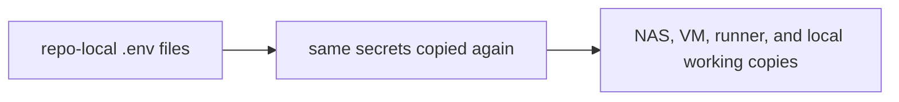
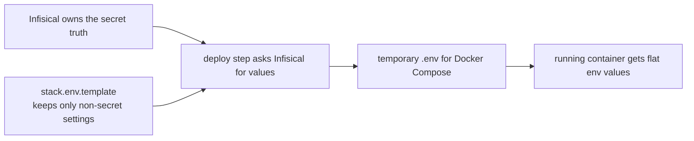
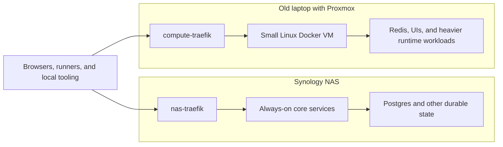

This is part 1 of a 3-part series on the move to Infisical<sup><a href="#fn-infisical" id="ref-infisical">1</a></sup>.

- Part 2: `How I Designed My Infisical Secret Architecture`
- Part 3: `Infisical, Gitea Actions, and the Secret Zero Problem`

I had not written here for a while, but my journey still continues as an independent consultant. And boy, I am having fun. Let’s deep dive.

I started my company, spent a period at Liantis, and later landed back at AXA. Most of the work is still .NET, with some Angular and the usual spillover into DevOps support and system analysis. Outside work I kept cleaning up the homelab, tightening GitOps, and trying local LLMs while parts of the setup were still more improvised than I liked.

By then I was working across two hosts, a stack of repos, and separate routing. Calling it containers at home felt off.

There was no catastrophic breach behind it. I got sick of carrying the same secrets around all over the place.

## What Was Sitting There

I had a Synology NAS<sup><a href="#fn-synology" id="ref-synology">2</a></sup>, a separate Linux VM, and a handful of repositories.

On the NAS side I use a DS220+ with the RAM bumped to 6 GB. It is stable, which matters more than anything else here, and it holds the durable side of the environment: storage, databases, and the services I want close to disk. The Linux VM runs on an old laptop through Proxmox.

I keep the durable workloads on the NAS and the more moveable or heavier ones on the laptop side. Between those two boxes I had Docker stacks, managed with Dockge<sup><a href="#fn-dockge" id="ref-dockge">3</a></sup>. Adding all those `stack.env.template`, `.env`, `stack.env`, and `docker compose` files builds up quietly. You add another stack, then another host, then two services need the same provider token, and before long you are copying values around because you just want the deployment to finish. Before that I was using Portainer, but the LLMs kept trying to treat everything like plain `docker compose` in one obvious location. They never really coped well with the separate numbered folders Portainer was using behind the scenes, so I ended up moving to something more bare-bones and closer to the actual Compose files.

## When It Started To Hurt

Env files were not the issue by themselves. Trouble started when sensitive values sat there for too long, spread across copies, with no obvious owner.

Most of a file like this is ordinary config:

```dotenv
COMPOSE_PROJECT_NAME=traefik
TRAEFIK_HTTP_PORT=80
TRAEFIK_HTTPS_PORT=443
LETSENCRYPT_EMAIL=admin@itkriebbels.be
```

But then one or two sensitive values sit in the same file:

```dotenv
CLOUDFLARE_API_TOKEN=cf_v1_abcd***
```

Because the file looks routine, the secret starts to feel routine too. That is how the mess spreads. The same value ends up on the NAS, on the VM, in a local repo checkout, in a backup copy, and sometimes in another stack that needed it in a hurry.

I rotated a value and then had to work out which service on which machine was still using the old copy. One stack came back fine, another did not, and I was manually checking env files to find the stale one. Nothing blew up, but the annoyance alone told me the setup had outgrown the shortcut.


By then Infisical was no longer something I was testing on the side. It had become part of how the homelab worked.

## AI Tooling Made It More Obvious

Gemini, Codex, Copilot and similar tools kept complaining about token-like values, suspicious strings, or repo contents that looked too close to secrets. Those warnings were not always right in a strict sense. Sometimes they were noisy. Still, they kept pointing at the same weakness: too much operational meaning was leaking into normal working copies.

A model does not care about the excuses I tell myself about the homelab being "local anyway." It sees something that looks like a secret and reacts like that boundary is messy. Once I noticed the same pattern often enough, it got harder to dismiss.

I do want to use LLMs for real work: comparing approaches, helping with refactors, reviewing config, writing docs, and thinking through architecture. That works a lot better when code, config, and sensitive runtime state are not all sitting in the same pile.

## I Wasn't Trying To Ban `.env`

I was not trying to get rid of `.env` files altogether. Docker Compose still wants flat env values, and I am not interested in pretending otherwise. Not everything in an env file is a secret either. Ports, project names, feature flags, and non-sensitive defaults can stay as normal config.

What I wanted to stop doing was using `.env` files as the long-lived source of truth for secrets.

The first diagram below is the old pattern. The same secret starts in a repo-local env file, gets copied again, and then ends up spread across the NAS, the VM, the runner, and local working copies.



The second diagram is the shape I was trying to move toward. Infisical holds the sensitive values, the deploy step asks for them when it needs them, and Docker Compose still gets the flat env values it expects, but only at the last handoff.



I wanted one place to hold the sensitive values, the deploy step to fetch them, the repos to keep the boring settings, and Docker Compose to see a temporary flat env file only at the handoff.

## Why Infisical

Bitwarden Secrets Manager<sup><a href="#fn-bitwarden" id="ref-bitwarden">4</a></sup> was the first obvious comparison because I was already paying for Bitwarden and noticed that Secrets Manager came with it, so I could use that path as well.

Even though it is American software and I try to use European tools where I can, I also try to stay honest about what that looks like in practice. Doing everything the European way is still harder than people sometimes make it sound, and it takes a bit of character to keep pushing there consistently.

If I had needed a place to keep a couple of secrets, that would have been fine. By then I needed something that worked with self-hosting, local-first workflows, machine identities, CLI use, shared provider credentials, and a deploy flow that did not drag secret values through every repo.

Infisical made more sense in that setup because of the model around it: imports, references, machine identities, CLI support, and the fact that I could keep the control plane close to the environment it serves.

A lot of tooling sounds good until it starts assuming a different environment than the one you are running. I wanted something that matched the homelab I actually have.

Mine has a Synology NAS, a VM on old hardware, Gitea runners, local DNS habits, some Macvlan weirdness, and a strong preference for keeping internal services internal where possible. I wanted a secret system that matched that reality instead of fighting it.

## What Changed First

The first migration step was dumping everything into a vault.

That part is worth saying honestly, because it did not start with a clean product model. Codex was much more hesitant about this migration at first. Gemini, on the other hand, was very ready to scan the files, push the values into Infisical, and organize them per stack. That got the move started quickly, but it also recreated the same problem in a new place: the copies were still there, only now they lived in a vault.

I noticed that pretty quickly, and that is where the second step started to matter more than the first one. I let Gemini refactor the structure through Playwright MCP into a product-based model instead of a stack-based one. That was the point where the migration stopped being "put everything somewhere central" and started becoming an actual design cleanup.

After that, I started separating what was actually secret from what was config. I pulled the non-sensitive values into `stack.env.template` files and left those in the repos. Ports, names, and regular defaults could stay where they were. The sensitive values stayed in Infisical, and the deploy flow changed so the runner could fetch them when needed.

Before I landed on Gitea runners, I experimented with webhooks. The LLMs kept tripping over that setup, which told me pretty quickly that I was pushing into a construction they were not very good at reasoning about. That kept slowing me down instead of helping me forward. In the end I dropped that path and moved to runners, partly because it is the more standard way to do this and partly because it gave me something the tooling could reason about much more reliably.

That touched more of the homelab than I expected: `paperless-private`, `traefik`, `immich` on the VM, `litellm` on the VM, `gk-shield`, `gk-mailfence`, `gk-fixtures`, `compute-traefik`, and other stacks following the same pattern. The `gk-` prefix is my Gatekeeper project family, so that was not random sprawl. The same pattern kept showing up, which is where a proper secret model helps.

The physical split stayed the same:



I want to keep that physical split. The NAS carries the durable side, with databases and state that should stay close to the disks. The old laptop carries the compute side: Redis, heavier runtimes, and the UI-heavy workloads that make more sense there. A Traefik runs on each side because in practice there are two routing surfaces, not one.

I did not redesign the entire homelab. I changed how secrets moved through it.

## The Tradeoff Is Real

For simple containers, the old way felt easier. Open `.env`, paste value, restart, done. Infisical adds more machinery: bootstrap work, machine identity setup, Secret Zero, and more structure to maintain.

Because of that, debugging changes as well. With a plain env file, the value is right there. With a vault-based flow, I sometimes have to check the identity, the fetch step, the export step, and the runtime handoff before I know where the problem actually is.

By the time I made this move, the duplication had already become more expensive than the extra structure.

```text
~/.codex/history.jsonl
~/.codex/archived_sessions/<session-id>.jsonl

excerpt:

llms keep complaining about tokens found, even in my local homelab...
```

The saved fragment is blunt enough on its own. I kept defending the local mess because the setup was local. The tools never cared about that argument.

## Why I Wanted It Local

I wanted this to keep making sense even when public internet was not part of the path. Not because I expect the connection to fail every week, but because I do not want basic internal secret discipline to depend on a public service being reachable. If the homelab keeps working when the outside world gets noisy, I learn better habits from it. If every local problem gets solved by public SaaS on day one, I end up practicing a narrower kind of infrastructure than the one I actually want to get better at.

## Why Privacy Became Part Of It

This started bothering me more because the LLMs kept complaining about files, values, and leftovers that looked too much like secrets. At first that was just irritating. After a while, with all the terminal hacks, helper scripts, and agent workflows around them, it became harder to ignore what was really going on.

Those tools keep trying to get where they need to go. If a token is sitting around in a repo, a leftover file, or some other working copy, they will eventually run into it or try to use it because that is the shortest path to the goal they were given.

That changed the way I looked at the homelab. I was leaving too much sensitive data around while working with LLMs, and those tools are very good at following whatever path looks useful.

I still use cloud LLMs because they are useful. I also care a lot more now about what they get to see by default.


By then this was not one isolated secret-management problem anymore. The vault, the runners, the local workflows, and the AI tooling were all pulling on the same setup. Halfway through the migration I could see it touching the rest of the environment as well. GitOps got involved because the repos, deploy flows, and runner jobs all had to stop assuming the secret was already sitting beside the stack. Shared credentials were part of it too, because once the same provider token shows up in several places, ownership gets vague very quickly. The amount of noise in AI-assisted work was tied to that same mess. I should probably have done it earlier.

## What Comes Next

The next post gets into the secret structure itself: why I grouped secrets by product or provider instead of by stack, and how imports and references changed the model.

After that I want to get into the runner side: machine identities, Universal Auth, `infisical run`, `infisical export --expand`, and the networking details across the NAS and the compute VM.

## Footnotes

1. <span id="fn-infisical"></span>[Infisical](https://infisical.com/) is the self-hosted secret control plane in this series because imports, references, machine identities, and the CLI fit this GitOps flow better than copied `.env` files. <a href="#ref-infisical">↩</a>
2. <span id="fn-synology"></span>[Synology DS220+](https://www.synology.com/en-nz/company/news/article/DS220plus/Synology%C2%AE%20Introduces%20DS220%2B) with 6 GB RAM, used here for storage, databases, and other persistent services. <a href="#ref-synology">↩</a>
3. <span id="fn-dockge"></span>[Dockge](https://github.com/louislam/dockge) is the lightweight Compose manager I use because the files stay plain and easy to diff; I moved there after Portainer because the numbered folder structure behind it kept confusing the LLM workflows. <a href="#ref-dockge">↩</a>
4. <span id="fn-bitwarden"></span>[Bitwarden Secrets Manager](https://bitwarden.com/products/secrets-manager/) is Bitwarden’s machine-facing secrets product, separate from the personal password vault, and I noticed I already had access to it because I was paying for Bitwarden anyway. <a href="#ref-bitwarden">↩</a>

## How I Wrote This Post

This post comes from the migration itself. I wrote it from the work, read it aloud, fed the transcript back into the draft, and kept cutting where the text started sounding stitched together. I also used the usual mix of tools you end up leaning on when you do this seriously: one to compare versions, one to point at stiff wording, one to sanity-check structure, one to transcribe a read-aloud pass, and one to help with screenshots and edits around the site itself. None of that changes the source of the story. The work behind it is still mine.

## Sources

- [Infisical introduction](https://infisical.com/docs/documentation/getting-started/introduction)  
  Starting point for what Infisical is trying to solve.

- [Infisical self-hosting overview](https://infisical.com/docs/self-hosting/overview)  
  Covers the self-hosting side I needed for a local-first control plane.

- [Bitwarden Secrets Manager](https://bitwarden.com/products/secrets-manager/)  
  Bitwarden's machine-facing secret product, and the first comparison because I already use Bitwarden personally.

- [ChatGPT](https://chatgpt.com/), [OpenAI Codex](https://openai.com/codex/), [Gemini](https://gemini.google.com/), [QuillBot](https://quillbot.com/), [GPTZero](https://gptzero.me/), and [Transkriptor](https://transkriptor.com/)  
  These were part of the writing loop: comparing versions, checking where the prose got too neat, reading the post back to myself through transcription, and fixing the site around it until it felt right.

## Outro

I wanted the weak boundary gone before it hardened any further. By then the move to Infisical felt less like an upgrade than maintenance I had put off too long.
