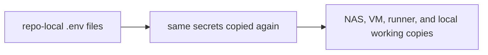
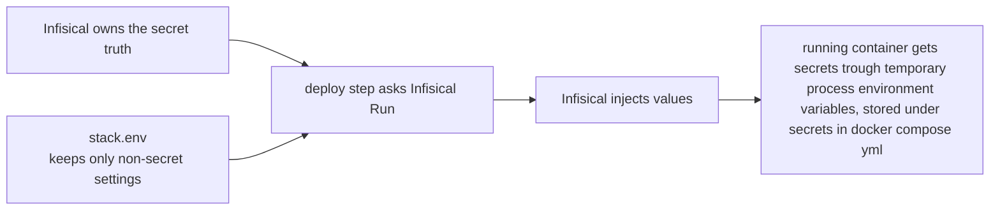
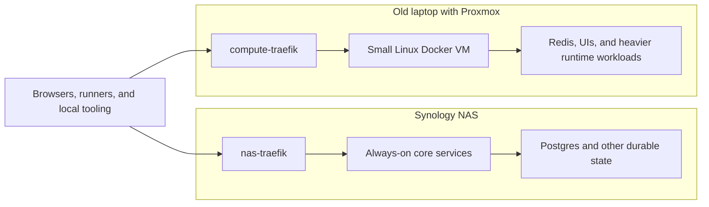

This is the first of three parts discussing the migration to Infisical<sup><a href="#fn-infisical" id="ref-infisical">1</a></sup>.

- Part 2: `How I Built My Infisical Secret Architecture`
- Part 3: `The Secret Zero Problem, Infisical, and Gitea Actions`

It's been a while since I wrote here, but being an independent consultant has been a lot of fun. And yeah, I'm really having fun. Let's get going.

I launched my own business, worked with Liantis for a time, and then went back to AXA. I still do most of my work in .NET, but there is also some Angular in there, plus the usual spillover into DevOps support and system analysis. Outside work, I kept cleaning up the homelab, tightening GitOps, and trying out local LLMs, even though parts of the setup were still rougher than I would have liked.

At that time, I had two machines (hosts), a stack of repositories, and separate routing (traefik per machine). Why? Because I do not know better and still learning / evolving.

## What Was There?

I had a Synology NAS<sup><a href="#fn-synology" id="ref-synology">2</a></sup>, a separate Linux VM, and a few repositories.

On the NAS side, I use a DS220+ with the RAM bumped to 6 GB. The important thing there is stability. It carries the long-term side of the environment: storage, databases, and the services I want close to disk. The Linux VM runs on an old laptop through Proxmox. Why Proxmox? Because of the buzzwords that you hear over on YouTube. 

I put the more durable workloads on the NAS and the more movable or heavier ones on the laptop. Between those two boxes, Dockge<sup><a href="#fn-dockge" id="ref-dockge">3</a></sup> managed my Docker stacks. I moved away from Portainer, because it trips up Gemini and Codex on how portainer works and at the time, I was not busy with instruction files, skills etc... Adding `dockercompose.yml` and `stack.env` files does not take long. You add one more stack, to one of the machines. Then you notice that two services need the same secret e.g. a Bearer token. Before you notice, you are copying values around because you just want the deployment to be over with. I needs to work.


## When It Started To Hurt

It was not simply the env files themselves that were wrong. Things started going bad when sensitive values were left lying around for too long, spread across copies, and no one really knew who owned them.

Most of a file like this is just ordinary config:

```dotenv
COMPOSE_PROJECT_NAME=traefik
TRAEFIK_HTTP_PORT=80
TRAEFIK_HTTPS_PORT=443
LETSENCRYPT_EMAIL=admin@itkriebbels.be
```

But then there are one or two sensitive values in the same file:

```dotenv
CLOUDFLARE_API_TOKEN=cf_v1_abcd***
```

Adding secrets starts to feel normal because you make a mistake in the thinking process. <think> *Whats the harm anyway in a HomeLab without a VPM?* </think>. Those secret values ends up on the NAS, on the VM, in a local repo checkout, in a backup copy, and sometimes even in another stack that needs it right away.

After rotating a value, I had to figure out which machine and service were still using the old one. One stack came back fine, but the other did not. I had to go through env files by hand to find the stale copy. But the fact that it was not annoying enough, is actually quite strange for a senior developer that explains to others how to store they secrets safely... My *Say what you do and do what you say* mantra is not applicable here... but then again, it is only a HomeLab? Shouldn't we be more pragmatic anyway? 


I asked an LLM a free dockerized keyvault and it suggested Infisical. I did not put anymore tought into it. 

## AI Tooling Made It More Obvious

Gemini, Codex, Copilot, and similar tools kept pointing at values that looked like tokens, strings that seemed suspicious, or folder and/or repositories that contain contents that looked too close to secrets. In a strict sense, those warnings were not always right. Sometimes they were noisy. Still, they kept pointing at the same problem: too much operational meaning was leaking into ordinary working copies.

When an LLM sees something that looks like a secret, it treats that boundary as messy, at leaast some of those LLms. Codex is really secure, but Gemini... oh boy. Secrets or not... It is a product of Google after all and Google knows everything already, I suppose?

I do want to use LLMs for real work: comparing approaches, helping with refactors, reviewing config, writing docs, and thinking through architecture and yes, even setup services, configuring and even debug networks. That works a lot better when code, configuration, and sensitive runtime state are not all sitting in the same *Doom?* pile.

## I Wasn't Trying To Get Rid Of `.env`

I did not want to get rid of `.env` files completely. Docker Compose still needs flat environment values, and I am not interested in pretending otherwise. Not everything in an env file is secret either. Ports, project names, feature flags, and non-sensitive defaults can still live as normal config.

The first diagram below shows the old pattern. The same secret starts in a repo-local env file, gets copied again, and then ends up spread across the NAS, the VM, the runner, and local working copies.



The second diagram shows the shape I was trying to move toward. Infisical keeps the sensitive values, the deploy step asks for them when it needs them, and Docker Compose still must not get flat env values it expects. LLMs will exploit that weakness.



I wanted the sensitive data in one place, the non secrets settings in the repositories, and Docker Compose to see a a section secrets in the dockercompose file.

## Why Infisical?

Bitwarden Secrets Manager<sup><a href="#fn-bitwarden" id="ref-bitwarden">4</a></sup> was the first thing I tought off. I noticed when renewing my subscription, Bitwarden offers a free Secrets Manager. If I had only needed a place to hide a couple of secrets, Bitwarden would probably have been fine. But I needed something that worked with self-hosting, local-first workflows, machine identities, CLI use, shared provider credentials, and a deploy flow that did not drag secret values through every repository. Even tough Bitwarden offers Vaultwarden as a selfhost solution, I just went with the LLMs suggestion. Gemini suggested me it can do all those things. <sarcasm> If the LLM knows how it works, how dangerous can this way of thinking be? </sarcasm>

Infisical does make more sense in that setup because of the model around it: imports, references, machine identities, CLI support, and the fact that I could keep the control plane close to the environment it serves, so even when the Internet goes down, we still have a homelab. So, first priority was, migrating the secrets, later I can investigate what other solutions serve my purposes better, but that is another story.

## What Changed First

Dumping everything into a vault really was the first step in the move. Codex refused, Gemini came to the rescue! When a job is to dirty for Codex, Gemini will always be the one that does the dirty work. But yes, we are playing with secrets. And the secrets it has read, are exposed now. Altough, I pay for the subscription.... <sarcasm> No worries, Google wouldnt use it right? And because all the secrets are all now in Infisical anyway, I should be able to rotate them easily...  </sarcasm> This is the beauty part of a HomeLab. I just do not care, it is fake. No services that I depend on, that are mission critical.

So how did I start to put the secrets in the vault? I gave the order to Gemini. That LLM scanned the files, push the values into Infisical using `playwright MCP`, and organise them per stack (repository). That got the move started quickly, but it also recreated the same problem in a different place: the copies were still there, only now they lived in a vault. So duplication was more easily to mitigate, but still, there was duplication. As a good developer, I always want to use the DRY-principle unless it really needs to be duplicated due to safety reaons.

Once I inspected the result, I was not happy with the repository-mirroring setup towards the keyvault. I let Gemini refactor the structure from a stack-based model into a product-based one using the `playwright`-browser from my laptop. That was the point where the migration stopped being "put everything somewhere central" and started becoming an actual design cleanup.

After that, Gemini started separating what was really secret from what was just configuration. I kept the non-sensitive values into `stack.env` files and left them in the repos: names, ports, defaults, environment variables, volume mappings, etc... The sensitive values stayed in Infisical, and the deploy flow changed so the runner could fetch them when needed.

Before I settled on Gitea runners, I tried webhooks. The LLMs kept getting stuck on that setup, which told me pretty quickly that I was pushing them into a construction they were not very good at reasoning about. That slowed me down instead of speeding me up. In the end, I moved to runners because it is the more standard way to do this and because it gave the LLMs something it could reason about much more reliably.

That touched more of the homelab than I expected: `paperless-private`, `traefik`, `immich-db`, etc... on the NAS, `litellm` , `gk-shield`, `gk-mailfence`, `gk-fixtures`, `compute-traefik`, and other stacks on the NAS. (Note: The `gk-` prefix is short for Gatekeeper, a project family that I have). 

The physical split stayed the same:



I want to keep that physical split. The NAS carries the durable side, with databases and state that should stay close to the disks. The old laptop carries the compute side: Redis, heavier runtimes, and UI-heavy workloads that make more sense there. A Traefik runs on each side because in practice there are two routing surfaces, not one.

I did not redesign the whole homelab. I changed how secrets moved through it.

## The Tradeoff Is Real

For basic containers, the old way felt easier, faster, more humanoid, less *enterprisy* : Open the `.env` file, paste the value, restart the stack, done. Infisical adds more machinery: bootstrap work, machine identity setup, and more structure to maintain.

Because of that, debugging changes too. In a plain env file, the value is right there. With a vault-based flow, I sometimes have to check the identity, the fetch step, the export step, and the runtime handoff before I know what is actually wrong.

By the time I made this move, the duplication had already become more expensive than the extra structure. the following text-block is a copy/paste from the chatlogs of codex:

```text
~/.codex/history.jsonl
~/.codex/archived_sessions/<session-id>.jsonl

excerpt:

llms keep complaining about tokens found, even in my local homelab...
```

That saved fragment tells you that I do use spelling mistakes: except instead of excrept, and that I talk to an LLm somethines like it is a being, while it is obvious is not. Thats what we call `Projection of a personae`. I kept defending the local mess because the setup was local. The tools never cared about that argument,

## Why I Wanted It To Be Local

I wanted this to still make sense even when public internet was not available. Not because I expect not to have internet every week, but because I do not want basic internal secret discipline to depend on some public service being available. If public SaaS solves every local problem on day one, I end up practising a narrower kind of infrastructure than the one I actually want to get better at. You learn from getting problems, experimenting, using... And sometimes, using SaaS from the beginning, means skipping a step or two that could give you more insights in networking, hosting, docker, artifacts, etc...

## Why Privacy Became Part Of It

The LLMs kept complaining that files, values, and leftovers looked too much like secrets, and that started bothering me more and more. At first, it was just annoying. After a while, with all the terminal hacks, helper scripts, and agent workflows around them, it became harder to ignore what was really going on.

Those tools keep trying to get where they need to go. If a token is sitting around in a repository, a leftover file, or some other working copy, they will eventually run into it  and use it. Codex has at least the decency not to show the secret on screen. Gemini just does not care, even with instructions, guard railes, sometimes it forgets them. That is something I want to investigate. I still use cloud LLMs because they are useful. But I use one tool for some set of operations, and another LLM for another set of operations. THere is not one that just can do it all, IMHO. Now, I care a lot more about what they get to see by default and really have respect towards the cybersecurity specialists trying to mitigate this danger.


For me, this was no longer just one problem about secret management. The vault, the runners, the local workflows, and the AI tooling were all pulling on the same setup. Halfway through the migration, I could see it touching the rest of the environment too. GitOps got involved because the repos, deploy flows, and runner jobs all had to stop assuming the secret was already sitting beside the stack. I wanted to push the LLMs in working in a process, limiting and using there reasoning... . I should probably have done it earlier, bt by doing, we learn.

## What Comes Next

The next piece gets into the secret structure itself, bootstrapping, chicken or egg problem and after that, I want to explore the machine identities, Universal Auth, `infisical run`, `infisical export --expand`, and the networking details between the NAS and the compute VM.

And after that, I have some other ideas to write about as well.

## Footnotes

1. <span id="fn-infisical"></span>[Infisical](https://infisical.com/) is the self-hosted secret control plane in this series because it fits this GitOps flow better than copied `.env` files through imports, references, machine identities, and the CLI. <a href="#ref-infisical">↩</a>
2. <span id="fn-synology"></span>[Synology DS220+](https://www.synology.com/en-nz/company/news/article/DS220plus/Synology%C2%AE%20Introduces%20DS220%2B) with 6 GB RAM, used here for storage, databases, and other persistent services. <a href="#ref-synology">↩</a>
3. <span id="fn-dockge"></span>[Dockge](https://github.com/louislam/dockge) is the lightweight Compose manager I use because the files stay plain and easy to compare; I moved from Portainer because the numbered folder structure behind it kept confusing the LLM workflows. <a href="#ref-dockge">↩</a>
4. <span id="fn-bitwarden"></span>[Bitwarden Secrets Manager](https://bitwarden.com/products/secrets-manager/) is Bitwarden’s machine-facing secret product, separate from the personal password vault, and I noticed I already had access to it because I was already paying for Bitwarden. <a href="#ref-bitwarden">↩</a>

## How I Wrote This Piece

This post comes from the migration itself. I wrote it from the work, read it aloud, fed the transcript back into the draft, and kept cutting where it started sounding stitched together. I also used the usual mix of tools you end up leaning on when you do this seriously: one to compare versions, one to point at stiff wording, one to sanity-check structure, one to transcribe a read-aloud pass, and one to help with screenshots and edits around the site itself. None of that changes where the story comes from. The work behind it is still mine.

## Sources

- [Infisical introduction](https://infisical.com/docs/documentation/getting-started/introduction)  
  The starting point for what Infisical is trying to solve.

- [Infisical self-hosting overview](https://infisical.com/docs/self-hosting/overview)  
  Covers the self-hosting side; I needed a control plane that made sense locally first.

- [Bitwarden Secrets Manager](https://bitwarden.com/products/secrets-manager/)  
  Bitwarden’s machine-facing secret product, and the first comparison because I already use Bitwarden.

- [ChatGPT](https://chatgpt.com/), [OpenAI Codex](https://openai.com/codex/), [Gemini](https://gemini.google.com/), [QuillBot](https://quillbot.com/), [GPTZero](https://gptzero.me/), and [Transkriptor](https://transkriptor.com/)  
  These were part of the writing loop: comparing versions, checking where the wording got too tidy, reading the article back to myself through transcription, and fixing the site until it felt right.

## Outro

So in summary, the way that the LLMs are trained, and is behaving has influence on the way I do things as well. More secure, more enterprisy and feeling more afraid on what an LLM c an do on my machine. This journey will help me how to limit, or rather funnel that power into a direction that helps me, and like a full blown maniac do stuff. An LLM behaves like `the end justifies the means`, while I am more like a person that want to learn technologies, upgrade my skills and funnnel the power of the LLMs.
