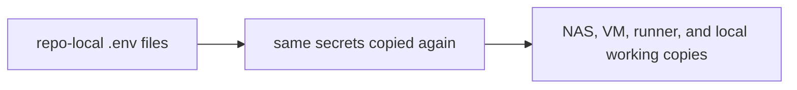
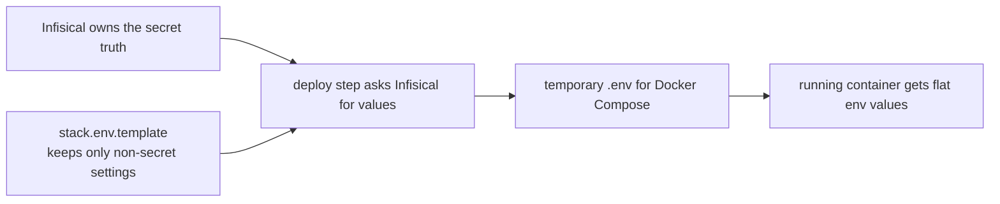
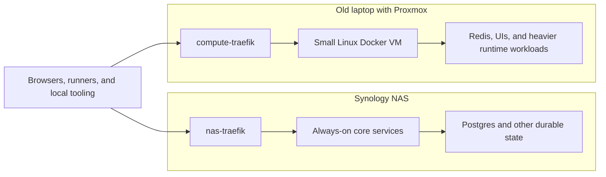

# Why I Finally Moved My HomeLab Secrets Out of `.env` Files

This is part 1 of a 3-part series on the move to Infisical.

- Part 2: `How I Designed My Infisical Secret Architecture`
- Part 3: `Infisical, Gitea Actions, and the Secret Zero Problem`

I had not written here for a while, but the homelab did not stand still.

Over the last stretch I started my company, spent some time at Liantis, and later ended up back at AXA in a .NET-heavy role with some Angular and the usual DevOps and system-analysis spillover around it. Outside work I kept doing the same kind of cleanup in my own setup: GitOps, local LLM experiments, stack cleanup, better separation between durable services and compute workloads.

At some point the usual excuse stopped working. It was no longer "just a few containers at home." It was still a small setup, yes, but not a simple one anymore. There were multiple hosts, multiple repos, a split between NAS and compute, and enough repeated deploy work that shortcuts had started hardening into habits.

The biggest one was how I handled secrets.

## What I Had, More Or Less

The setup was spread across a Synology NAS, a small Linux VM, and several repositories.

The NAS is a DS220+ with the RAM bumped to 6 GB. Nothing exotic there. It just does the boring durable part well, which is exactly what I need from it: storage, databases, and services I want to keep close to disk.

Then there is a Linux VM running on an old laptop through Proxmox. That is where I place workloads I do not want on the NAS, or want to move around more easily later. Between those machines I had multiple Docker stacks, mostly managed through Dockge, and over time a pile of `stack.env.template`, `.env`, and `stack.env` files had built up.

That last part is where things drifted.

A stack gets added. Another host appears. One service needs the same provider token as another. You copy a value because it is late and you want the deployment done. Then you do the same thing two weeks later somewhere else. Eventually the copy stops feeling temporary and becomes part of how the setup works.

That is where I had landed.

## Where It Actually Broke

The real problem was not "`env` files are bad." That would be too easy, and also not true.

Most env files are mostly normal config. A file like this is not interesting:

```dotenv
COMPOSE_PROJECT_NAME=traefik
TRAEFIK_HTTP_PORT=80
TRAEFIK_HTTPS_PORT=443
LETSENCRYPT_EMAIL=admin@itkriebbels.be
```

That is just config.

The trouble starts when one or two sensitive values sit in the same file and then get treated with the same casualness:

```dotenv
CLOUDFLARE_API_TOKEN=cf_v1_abcd***
```

That mixed shape is where the boundary gets blurry. The file looks harmless because most of it is harmless. So the secret starts to feel harmless too.

The moment that finally pushed me over was pretty mundane. I rotated a value and then had to work out which stack on which machine was still using the old copy. One service recovered fine. Another did not. I ended up checking env files by hand across the NAS, the VM, and a local repo copy just to find the stale one.

Nothing exploded. But it was exactly the kind of problem that should not exist once the environment has grown past toy scale.

That was the point where I stopped telling myself this was still "good enough for now."


What the screenshot above shows is not just that Infisical has a UI. It shows the point where secret ownership finally moved out of repo files and into something built for that job.

## AI Tooling Made The Weak Spot Harder To Ignore

Another reason this started bothering me more is that I have been using AI tools much more seriously in the same environment.

Gemini, Codex, Copilot and similar tools kept flagging token-like strings, suspicious files, or repos that looked too close to secret material. Those warnings were not always correct in a literal sense. Sometimes they were noisy. Still, they kept surfacing the same uncomfortable fact: too much sensitive operational state was sitting in normal working copies.

That was useful feedback, even when it was irritating.

A model does not care about the homelab story I tell myself. It sees something that looks like a secret and reacts as if the boundary is messy. After seeing that often enough, it got harder to pretend the setup was clean enough.

And I do want to use LLMs for real work: reviewing config, comparing approaches, helping with docs, checking assumptions before changing infrastructure. For that to stay comfortable, code, config, and secrets need better separation than what I had.

Not perfect separation. Just better than "there are probably three old copies of this token somewhere."

## What I Actually Wanted

I was not trying to ban `.env` files or make Docker Compose behave like something it is not.

Compose still wants flat env values. Fine.

What I wanted to stop doing was using `.env` files as the long-lived source of truth for secrets.

Before, the flow was basically this:



That was the real system.

What I wanted instead was this:



Compose still gets the flat env it expects. The difference is that the copy becomes temporary instead of becoming the system.

## Why I Picked Infisical

Before settling on Infisical, Bitwarden Secrets Manager was the obvious comparison first, mainly because I already use Bitwarden and pay for it anyway.

If the question had only been "where do I store some secrets," Bitwarden would have been a perfectly fair answer.

But that was not really the problem anymore. I needed something that fit self-hosting, local-first workflows, machine identities, CLI usage, shared provider credentials, and a deploy path that could pull secrets in at runtime instead of dragging them through every repo.

That pushed me toward Infisical.

What clicked for me was not just the UI. It was the operating model around it: imports, references, machine identities, CLI support, and the fact that I could keep the control plane close to the environment it serves.

That mattered because the homelab is not abstract. It has a Synology NAS, a VM on old hardware, Gitea runners, local DNS habits, and some Macvlan weirdness. I did not want a secrets solution that sounded good in theory but assumed a cleaner world than the one I actually run.

## What Changed First

The first migration step was not "dump everything into a vault."

It was separating what was actually secret from what was just config. That sounds obvious, but it mattered because part of the earlier mess came from treating every env value like it belonged in the same bucket.

So I pulled the non-sensitive values into `stack.env.template` files and left those in the repos. Ports, names, regular defaults, those could stay where they were.

Then I moved the sensitive values into Infisical and changed the deploy flow so the runner could fetch them at deploy time.

That touched more of the homelab than I expected: `paperless-private`, `traefik`, `immich` on the VM, `litellm` on the VM, `gk-shield`, `gk-mailfence`, `gk-fixtures`, `compute-traefik`, and a few others that follow the same pattern. The `gk-` prefix is my Gatekeeper project family, so that was not random sprawl. It was repeated structure, which is exactly where a proper secret model helps.

The physical split stayed the same:



What the diagram above shows is the split I wanted to keep. The NAS holds the durable side. The VM carries more compute-heavy or UI-heavy workloads. There is a Traefik on each side because in practice there are two routing surfaces.

I did not redesign the entire homelab. I changed how secrets moved through it.

## The Tradeoff Is Real

The new model is better, but it is not free.

For simple containers, the old way felt easier. Open `.env`, paste value, restart, done. Infisical adds more machinery. There is bootstrap work, machine identity setup, Secret Zero to think about, and more structure to maintain.

Debugging changes too. With a plain env file, the value is right there. With a vault-based flow, I sometimes have to check the identity, the fetch step, the export step, and the runtime handoff before I know where the problem actually is.

So yes, there is a real tradeoff here: cleaner boundaries, more moving parts.

Still, by the time I made this move, the duplication had already become more expensive than the extra structure.

```text
~/.codex/history.jsonl
~/.codex/archived_sessions/<session-id>.jsonl

excerpt:

llms keep complaining about tokens found, even it is only in my local homelab...
```

That saved fragment still says it more honestly than a neat summary could. I kept defending the local mess because it was local. The tools did not care about that argument.

## Why The Local-First Part Mattered

One thing I cared about from the start was that this should still make sense without public internet being part of every internal secret decision.

That is not because I expect my connection to fail every week. It is more that I want the homelab to remain useful on its own terms. If every local infra problem gets solved by external SaaS from day one, the environment ends up teaching a narrower set of instincts than the ones I actually want to build.

That was part of the appeal here too. I wanted the secret control plane to live close to the environment it serves. The more I use the homelab for delivery habits, AI-assisted workflows, and local-first infra experiments, the less I want secret handling to remain the sloppiest part of it.

## The Privacy Side Of It

This also became a privacy and context-management issue, not just an infra hygiene issue.

Once I started using cloud LLMs more often, I had to ask better questions about what should sit close to everyday repo context and what should not. I do not think the answer is fearmongering, and I am not pretending cloud models are unusable. I use them because they are useful.

But I also want the amount of sensitive operational state in normal working context to go down, not up.

That is also where the local LLM side matters to me. I do not see local models as replacements for the strongest cloud models right now. I see them as part of a cleaner split. Local models are useful for infra-heavy inspection, sensitive logs, and token-adjacent work. Cloud models stay useful for higher-level reasoning, comparison, and writing once the context is cleaner.

That split becomes much more believable once the secret story underneath it is less messy.


The illustration above is there because this stopped being one isolated secret-management problem. The vault, the runners, the local workflows, and the AI tooling all pull on the same setup.

## Why This Turned Into A Bigger Cleanup Than Expected

Halfway through it, it was obvious this connected to a bunch of other things I care about anyway:

- better GitOps habits
- cleaner runner workflows
- clearer ownership of shared credentials
- less noisy AI-assisted work
- and a homelab that stops rewarding shortcuts just because it is local

That is why this felt worth writing down.

It is not really a story about one tool. It is about the point where a small setup stops being loose scripts with decent intentions and starts needing better boundaries.

I should probably have done it earlier.

## What Comes Next

The next post will focus on the secret structure itself: why I grouped things by product or provider instead of by stack, how imports and references changed the model, and why that ended up cleaner than copying the same values into every consumer.

After that I will cover the runner side: machine identities, Universal Auth, `infisical run`, `infisical export --expand`, and the networking details that made the setup behave properly across the NAS and the compute VM.

## Outro

In the end this was not about making the homelab look more "enterprise" than it really is.

It was about getting rid of a weak boundary that had quietly become normal.

Once I saw it that way, the move to Infisical felt less like an upgrade and more like overdue maintenance.
