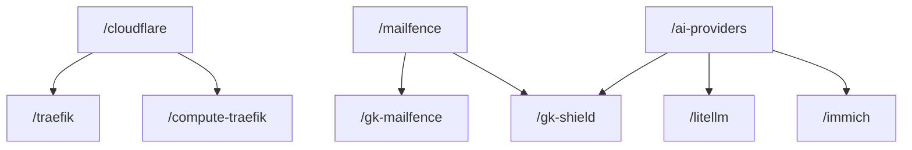
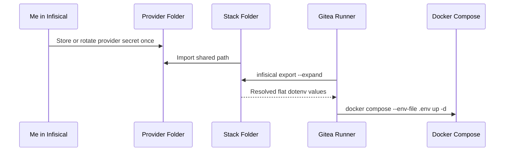

# How I Designed My Infisical Secret Architecture

This is part 2 of a 3-part series.

- Previously: [Why I Finally Moved My HomeLab Secrets Out of `.env` Files](/blog/why-i-finally-moved-my-homelab-secrets-out-of-env-files)
- Coming next: `Infisical, Gitea Actions, and the Secret Zero Problem`

## Previously On

In the previous post, I explained why I finally stopped tolerating duplicated `.env` files and token-like values spread across the HomeLab. The short version was that the HomeLab had started behaving like a real platform, AI tooling kept surfacing weak boundaries, and I wanted a secret story that would still make sense when the internet was down.

This post picks up where that one stopped. Installing a secret manager is the easy part. The real work starts when I have to decide how Infisical should represent the system.

## Context

The biggest design choice in the migration was also the one that mattered most later: I organized secrets by provider and product, not by consuming stack.

That may sound like a small preference at first, but it changes what the vault is actually describing.

If I keep thinking like the old env-file layout, I end up with a folder per stack and a lot of duplication that only looks tidy because it is hidden. `/traefik` gets Cloudflare values. `/compute-traefik` gets the same Cloudflare values again. `/gk-mailfence` gets mail-related values. `/gk-shield` quietly carries another copy. AI-related stacks each grow their own provider keys.

That structure feels self-contained. It is also dishonest. The self-containment comes from duplication.

## The Core Design Choice

I wanted the provider folders to carry the truth. In practice that meant folders such as `/cloudflare`, `/mailfence`, `/ai-providers`, and `/windscribe` owning the shared provider relationship. Consumer folders then import what they need.

That changes the operational picture more than the UI suggests, because Cloudflare, Mailfence, and the AI provider keys each have one clear owning place in the vault. A stack receives what it needs through imports and references instead of quietly becoming its own little copy shop.

Once I modeled the vault that way, the structure started matching the real system instead of the accidental shape of old `.env` files.

<!-- visual-slot: post2-provider-folders-tight
type: screenshot
source: infisical folder hierarchy
goal: keep the existing wide screenshot, but add a tighter provider-folder crop if the hierarchy reads too small in the article
see: docs/INFISICAL_VISUAL_STORYBOARD.md
-->


What stands out in the screenshot above is how different provider folders feel from stack folders once they live in the same product. The hierarchy itself starts teaching the architecture.



The diagram is deliberately simple. The point is not to list every stack. The point is to show the direction of truth. Provider-owned truth points outward toward consumers instead of being duplicated downward into every stack that happens to use it.

## Why Organize By Product?

A provider-based hierarchy answers the questions I actually have to answer when something changes.

It helps me answer the questions that matter under pressure: which stacks depend on Cloudflare, which services consume Mailfence, which AI workloads share provider keys, where I should rotate a value, who owns it, and which consumers I should expect to move when I touch it.

Those are the questions that matter during rotation, incident response, onboarding, and decommissioning. If the vault structure does not help me answer them, then the vault may be centralized, but it is not well designed.

That is why I prefer product and provider ownership as the starting point. It makes the system legible under pressure.

## Imports Instead Of Copy-Paste

One of the reasons this architecture works well in Infisical is that I can use imports to model the system honestly.

<!-- visual-slot: post2-import-ui
type: screenshot
source: infisical import or reference view
goal: show one consumer path linked to one provider path so imports feel real, not only described
see: docs/INFISICAL_VISUAL_STORYBOARD.md
-->


This is the screenshot I was missing earlier. It proves the idea in the actual product: the `traefik` consumer path can stay small because the shared Cloudflare truth is pulled in through an import instead of being copied again under a new folder.

Cloudflare is the easiest example. Both `traefik` and `compute-traefik` need Cloudflare credentials for DNS automation. The lazy structure would copy the same values into both folders. The product-based structure is simpler once I stop thinking in terms of files:

- `/cloudflare` owns the credentials
- `/traefik` imports from `/cloudflare`
- `/compute-traefik` imports from `/cloudflare`

That reduces duplication, but the more important gain is clarity. When I ask where the key lives, there is one answer. When I ask who consumes it, the importing folders tell me. When I ask who owns it, I do not need to reverse-engineer the answer from whichever stack happened to duplicate the value first.

The same pattern applies to Mailfence and AI provider keys. Once I stopped treating every stack as if it needed its own local copy of the world, the vault got simpler and more honest at the same time.

## AI Providers Are Especially Good At Creating Secret Sprawl

This part mattered to me because AI experimentation is very good at creating bad secret habits quickly.

It starts with `OPENAI_API_KEY`. Then another provider shows up. Then a third. Then a side project appears that needs "just one more key." Before long, every AI-related service, script, or experiment has its own local variation of the same provider relationship.

That is how secret sprawl wins.

Putting those values under `/ai-providers` acknowledges a more stable truth. The stable thing is not whichever side project I happen to be running this week. The stable thing is the provider relationship itself. Once that becomes the owning layer, I can add and remove consumers without recreating the same messy secret surface every time.

It is a DRY choice, but it is also a context-hygiene choice. It reduces how many places ordinary tooling, including LLM tooling, sees secret-adjacent meaning.

## What Still Belongs In A Stack Folder?

Not everything should be pulled upward into provider folders.

Stack folders still matter for stack-specific application secrets, one-off database credentials, signing keys that genuinely belong to one service, and feature flags that are secret in nature and not shared.

The rule I ended up using is simple. If a value is shared provider truth used by multiple consumers, I want it in the provider folder. If a value belongs to one consumer, I keep it local to that stack path.

I like that rule because it is easy to explain and easy to defend. It is also specific enough to prevent the two common failure modes: copying everything everywhere, or abstracting so aggressively that the vault turns into a puzzle.

## Why Flattening Everything Would Have Been A Trap

The most tempting alternative would have been the fastest one: mirror the old `.env` layout into Infisical, folder for folder, and call the migration done.

That would have centralized storage, but it would not have improved the architecture. I still would have ended up with duplicate values, weak ownership, repeated rotations, and noisy secret-adjacent context. The only thing that would have changed is the storage backend.

That is the quiet failure mode in a lot of secret migrations. The values are technically "in the vault" now, but the design is still lying about who owns what.

I wanted the result to be structurally better, not only more modern.

## Why References Matter

References matter for the same reason imports matter. They let me keep meaning at the right layer.

Without imports and references, people duplicate values because they are afraid indirection makes the runtime fragile. In practice, disciplined indirection makes the model cleaner. Rotation happens in the right place. Ownership stays visible. Consumers stay small. The runner side matters here as well, because a Gitea runner should be able to consume this structure without turning it back into duplication.

Once I combine that with `infisical export --expand`, the runtime still gets concrete values at the edge while the vault keeps the better structure internally. That is exactly the balance I wanted: expressive architecture in the control plane, boring flat values at runtime.



That is the flow I wanted from the start. Meaning stays in the vault. Flat values only exist at the runtime edge because that is where older tooling still expects them.

## Why Legibility Matters Almost As Much As Encryption

When people talk about secret managers, they often jump straight to encryption. That matters, obviously. In day-to-day operations, legibility matters almost as much.

If future-me cannot explain why a secret lives where it does, who owns it, which consumers depend on it, and how I expect it to rotate, then the design is either too clever or too messy. Good secret architecture is not only about confidentiality. It is also about how fast I can regain orientation when I am tired, distracted, or debugging under pressure.

That is one of the reasons I like the product-based model. It is easier to explain after two coffees and one bad night than a flattened pile of values with a nice UI wrapped around it.

## Why This Helps When LLMs Touch More Of The Workflow

One reason I went deeper than a basic vault migration is that my engineering workflow is no longer only me and the code.

It increasingly includes Gemini for investigation and orchestration, Codex for repo work and patching, Copilot for smaller coding moments, and local models for privacy-sensitive or infra-heavy tasks. Once those tools become part of the workflow, architecture mistakes become more expensive. Not because the models are malicious, but because the context surface gets larger.

The more tools inspect repos, env files, deployment pipelines, Compose files, and scripts, the more valuable it becomes to have a clean boundary between code, config, and secrets. A provider-based vault model reduces semantic leakage. Shared provider truth appears in fewer places. Stack-specific truth stays local. Non-secret structure stays in Git. That is better for people, and it is better for AI-assisted workflows.

That sounds abstract until I look at how the tools actually behave. Gemini is better when it can scan the architecture without dragging three local copies of the same provider key through the conversation. Codex is better when the repo-local artifacts are concrete but not polluted by duplicated secret meaning. A cleaner vault model does not make the tools wiser by magic. It makes the environment less noisy for them.

## What Dangerous AI-Assisted Infrastructure Work Looks Like

I find it more useful to name the dangerous patterns than to say something vague like "AI in infra is risky."

For me, the obvious risks look like this:

1. an agent sees too much secret-adjacent context because the repo structure is messy
2. a model suggests a technically valid shortcut that weakens a trust boundary
3. I trust generated structure more than the real platform constraints
4. urgency turns "just this once" into a new normal

I have seen traces of all four during the migration work. The emotional tone is not the interesting part. The operational reflex underneath it is. Convenience always tries to win. Good structure is the thing that keeps convenience from quietly eroding the boundary.

That is another reason the provider model feels right to me. A better architecture removes some of the temptation before the tool even starts reasoning.

## A More Concrete Walkthrough

The easiest way to misunderstand this migration would be to treat the design as a principle only, when it actually shows up in concrete folders and concrete flows.

### Case Study: `traefik` And `compute-traefik`

This is the cleanest example. Both stacks need Cloudflare credentials for DNS-related automation. In the old model I would likely have copied the same values into both folders and moved on.

That only works until the day I rotate something. Then I have to remember every copy, every local name, and every consumer that may still depend on an older value.

The provider model is much more direct:

- `/cloudflare` owns the provider credentials
- `/traefik` imports from `/cloudflare`
- `/compute-traefik` imports from `/cloudflare`

That does not only remove duplication. It makes the operational answers boring, which is exactly what I want, because rotation happens in `/cloudflare`, the importing folders show the consumers directly, and ownership has much less room to drift.

### Case Study: `gk-mailfence` And `gk-shield`

Mailfence is useful because it shows that not every shared relationship is as obvious as a reverse proxy and a DNS provider.

<!-- visual-slot: post2-secret-detail-mask
type: screenshot
source: infisical secret detail view
goal: show one masked provider-owned secret with name visible and value partially masked
see: docs/INFISICAL_VISUAL_STORYBOARD.md
-->


This second proof shot matters for a different reason. The import view shows where the consumer points. The secret detail view shows that the provider-owned value itself is still treated as one piece of truth with a real path and a real owner.

The application context feels different between `gk-mailfence` and `gk-shield`, so it would have been easy to let each stack pretend it owned its own mail-related truth. That still creates duplication if the underlying provider relationship is shared.

The more honest model is the same one as before: shared Mailfence truth in `/mailfence`, stack-specific values in the consuming folders, and imports wherever shared provider credentials are needed.

That gives me a clean split between provider-owned truth and service-owned truth. That split is what makes rotation, explanation, and auditing easier later.

Here is the kind of masked snapshot that makes the model easier to explain:

```dotenv
CLOUDFLARE_API_TOKEN=cf_v1_abcd***
CLOUDFLARE_ZONE_ID=1f6d2c***
MAIL_FROM_ADDRESS=alerts@itkriebbels.be
OPENAI_API_KEY=sk-proj-abcd***
```

The literal values are not the point. The point is that each of them should have one honest owner and a limited set of consumers.

### Case Study: `/ai-providers`

This is the part I care about most because it sits at the intersection of infrastructure work and AI experimentation.

If I let every AI-related service own copies of `OPENAI_API_KEY`, `GROQ_API_KEY`, `MISTRAL_API_KEY`, and whatever comes next, the HomeLab becomes a secret copier very quickly.

That is especially bad in an environment where I experiment a lot, try new tools, and increasingly care about privacy and context cleanliness. Centralizing those values under `/ai-providers` is therefore not only a DRY decision. It is a way to keep the provider relationship stable while the experiments around it change.

## What I Would Have Done Wrong A Year Ago

If I had done this earlier, I probably would have made one of four mistakes:

1. mirrored the old `.env` layout into Infisical and called it architecture
2. moved too many non-secret values into the vault just because I finally had a vault
3. optimized for migration speed instead of ownership clarity
4. kept too much stack-local duplication because seeing everything in one folder felt safer

All four would have produced something that looked better while staying operationally messy. That is why I keep coming back to the difference between centralization and design. Centralization changes where the values live. Design changes what the system means.

That is also why I keep resisting the lazy definition of success. A vault migration can fail quietly. The values are technically in a nicer product, but the mental model is still the same messy one from the old `.env` era. I wanted the meaning of the system to change, not only the storage location.

## The Cost Of The Better Design

The provider-based model is not free. It costs more thought up front.

I had to decide what counted as provider truth, what counted as stack truth, what should be imported, what should stay local, and where naming needed to become consistent. That is more work than copying values into folders that happen to match repository names.

I still think it is the right trade. I would rather pay the design cost once than keep paying for operational confusion every time I rotate, explain, or expand the setup.

## A Safe Snapshot From The Migration Process

The migration notes capture the center of gravity quite well:

> "Deep Dive into Architecture: Explain the 'Product-Based' (DRY) strategy where secrets are stored in provider-specific folders (`/cloudflare`, `/mailfence`, etc.) and imported into stack folders."

That was exactly the direction I kept pushing.

There is also a practical GitOps example in the local artifacts that shows how the design reaches a real deployment:

```yaml
- name: Inject Secrets from Infisical
  env:
    INFISICAL_CLIENT_ID: ${{ secrets.INFISICAL_CLIENT_ID }}
    INFISICAL_CLIENT_SECRET: ${{ secrets.INFISICAL_CLIENT_SECRET }}
    INFISICAL_PROJECT_ID: ${{ secrets.INFISICAL_PROJECT_ID }}
  run: |
    export INFISICAL_TOKEN=$(infisical login --method=universal-auth \
      --client-id="$INFISICAL_CLIENT_ID" \
      --client-secret="$INFISICAL_CLIENT_SECRET" \
      --plain --silent \
      --domain="http://192.168.5.90:8081")

    cp stack.env.template .env

    infisical export --token="$INFISICAL_TOKEN" \
      --projectId "$INFISICAL_PROJECT_ID" \
      --env "prod" \
      --path "/traefik" \
      --domain="http://192.168.5.90:8081" \
      --format=dotenv >> .env
```

Even though that is a deployment example, it reinforces the architectural point. The stack consumes from a clear path. That path exists inside a larger provider-owned model. The runtime gets flat values only at the edge.

I also want one Compose example here, because this is where a lot of architecture talk either becomes credible or falls apart.

The shortest version of that runtime edge looks like this:

```bash
cp stack.env.template .env
infisical export --expand >> .env
docker compose --env-file .env up -d
```

That is the boring handoff I wanted. The architecture can stay expressive in Infisical, while the runtime still gets the flat shape it expects without turning the repo into the long-term home of the secret values.

```dotenv
# stack.env.template
COMPOSE_PROJECT_NAME=traefik
TRAEFIK_HTTP_PORT=80
TRAEFIK_HTTPS_PORT=443
```

```bash
cp stack.env.template .env

infisical export \
  --token="$INFISICAL_TOKEN" \
  --projectId "$INFISICAL_PROJECT_ID" \
  --env "prod" \
  --path "/traefik" \
  --domain="http://192.168.5.90:8081" \
  --format=dotenv \
  --expand >> .env

docker compose --env-file .env up -d
```

This is what I mean when I say the runtime should stay boring. The template holds the non-secret shape. Infisical appends the sensitive part at deploy time. Compose still gets the flat env-file shape it expects, but that shape is no longer the long-term home of the secret architecture.

## Why This Architecture Is Also A Teaching Tool

Part of why I blog at all is that writing helps me understand what I am doing. That is still true here. I also spend time sharing what I learn with colleagues, especially where LLMs meet delivery work and platform thinking meets application work.

This architecture is useful to explain because it gives me a concrete answer to a recurring question: how do I modernize secret handling without replacing one mess with a more fashionable one?

My answer is simple enough to teach:

- model ownership honestly
- keep shared provider truth shared
- keep stack truth local
- let imports and references do real work
- keep non-secret structure in Git

That is not vendor hype. It is an operating pattern.

## What’s Next

The final post turns this architecture into a deployment story. That means machine identities, Universal Auth, the Secret Zero problem, `infisical run`, `infisical export --expand`, the Macvlan paradox, and the naming and routing details that made the setup work in practice.

- Part 3: [Infisical, Gitea Actions, and the Secret Zero Problem](/blog/infisical-gitea-actions-and-the-secret-zero-problem)
