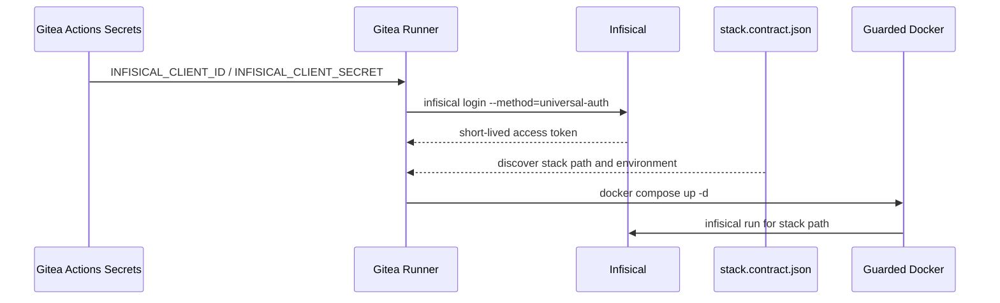
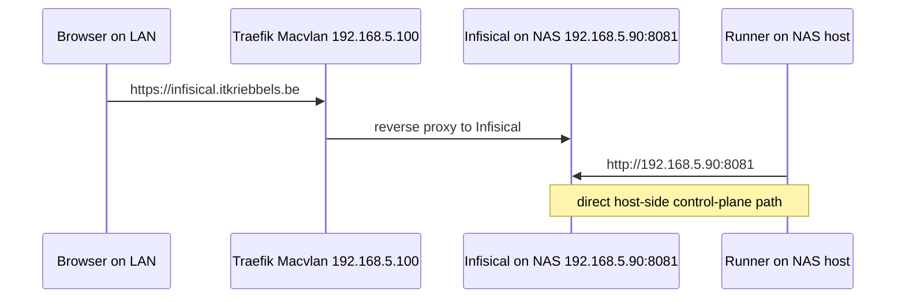
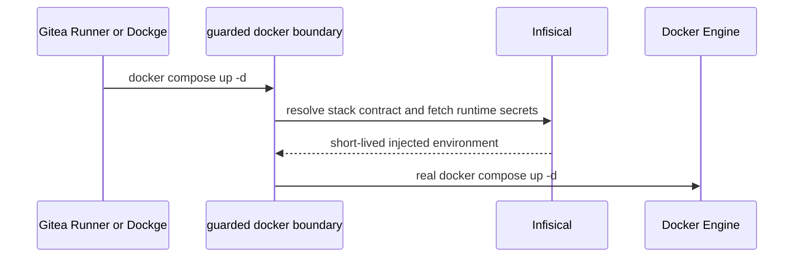

This is part 3 of a 3-part series.

- Previously: [Why I Finally Moved My HomeLab Secrets Out of `.env` Files](/blog/why-i-finally-moved-my-homelab-secrets-out-of-env-files)
- Previously: [How I Designed My Infisical Secret Architecture](/blog/how-i-designed-my-infisical-secret-architecture)

## Previously On

In the first two posts, I explained why I stopped tolerating duplicated `.env` files and how I redesigned the vault around providers and products instead of around every consuming stack.

This post is the practical one. Once the structure exists, the next question is obvious: how does this work in a GitOps-style environment without turning the vault itself into a new source of operational pain?

## Context

The [Synology NAS](https://www.synology.com/en-nz/company/news/article/DS220plus/Synology%C2%AE%20Introduces%20DS220%2B) doesn't log in like a human. The compute VM, running on [Proxmox](https://www.proxmox.com/en/products/proxmox-virtual-environment/overview), doesn't log in like a human. [Gitea runners](https://docs.gitea.com/usage/actions/act-runner) definitely shouldn't inherit admin credentials through shell history or copied files just because automation is inconvenient.

That is the real context for the rest of this post: the authentication story had to be machine-native.

That requirement pushed me toward Machine Identities and Universal Auth. Before I get into the commands, though, I need to name the uncomfortable concept that sits underneath every secret platform.

## The Secret Zero Problem

Every secret manager eventually runs into the same question: how do I authenticate to the vault without already having a secret?

That is the Secret Zero problem.

If I ignore it, the whole story about "secretless infrastructure" becomes self-congratulatory nonsense. The runner is not truly unauthenticated. Some bootstrap trust still exists somewhere. The only serious objective is to minimize the scope, lifetime, and privileges of that bootstrap material.

In my setup, the bootstrap trust is `INFISICAL_CLIENT_ID` and `INFISICAL_CLIENT_SECRET`, stored as Gitea Actions secrets and exchanged for a short-lived access token during the workflow.

That isn't "no secret at all." It is a controlled bootstrap secret, and I think that's the grown-up answer.

## Why Machine Identities Matter

The important mental shift is straightforward: machines should not borrow human trust because automation would otherwise be annoying.

Machine identities matter because they give automation its own principal. That makes access boundaries explicit. It reduces blast radius. It allows short-lived access tokens instead of shared long-lived credentials.

It also makes debugging more honest.

One of the most useful lessons in this migration came from a simple failure. The `nas-deployer` machine identity initially had a `Viewer` role, and the workflow hit a `403 Forbidden` when it needed more. That is easy to misdiagnose if I am not disciplined. It is tempting to suspect a malformed token, a broken CLI, a wrong path, or a dead server. Sometimes the real answer is simpler: the identity is too weak for the work it is trying to do.

I don't read that as a flaky platform. I read it as a line that was enforced exactly the way it had been configured.

<!-- visual-slot: post3-machine-identity-tight
type: screenshot
source: infisical machine identities or access-control detail
goal: add a tighter role/scope crop if the current overview stays too broad
see: docs/INFISICAL_VISUAL_STORYBOARD.md
-->


The useful part in the screenshot above is that the runner is not a ghost. It has an identity, a role, and a scope. The tighter project-level capture works better because it shows the two identities that mattered in practice: `nas-deployer` and `vm-deployer`. That is the trust model the rest of the workflow depends on.



That sequence is the center of gravity for the whole deployment story. The bootstrap secret stays small. The runner gets what it needs without becoming the long-term home of the secret architecture, and the runtime edge no longer depends on a secret-bearing env file.

## The Login Flow

The core login flow looks like this:

```bash
export INFISICAL_TOKEN=$(infisical login \
  --method=universal-auth \
  --client-id="$INFISICAL_CLIENT_ID" \
  --client-secret="$INFISICAL_CLIENT_SECRET" \
  --plain \
  --silent \
  --domain="http://192.168.5.90:8081")
```

Every part of that command matters.

`--method=universal-auth` selects the machine-auth path. `--client-id` identifies the machine principal. `--client-secret` is the bootstrap material and has to be treated that way. `--plain` returns a token that is easy to export in shell workflows. `--silent` keeps the logs cleaner.

The last flag matters more than it first appears. `--domain` has to point at the endpoint that is actually reachable from the place where the workflow runs. It sounds obvious until the network topology gets involved.

## The Macvlan Paradox

The NAS host cannot talk to its own Traefik Macvlan IP the same way a browser on another machine can.

<!-- visual-slot: post3-macvlan-route-annotation
type: diagram-or-annotated-screenshot
source: network sketch
goal: show browser path through Traefik versus direct host-side path to 192.168.5.90:8081
see: docs/INFISICAL_VISUAL_STORYBOARD.md
-->

That sentence explains a surprising amount of confusion. If I forget it, I keep trying paths like `https://infisical.nas-01.itkriebbels.be` or `http://192.168.5.100` from the NAS host or the runner context, and then I start blaming DNS, TLS, Traefik, or Infisical.

The correct host-side path in this environment is:

- `http://192.168.5.90:8081`

I don't think of that path as a workaround. It is simply the honest path for the topology I actually built.

I wanted this post to include that detail because otherwise the final setup sounds cleaner than it really is. The clean browser path and the clean host-side automation path are not always the same thing. In this environment they deliberately are not.



That is the kind of diagram I always miss in neat tutorials. It is not there to look pretty. It is useful because it tells the truth about which path belongs to which actor.

## The First Runtime Edge

Once the runner has an access token, the next question is no longer "can I get the values out of Infisical?" The real question is where I want the runtime boundary to sit.

<!-- visual-slot: post3-gitea-run-view
type: screenshot
source: gitea workflow run details
goal: show the login plus guarded deploy step where the control plane meets the pipeline
see: docs/INFISICAL_VISUAL_STORYBOARD.md
-->

```bash
export INFISICAL_TOKEN=$(infisical login \
  --method=universal-auth \
  --client-id="$INFISICAL_CLIENT_ID" \
  --client-secret="$INFISICAL_CLIENT_SECRET" \
  --plain --silent \
  --domain="http://192.168.5.90:8081")

docker compose up -d
```

That looks almost too small, which is part of the point. The deployment command only stays that short because the real work moved lower. The stack directory carries `stack.contract.json`, and the guarded Docker boundary underneath `docker compose` uses that contract to resolve the right Infisical path at runtime.

The workflow shape therefore changed as well:

```yaml
- name: Deploy through guarded Docker
  env:
    INFISICAL_CLIENT_ID: ${{ secrets.INFISICAL_CLIENT_ID }}
    INFISICAL_CLIENT_SECRET: ${{ secrets.INFISICAL_CLIENT_SECRET }}
  run: |
    export INFISICAL_TOKEN=$(infisical login \
      --method=universal-auth \
      --client-id="$INFISICAL_CLIENT_ID" \
      --client-secret="$INFISICAL_CLIENT_SECRET" \
      --plain --silent \
      --domain="http://192.168.5.90:8081")

    docker compose up -d
```


The screenshot above shows the execution surface itself. It is not yet the full secret export log, but it does show the exact place where the vault interaction belongs.

That is the part I wanted to show explicitly. Git still carries structure. Infisical still carries the secret truth. What changed is that the runtime edge no longer needs to manufacture a secret-bearing env file on disk just to keep Compose happy.

## `infisical run` And Why I Like It

There is another side to the story that matters just as much for local development:

<!-- visual-slot: post3-local-dev-direct-run
type: code-taste
source: short local-dev command pair
goal: show the difference between guarded runtime injection and the old env-file reflex
see: docs/INFISICAL_VISUAL_STORYBOARD.md
-->

```bash
infisical run -- dotnet run --project apps/review-backend/Gatekeeper.Api
```

I like this pattern because it removes a lot of ritual around local secret handling. Instead of exporting to a file, leaving the file around, and wondering whether it is stale or ignored correctly, I get a running process with runtime-injected secrets and less durable secret litter on disk.

That makes Infisical feel more like a developer platform than a compliance platform. I care about that distinction because engineers keep using the secure path when it is also the pleasant path.

The important part for the HomeLab came a little later: I stopped thinking of `infisical run` as just a developer convenience and started treating it as the actual runtime boundary.

## Docker Turned Out To Be The Real Boundary

That matters because LLMs already know `docker run` and `docker compose up`. They reach for those commands instinctively. Dockge does the same thing from a nicer UI. If I only improve the vault and leave Docker untouched, the old habit can still reappear at the exact moment where secrets enter the runtime.

That is why I ended up moving the policy lower:

- keep ownership in Infisical
- keep non-secret structure in Git
- put the enforcement boundary underneath `docker`

In practice that meant a guarded Docker wrapper plus a committed `stack.contract.json` beside each Compose file.



This is the part I had been missing earlier. The vault defines ownership. The Docker boundary enforces behavior.

## Why Dockge Changed The Picture

The moment Dockge entered the story, the old compromise looked even weaker.

Dockge is still a Docker caller. It just happens to be a Docker caller behind a friendlier interface. If I allow the UI to bypass the policy boundary, then I have created exactly the kind of split-brain setup that gets messy under pressure: one path for disciplined automation, another path for convenience.

I did not want that.

So Dockge became part of the same design. The control-plane image now needs the Infisical CLI, the same guarded Docker entrypoint, and the same fail-closed behavior as the MCP bridges and shell tooling.

That is a more honest design than telling myself the UI is somehow exempt from the rules because it looks less dangerous than a terminal.

## Why A Docker Plugin Would Have Been Nice

At one point I wanted Docker to solve this for me with a neat plugin hook.

That would have been convenient, but it turned out not to be the shape of the problem. Docker has plugin mechanisms, but not the kind of universal pre-run policy hook I wanted for every mutating `docker run` or `docker compose` call.

So the practical answer was not "find the magical plugin slot." The practical answer was to wrap the execution surface that both humans and tools already reach for.

## Why `stack.contract.json` Matters More Than `stack.env.template`

I still do not want this series to sound ideological. Non-secret structure still belongs in Git. The difference is that I no longer want the runtime story to depend on env files, even temporary ones.

That is why `stack.contract.json` matters more to me now than `stack.env.template`.

The contract is not a secret store. It is the discoverable metadata that tells the runtime boundary which Infisical folder belongs to the stack:

```json
{
  "stack": "paperless-private",
  "infisical": {
    "domain": "http://192.168.5.90:8081",
    "project_id": "replace-me",
    "environment": "prod",
    "path": "/paperless-private"
  }
}
```

That is the line I wanted in the end:

- non-secret structure and metadata in Git
- secret truth in Infisical
- runtime enforcement under Docker

`stack.env.template` can still exist as a migration aid for non-sensitive defaults. It is just no longer the center of gravity.

## The Gitea Naming Paradox

Gitea checks out repositories into a working directory whose name is not always the operational name I want Docker Compose to adopt.

If Compose derives its project name from the checkout path, naming drift and collisions become more likely. The clean fix is to keep that naming explicit in non-secret config instead of letting the checkout path decide it by accident.

This is exactly the kind of detail that disappears from glossy tutorials because it only matters when GitOps is real, multiple deployments coexist, and predictable container identity matters. In other words, it matters precisely when the documentation needs to become more honest.

## What "Secretless" Means Here

I don't like vague uses of the phrase "secretless infrastructure."

In this setup it doesn't mean that no secrets exist or that no bootstrap secret exists. It means something narrower and more useful:

- secrets are not committed as normal repo state
- deployments retrieve secret material from a managed source of truth
- the runtime edge does not rely on secret-bearing `.env` or `stack.env` files
- automation consumes secrets intentionally, briefly, and through a guarded boundary
- if the secret control plane is unavailable, mutating runtime actions fail closed instead of improvising a fallback

That definition is less impressive than the slogan version. It is also more useful.

## Infisical vs Azure Key Vault

This comparison only makes sense if I name the environment honestly.

Azure Key Vault wins when the workloads are Azure-native, Managed Identities are available end to end, and the rest of the platform already lives inside the Microsoft control plane.

Infisical wins when the environment is hybrid or self-hosted, local latency matters, public cloud dependency is undesirable, data sovereignty matters, and the developer experience has to work outside the Azure center of gravity.

My environment is intentionally hybrid: NAS, VM, local-first operation, GitOps runners, and HomeLab constraints all sit on the same substrate. Azure Key Vault is not weak. It is simply not the natural fit for this substrate.

That doesn't make Azure Key Vault irrelevant to me. It makes it a comparison from a different angle.

I think about it in almost the same way people think about local Azure-adjacent tooling such as running support services in Docker while keeping the option open to move deeper into Azure later. That path makes sense when I want to stay mentally close to an Azure landing zone, use Azure-native identity later, and reduce migration friction toward a more cloud-centered model.

Infisical is serving a different need in this HomeLab. It is not trying to mimic Azure locally. It is trying to be the local control plane that fits the substrate I already have. If the future path were "move this whole trust model into Azure," then Azure Key Vault would become more compelling very quickly. Right now the stronger requirement is that the secret path should stay useful and honest on local infrastructure first.

That is the practical comparison I care about. [Azure Key Vault](https://learn.microsoft.com/en-us/azure/key-vault/general/basic-concepts) is the cleaner answer when Azure is already the center of gravity. Infisical is the cleaner answer when the HomeLab itself is the center of gravity and the cloud may still come later.

## How I Would Verify The Result

To verify that the migration actually works, I would want to confirm at least five things:

1. the Gitea runner logs show the Infisical login and guarded deploy step succeeding
2. the correct endpoint is used from the runner context: `http://192.168.5.90:8081`
3. the stack contract resolves to the expected Infisical path
4. a guarded Docker action fails closed when Infisical auth is unavailable
5. a shared provider secret can be rotated once and observed correctly downstream

I don't want to normalize manual grepping forever. I do want to close the loop at least once so the control plane, the pipeline, and the runtime all agree.

## How Gemini And Codex Actually Helped

This migration didn't happen in isolation. LLMs were visibly involved in the work, and I think that is worth documenting more honestly than "I used AI."

What I actually did was more structured than that. Gemini was useful as an investigator and orchestrator. Codex was useful as a coding and patching agent. Playwright automation helped when the UI was the shortest path. Human judgment still mattered whenever permissions, structure, or trust boundaries were involved.

That division of labor matters because different tools encourage different ways of working.

### Gemini's Strength In This Kind Of Work

Looking at the local Gemini chats, the recurring pattern is investigation and orchestration.

Gemini was good at scanning a problem space quickly, helping shape the vault structure, and keeping a broad view over NAS, VM, Gitea, and Docker concerns. One shortened trace from the local chat directory captures that role quite well:

```text
~/.gemini/tmp/<user>/chats/2026-03-*/session-*.md

excerpt:
document this way of working
this needs to be a tutorial, teacher blog post that explains why infisical, why important, how to use
```

That was not just a writing prompt. It reflected the role I was giving Gemini in the process: not only helping solve one issue, but helping shape the operating model around it.

Another safe fragment from the same chat trail shows the pattern from a different angle:

```text
~/.gemini/tmp/<user>/chats/2026-03-*/session-*.md

excerpt:
Planning the Next Actions
assessing the optimal location for the docker compose file and related files
```

That tone is worth documenting because it matches how Gemini helped here. It kept widening the frame. It was usually strongest when the task was still about orchestration, not yet about the final patch.

### Codex's Strength In This Kind Of Work

Codex becomes most useful once the problem is concrete: patch this file, inspect this repo, verify this command path, and turn the plan into an actual artifact.

That matches how I use it. Codex is strongest when the workspace is real, the paths are known, and the answer has to survive contact with an actual repo.

If Gemini is good at surveying the terrain, Codex is good at putting boots on it.

The friction also shows up clearly once the order of operations is wrong. One line from the local Codex history says it more honestly than a polished summary would:

```text
~/.codex/history.jsonl
~/.codex/archived_sessions/<session-id>.jsonl

excerpt:
do not remove the token
as long as we did not implement infisical, you cannot remove anything
```

I like that example because it shows the real tension. Execution-focused tooling is useful once the constraints are concrete. Before that, it is very easy to reach for cleanup too early just because the cleanup looks neat.

### Claude In The Comparison

Claude belongs in the comparison too, even though it was not the main actor in this migration.

Over time I have noticed that the different LLMs tend to encourage different kinds of work. Gemini fits broad orchestration and infrastructure investigation. Codex fits repo-local execution and code changes. Claude is often useful when I want a more articulate explanation or a second angle on a technical idea.

That is not a benchmark table. It is a workflow observation. I get better results when I match the tool to the work instead of asking one model to be everything at once.

## Where The Weak Points And Dangers Are

Using LLMs in infrastructure work also creates obvious failure modes.

The important ones for me are:

1. too much secret-adjacent context in repos and working directories
2. models simplifying away a constraint that looked ugly but mattered
3. auth and permission issues that are misread as general bugs
4. tooling mismatches, such as using the UI when the CLI would have been the safer channel
5. my own impatience when a generated path looks plausible enough to trust too early

I saw traces of all of those patterns during the work. The most dangerous failures are often not dramatic hallucinations. They are omissions. A model removes one ugly operational detail because the simpler answer looks nicer, and suddenly the cleaner-looking path is the wrong one.

That is why I care so much about rollback, explicit boundaries, and documentation that names the weird details instead of smoothing them away.

That is also why I wanted the screenshots, the diagrams, and the awkward operational details in this series. The danger in AI-assisted infrastructure work is often not flamboyant nonsense. It is neatness that arrives too early.

## Why The Future Local LLM Lab Matters

This is where the Infisical story and the local-LLM story start to connect more directly.

<!-- visual-slot: post3-local-vs-cloud-llm-split
type: diagram
source: mermaid split view
goal: show local models for token-adjacent work and cloud models for cleaner high-level reasoning
see: docs/INFISICAL_VISUAL_STORYBOARD.md
-->

I don't want the conclusion to be "cloud bad, local good." That is too simple to be useful. The strongest cloud models still help me with broader reasoning, stronger writing, better synthesis, and faster comparison of options.

At the same time, I don't want every sensitive or token-adjacent workflow to lean on cloud context by default. That is where the future local LLM lab becomes strategically useful. Not as a total replacement, but as a second layer with different privacy properties.

The split I am aiming for is straightforward:

- local models for logs, token-adjacent investigation, infrastructure exploration, and internal operational analysis
- cloud models for high-level reasoning, writing, comparison, and difficult design trade-offs after the context is cleaned up

That separation only makes sense if the secret architecture underneath it is also disciplined. Otherwise I am just routing messy context through more tools and pretending the complexity itself is progress.

There is a future local-development angle behind that split as well. I want a local Infisical-facing proxy path later, so a local dev flow doesn't have to assume the wider network is reachable every time I want to boot a service. That fits the same principle as the rest of this migration: the secret path should feel local, deliberate, and explicit.

## Why Traefik Is Part Of The Secret Story

At first glance, [Traefik](https://traefik.io/traefik/) might look like a side topic in a post about Infisical, but in this environment it clearly is not.

In this environment, Traefik is part of the secret story because it is part of the service access story. I need stable ways to reach self-hosted services for browsers, Gitea runners, MCP bridges, Playwright automation, and AI-assisted workflows that rely on predictable endpoints.

Traefik gives me hostnames, TLS termination, and one central place to route web traffic. That matters because a secret manager is only pleasant to work with if the surrounding access model is also pleasant. If the hostname is unstable, the routing is inconsistent, or DSM and Docker keep fighting over the same surface, then the vault may be fine while the operator experience is still bad.

That is why Traefik belongs in this story. It is not just a proxy. It is part of the platform ergonomics.

## Why Synology Needed Macvlan

Synology ships with DSM and its own strong opinions about the host environment. If I want Docker services to feel like first-class network citizens, I quickly run into a practical question: how do I expose services cleanly without constantly fighting the NAS host for the same ports and identities?

That is where Macvlan helped. In this setup, Traefik runs with its own Macvlan identity on `192.168.5.100` while the NAS host itself remains `192.168.5.90`.

That buys a few useful things:

- cleaner separation between DSM and Docker-exposed services
- a stable LAN identity for Traefik
- easier exposure for browser-facing workloads
- fewer arguments about which IP owns which ports

There is also a Synology-specific constraint behind that design: ports need to be explicitly bound to the correct IP to avoid DSM conflicts. That detail is part of the architecture, not an implementation footnote.

## Why Macvlan Is Also Annoying

Macvlan solves one class of problems by introducing another. The most important consequence is that the NAS host cannot talk to its own Macvlan IP the normal way.

That is why the "nice" path through Traefik hostnames is not the right path from the NAS host or runner context. The correct host-side path is still `http://192.168.5.90:8081`.

I wanted to spell that out because it is easy to describe the final result too neatly. The browser path and the host-side control-plane path are intentionally different. That is not inconsistency. It is the cost of the topology I chose.

## Where DNS Resolution Comes From

The local infrastructure is unified under the `itkriebbels.be` domain, and the MikroTik DHCP setup provides `itkriebbels.be` as the search domain.

That means the naming story is not cosmetic. It is part of the operating model. There are really two related naming layers:

1. local discovery and short-name convenience, helped by the search domain and Traefik middleware
2. stable service hostnames used by browsers, tools, MCP bridges, and reverse-proxied services

There is also a Traefik middleware called `short-to-full@file`, which exists to redirect short names to the full `*.itkriebbels.be` form. That is a small detail with a large ergonomic effect. It nudges the platform toward one naming standard instead of tolerating endless drift.

## Where DNS Records Really Live

It helps to distinguish between local resolution and external provider ownership.

Local naming behavior is partly a HomeLab networking concern. MikroTik gives me the search-domain behavior. Traefik gives me the hostname-routing layer. Cloudflare is the provider-facing DNS relationship for public DNS concerns and automation.

That division lines up well with the provider-based secret model from the previous post. The `/cloudflare` folder exists because Cloudflare is a real provider boundary. It is not "a Traefik secret" just because Traefik consumes it.

That distinction matters whenever I rotate credentials, add another consumer, or explain the system to someone else.

## Why Stable Naming Matters For LLMs And MCP Tools

AI-assisted infrastructure work gets easier when service names are stable.

That applies to browser automation, MCP server configuration, CLI usage, dashboards, and runner workflows. If a tool can rely on one clear hostname, or on one clear direct-IP exception, the conversation stays focused on the task. If naming is inconsistent, every session leaks energy into side questions about which path is correct from which place.

That is exactly the sort of ambiguity that makes LLM-assisted infrastructure work feel noisy. Stable naming reduces that noise. That is why Traefik, Macvlan, DNS, and Infisical are not separate stories in this environment. They form one operating model.

## A Practical Network Rule That Kept Coming Back

One rule captures the whole situation well:

- use the NAS primary IP `192.168.5.90` for direct host-side API and tool communication
- use the Traefik and Macvlan layer for browser-facing hostname access

Once I internalize that rule, a lot of earlier confusion becomes easier to explain. It also becomes easier to tell an AI system what "the right endpoint" means in context.

That is not a small thing. Good AI-assisted operations work often starts by reducing ambiguity before the tool ever starts reasoning.

## How This Post Was Written

This post comes from the runner work, the auth failures, the routing weirdness, and the bits that only become obvious once I actually deploy against the setup instead of describing it from memory.

I used the same writing loop here as in the earlier parts: ChatGPT, Codex, Gemini, QuillBot, GPTZero, and Transkriptor. They helped me test phrasing, tighten the structure, check the screenshots, and feed spoken corrections back into the draft. The underlying workflow and tradeoffs still come from the work itself.

## Sources

- [Infisical Universal Auth](https://infisical.com/docs/documentation/platform/identities/universal-auth)  
  The machine-auth path behind the login flow in this post.

- [Infisical CLI usage](https://infisical.com/docs/cli/usage)  
  The CLI commands behind `infisical login`, `infisical export`, and `infisical run`.

- [Azure Key Vault basics](https://learn.microsoft.com/en-us/azure/key-vault/general/basic-concepts)  
  The baseline Azure comparison point for the self-hosted versus Azure-native trust model discussion.

- [ChatGPT](https://chatgpt.com/)  
  Used to compare structure, refine some text, and help shape supporting visuals.

- [OpenAI Codex](https://openai.com/codex/)  
  Used for repo-local editing, screenshot capture, CSS fixes, and site validation.

- [Gemini](https://gemini.google.com/)  
  Used as a second opinion on repeated problems and on the practical structure of the post.

- [QuillBot](https://quillbot.com/)  
  Used to compare sentence rhythm and catch overly tidy phrasing.

- [GPTZero](https://gptzero.me/)  
  Used as an external pressure test when the prose started reading too assembled.

- [Transkriptor](https://transkriptor.com/)  
  Used to capture spoken review passes and feed those comments back into the draft.

## Outro

The practical lesson from this migration is not that one product solved everything. It is that a local-first secret manager only works well when the surrounding platform model is also explicit.

Machine identities, bootstrap secrets, direct host-side endpoints, Traefik, Macvlan, DNS, GitOps runners, and AI-assisted tooling all touched the same operating surface. Once I accepted that, the system started making more sense. The trick was not to hide the awkward details. The trick was to put them in the architecture where they belonged.
